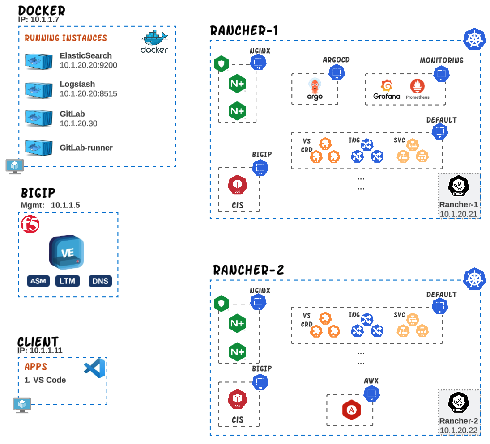

# OLTRA

This repository contains examples, use-cases and demos for modern architectures that you can use with **OLTRA** (one lab to rule all). 

**OLTRA** can be deployed either in F5's [UDF environment](https://udf.f5.com/b/94afd04b-a46b-4429-b2e1-2b3ac9813579) or in the public cloud provider of your choice ([AWS](/deployment/aws) or [Azure](/deployment/azure)) with the use of Terraform/Ansible. OLTRA is maintained by F5's EMEA Solution Architect team.
The high level diagram for OLTRA environment can be found below along with the technologies that are being used on this lab.

The technologies used for this environment can be found below along with their credentials.

| Name | Notes | Credentials |
|---|---|---|
| **BIGIP (15.1)** |  Standalone BIGIP that has the LTM/ASM/DNS/AFM modules provisioned. | admin / Ingresslab123 |
| **NGINX KIC** | Runs inside the K8s cluster. There are 2 primarly deployments of NGINX KIC.  One deployment with IngressClass `infra` that handles infrastructure components like Prometheus, Grafana and ArgoCD and another deployment with ingressclass `plus` that uis used for demos, use-cases and examples. The NGINX+ Ingress Controller version used is 2.2.2 | - |
| **CIS** |  Runs inside the K8s cluster. There are 2 CIS instances running inside the cluster. `cis-crd` instance is used to deploy services based on VirtualServer/TransportServer CRDs and ServiceType LB whereas `cis-ingress` instance is used for Ingress Resources and ConfiMaps | - |
| **K8s Cluster** | 3 node Kubernetes cluster (Master, Node01 and Node02) running verion 1.22|  - |
| **GitLab** | Runs on a dedicated server and provides three main functionalities:   - Source Code Management (gitlab.f5demo.cloud)   - CI/CD   - Container registry (registry.f5demo.cloud) | root / Ingresslab123 |
| **ArgoCD** | Argo CD is implemented as a kubernetes controller which continuously monitors running applications and compares the current, live state against the desired target state (as specified in the Git repo). | admin / Ingresslab123 |
| **Elasticsearch** | Elastic runs as an instance on the "Docker" system and its main purpose is to store the Access, Error and Security logs for NAP, NGINX and BIGIP.   | - |
| **Logstash** | Logstash runs as an instance on the "Docker" system and its main purpose is to process the logs, parse them and then forward them to Elastic.   | - |
| **VSCode** | Runs VScode through a web interface on the "Client" system. | - |
| **Prometheus** | Runs in K8s and provides a time-series storage for monitoring both BIGIP and NGINX+. | - |
| **Grafana** | Multiple Dashboards have been developed for displaying metrics/events from both Prometheus and Elastic. Runs in K8s. | admin / Ingresslab123 |

## Use-Cases
The use-case build for OLTRA can be found below:

- [**Building Multi-tenant Ingress services**](use-cases/multi-tenancy/README.md)
- **Deploying Active-Active or Active-Standby services in a multicluster K8s with CIS and NGINX**  
- **Implementing web application security into a DevOps environment** ()

## Demos
The demos build for OLTRA can be found below:

- [**Monitoring BIGIP services with Prometheus, Grafana and Elastic**](use-cases/bigip-monitoring/README.md)
- [**Monitoring NGINX+ Ingress services with Prometheus, Grafana and Elastic**](use-cases/nginx-monitoring/README.md)
- **Publishing NGINX+ Ingress with BIGIP**  
- **Securing K8s services against L3/L7 DDoS attacks with BIGIP**  
- **Securing K8s services against L7 DDoS attacks with NGINX+**  
- **Protecting K8s applications against web application attacks with BIGIP**  

## Examples
The examples build for OLTRA can be found below:

- [**Ingress capabilities with CIS**](use-cases/cis-examples/README.md)
- [**Publishing Type LoadBalancer services with CIS**](use-cases/cis-examples/cis-crd/serviceTypeLB/README.md)
- **DNS Publishing of K8s services with CIS**  
- **Continuous Deployment with ArgoCD**  
 
 
---

## Support
For support, please open a GitHub issue.  Note, the code in this repository is community supported and is not supported by F5 Networks.  For a complete list of supported projects please reference [SUPPORT.md](SUPPORT.md).

## Community Code of Conduct
Please refer to the [F5 DevCentral Community Code of Conduct](code_of_conduct.md).

## License
[Apache License 2.0](LICENSE)

## Copyright
Copyright 2014-2020 F5 Networks Inc.

### F5 Networks Contributor License Agreement

Before you start contributing to any project sponsored by F5 Networks, Inc. (F5) on GitHub, you will need to sign a Contributor License Agreement (CLA).

If you are signing as an individual, we recommend that you talk to your employer (if applicable) before signing the CLA since some employment agreements may have restrictions on your contributions to other projects.
Otherwise by submitting a CLA you represent that you are legally entitled to grant the licenses recited therein.

If your employer has rights to intellectual property that you create, such as your contributions, you represent that you have received permission to make contributions on behalf of that employer, that your employer has waived such rights for your contributions, or that your employer has executed a separate CLA with F5.

If you are signing on behalf of a company, you represent that you are legally entitled to grant the license recited therein.

You represent further that each employee of the entity that submits contributions is authorized to submit such contributions on behalf of the entity pursuant to the CLA.
