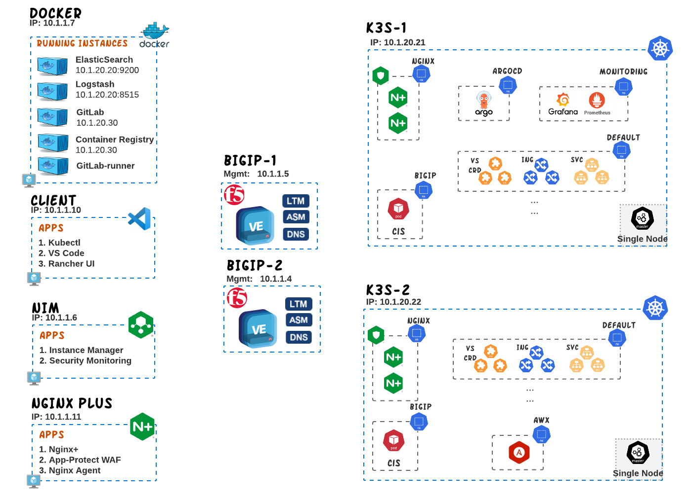

# OLTRA - One Lab To Rule All

Unlock the power of modern architecture with OLTRA! This repository is your comprehensive guide to harnessing the full potential of F5 solutions, including NGINX, BIG-IP, and CIS. Whether you're a seasoned DevOps or a newcomer exploring the vast world of application delivery and security, this repository serves as your go-to resource for examples, use-cases, and demos.

Dive into our collection of examples and demonstrations, that you illustrate how F5 Technologies can elevate your infrastructure to meet the demands of modern architecture.

Whether you're building microservices, deploying containers, or orchestrating Kubernetes clusters, F5 Technologies offer robust solutions to empower your projects. Let this repository be your guide as you navigate the complexities of modern IT environments, providing you with the knowledge and tools needed to architect solutions that are resilient, scalable, and secure.

**OLTRA** Lab can be deployed only in F5's [UDF environment](https://udf.f5.com/b/a0fae003-69b4-4cb4-84b0-c68633f5b2c7). OLTRA is maintained by F5's EMEA Solution Architect team.

The high level diagram for OLTRA environment can be found below along with the technologies that are being used on this lab.

  

## Technologies
The technologies used for this environment along with their credentials are shown on the following table.

| Name | Notes | Credentials |
|---|---|---|
| **BIGIP** |  Standalone BIGIP that has the LTM/ASM/DNS modules provisioned.   *Access UI: On UDF under `F5 products` go to `bigip-01` -> `TMUI`* | admin / Ingresslab123 |
| **NGINX IC** | Runs inside both K8s clusters and it is frequently updated to the latest one. The installation is done through Helm Charts. | - |
| **NGINX Plus** | The commercial version of NGINX has been deployed on a Virtual Machine and with the use of Nginx-Agent is managed from NIM.| - |
| **NIM** |  Nginx Instance Manager has been installed on a virtual Machine.   *Access UI: On UDF under `Systems` go to `NIM` -> `NIM UI`* | admin / Ingresslab123 |
| **CIS** |  Runs inside the K8s cluster. There are 2 CIS instances running in K3s-1 and a 1 instance in K3s-2. In K3s-1 you will find `cis-crd` instance is used to deploy services based on VirtualServer/TransportServer CRDs and ServiceType LB whereas `cis-ingress` instance is used for Ingress Resources and ConfiMaps. In K3s-2 you will find only cis-crd. The installation is done through manifests. | - |
| **K8s Clusters** | We have 2 single node Kubernetes clusters, K3s-1 and K3s-2, that you can access from VSCode. Both clusters are running verion 1.31 |  - |
| **VSCode** | Runs VScode through a web interface on the "Client" system.   *Access UI: On UDF under `Systems` go to `Client` -> `VSCode`* | - |
| **Kubectl** | In order to access both clusters with ease we have installed `Kubectl` on the `Client` Virtual Machine and configured access for both clusters with `.kube/config`.   *Access UI: On UDF under `Systems` go to `Client` -> `VSCode`* |  - |
| **GitLab** | Runs on a dedicated server and provides three main functionalities:   - Source Code Management (git.f5k8s.net)   - Gitlab Runner (CI/CD)   - Container registry (registry.f5k8s.net)   *Access UI: On UDF under `Systems` go to `Docker` -> `Gitlab`*| root / Ingresslab123 |
| **ArgoCD** | Argo CD is implemented as a kubernetes controller which continuously monitors running applications and compares the current, live state against the desired target state (as specified in the Git repo).   *Access UI: Under F5 products go to `bigip-01` -> `ArgoCD`* | admin / Ingresslab123 |
| **Elasticsearch** | Elastic runs as an instance on the "Docker" system and its main purpose is to store the Access, Error and Security logs for NAP, NGINX and BIGIP.   | - |
| **Logstash** | Logstash runs as an instance on the "Docker" system and its main purpose is to process the logs, parse them and then forward them to Elastic. | - |
| **Kibana** | Kibana runs as an instance on the "Docker" system and its purpose is to visualize the Elastic logs.   *Access UI: On UDF under `Systems` go to `Docker` -> `Kibana`*| - |
| **Prometheus** | Runs in K3s-1 and provides a time-series storage for monitoring both BIGIP and NGINX+. It is installed through Helm and exposed via CIS TransportServer.   *Access UI: On UDF under `Systems` go to `k3s-1` -> `Prometheus`* | - |
| **Grafana** | Multiple Dashboards have been developed for displaying metrics/events from both Prometheus and Elastic. Runs in K3s-1, is installed through Helm and exposed via CIS TransportServer.   *Access UI: On UDF under `Systems` go to `k3s-1` -> `Grafana`*  | admin / Ingresslab123 |
| **AWX** | The Opensource version of Ansible Tower has been installed on K3s-2 and is exposed via CIS TransportServer.   *Access UI: Under F5 products go to `bigip-01` -> `AWX`* | admin / Ingresslab123 |
| **RancherUI** | Rancher UI has been deployed as a docker on the `Client` VM and has been connected with both K8s clusters.   *Access UI: On UDF under `Systems` go to `Client` -> `Rancher`* | admin / Ingresslab123 |

## Use-Cases
The use-cases build for OLTRA can be found below:

- [**Building Multi-tenant Ingress services**](use-cases/two-tier-architectures/multi-tenancy/)
- [**Deploying Multi-cluster services K8s with CIS and NGINX**](use-cases/two-tier-architectures/multi-cluster)
- [**Building a 2 Tier Architecture with with CIS and NGINX**](use-cases/two-tier-architectures)
- [**Using GitOps to publish NGINX Ingress Controller with BIGIP**](use-cases/two-tier-architectures/gitops)
- [**Building a K8s DevSecOps infrastructure with NGINX App Protect**](use-cases/devsecops/k8s/)

## Demos
The demos build for OLTRA can be found below:

- [**Monitoring BIGIP services with Prometheus, Grafana and Elastic**](monitoring/bigip)
- [**Monitoring NGINX+ Ingress services with Prometheus, Grafana and Elastic**](monitoring/nginx)
- [**Monitoring NGINX App Protect with Grafana**](monitoring/app-protect/)

## Examples
The examples build for OLTRA can be found below:

- [**Ingress resource examples with NGINX+**](examples/nic/ingress-resources/)
- [**CRD examples with NGINX+**](examples/nic/custom-resources/)
- [**Publishing NGINX with IngressLink**](examples/cis/crd/IngressLink/)
- [**Service Type LoadBalancer with CIS**](examples/cis/crd/serviceTypeLB/)
- [**NGINX App protect examples**](examples/app-protect/)
- [**Service Type LoadBalancer with CIS**](examples/cis/crd/serviceTypeLB/)
- [**Ingress resource examples with CIS**](examples/cis/ingress/)
- [**CRD examples with CIS**](examples/cis/crd/)
- [**DNS Publishing of K8s services with CIS**](examples/cis/crd/ExternalDNS/)
- [**Using Argo CD to provide continuous delivery for NGINX App Protect**](examples/app-protect/argocd/)

 
---

## Support
For support, please open a GitHub issue.  Note, the code in this repository is community supported and is not supported by F5 Networks.  For a complete list of supported projects please reference [SUPPORT.md](SUPPORT.md).

## Community Code of Conduct
Please refer to the [F5 DevCentral Community Code of Conduct](code_of_conduct.md).

## License
[Apache License 2.0](LICENSE)

## Copyright
Copyright 2014-2020 F5 Networks Inc.

### F5 Networks Contributor License Agreement

Before you start contributing to any project sponsored by F5 Networks, Inc. (F5) on GitHub, you will need to sign a Contributor License Agreement (CLA).

If you are signing as an individual, we recommend that you talk to your employer (if applicable) before signing the CLA since some employment agreements may have restrictions on your contributions to other projects.
Otherwise by submitting a CLA you represent that you are legally entitled to grant the licenses recited therein.

If your employer has rights to intellectual property that you create, such as your contributions, you represent that you have received permission to make contributions on behalf of that employer, that your employer has waived such rights for your contributions, or that your employer has executed a separate CLA with F5.

If you are signing on behalf of a company, you represent that you are legally entitled to grant the license recited therein.

You represent further that each employee of the entity that submits contributions is authorized to submit such contributions on behalf of the entity pursuant to the CLA.
