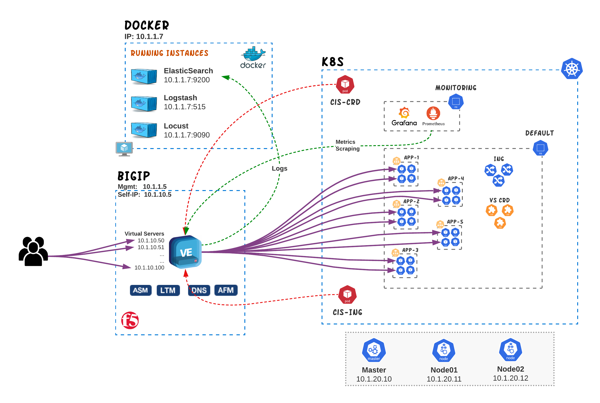

# Reverse Proxy capabilities with CIS

In this section we will be exploring five modes that CIS can be configured for in order to publish Kubernetes services; Ingress and VirtualServer CRD.
The following examples can be used to demonstrate the most common functionality for Ingress Services with CIS. The examples include:
- Ingress Resource examples
- VirtualServer CRD examples
- TransportServer CRD examples
- Service Type LoadBalancer examples
- EDNS examples

  

## Ingress Resource examples

In this section we provide examples for the most common use-cases of Ingress Resources with F5 CIS

* [Basic-Ingress](cis-ingress/basic-ingress)
* [FQDN-Based-Routing](cis-ingress/host-routing)
* [Fan-out/Path-Based-Routing](cis-ingress/fanout)
* [Health Monitor](cis-ingress/health-monitor)
* [AppRoot/URL Rewrite](cis-ingress/rewrite)
* [TLS Ingress Examples](cis-ingress/tls)

## VirtualServer CRD examples

* [Basic Virtual Server (without Host parameter) ](cis-crd/VirtualServer/Basic/#http-virtual-server-without-host-parameter)
* [Basic Virtual Server (with Host parameter) ](cis-crd/VirtualServer/Basic/#http-virtual-server-with-host-parameter-and-a-single-service)
* [Path based routing](cis-crd/VirtualServer/Basic/http-virtual-server-with-two-services-path-based-forwarding)
* [Host based routing](cis-ingress/VirtualServer/HostGroup)
* [AppRoot Rewrite](cis-crd/VirtualServer/PathRewrite/#uri-path-re-write)
* [URI Path Rewrite](cis-crd/VirtualServer/PathRewrite/#app-root-re-write)
* [HTTP Redirect](cis-crd/VirtualServer/hhtpTraffc/)
* [Dynamic IP Allocation (IPAM)](cis-crd/VirtualServer/IpamLabel)
* [Health Monitors](cis-crd/VirtualServer/HealthMonitor)
* [Wildcard Hostname](cis-crd/VirtualServer/Wildcard)
* [TLS VirtualServer](cis-crd/VirtualServer/TLS-termination/)
* [Using iRules ](cis-crd/VirtualServer/PolicyCRD/#policycrd-iRules)
* [Managing Persistence](cis-crd/VirtualServer/PolicyCRD/#policycrd-persistence)
* [Custom HTTP Profile](cis-crd/VirtualServer/PolicyCRD/#policycrd-xff)
* [VirtualServer with custom Port](cis-crd/VirtualServer/CustomPort/)

## TransportServer CRD examples

## Service Type LoadBalancer examples

## EDNS examples
