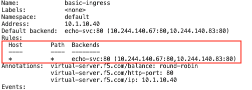
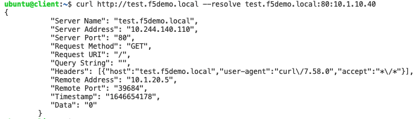

# Basic-Ingress
In the following example we deploy a basic ingress resource for a single K8s service.

Create the Ingress resource.
```
kubectl apply -f basic-ingress.yml
```

Confirm that the Ingress works:
```
kubectl describe ing basic-ingress
```

You should see the following output. Notice that the value of Host and Path (marked in red) is configured as `*`. 




Access the service as per the examples below. 

```
curl http://10.1.10.40 
curl http://10.1.10.40/test.php
curl http://test.f5demo.local --resolve test.f5demo.local:80:10.1.10.49
```

In all cases you should see similar output:


