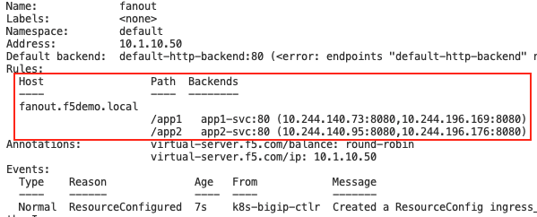
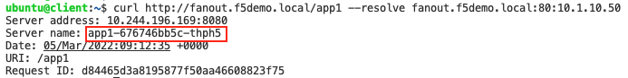

# FanOut/Path-Based-Routing
In the following example we deploy an Ingress resource that routes based on URL Path:

*fanout.f5demo.local/__app2__ => app2-svc* 

*fanout.f5demo.local/__app1__ => app1-svc*

Create the Ingress resource
```
kubectl apply -f fanout.yml
```

Confirm that the Ingress works:
```
kubectl describe ing fanout
```

Notice on the output that the value of Host is now defined "fanout.f5demo.local" and on the Path level there are 2 entries; __app1__ that points to `app1-svc` and __/app2__ that points to `app2-svc`.



Try accessing the service on a path that has not been defined on the Ingress resource like the example below.

```
curl http://fanout.f5demo.local/test/index.php --resolve fanout.f5demo.local:80:10.1.10.50
```
You should see a reset connection as it didnt match the configured Path value.
`curl: (56) Recv failure: Connection reset by peer`


Try again with either of the following options
```
curl http://fanout.f5demo.local/app1/index.php --resolve fanout.f5demo.local:80:10.1.10.50
curl http://fanout.f5demo.local/app2/index.php --resolve fanout.f5demo.local:80:10.1.10.50
curl http://fanout.f5demo.local/app1 --resolve fanout.f5demo.local:80:10.1.10.50
curl http://fanout.f5demo.local/app2 --resolve fanout.f5demo.local:80:10.1.10.50
```

In all cases you should see similar outputs but from different backend pods (__app1__ and __app2__ pods) depending on the path.



