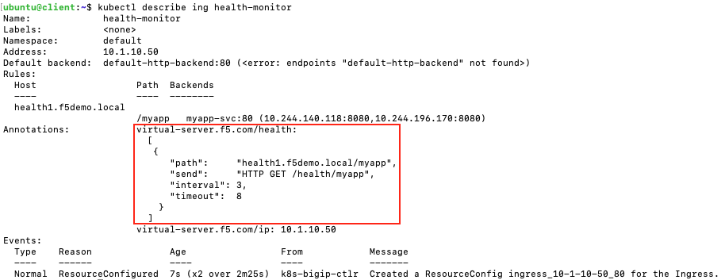

# Health Monitors
The following example deploys an Ingress resource with health monitor to verify that the K8S service is working properly.

__"HTTP GET /health/echo" => health-monitor-1__

Create the Ingress resource
```
kubectl apply -f health-monitor.yml
```

Confirm that the Ingress works:
```
kubectl describe ing health-monitor
```

You should see the following output. Notice on the annotation section the health monitors have been defined.




On the BIGIP UI, you should see the application pool marked as green and a custom monitor assigned to the pool

| BIGIP Pool             |  Pool Details |
:-------------------------:|:-------------------------:
  |  

