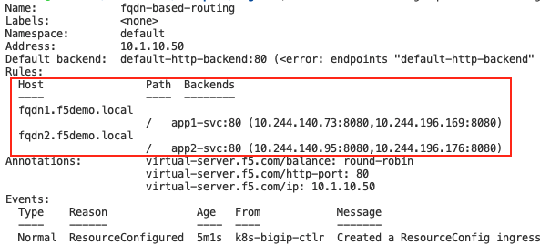
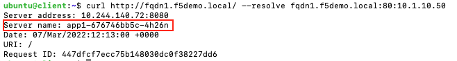

# FQDN-Based-Routing
In the following example we deploy an Ingress resource that routes based on FQDNs:

*fqdn1.f5demo.local => app1-svc*

*fqdn2.f5demo.local => app2-svc*

Create the Ingress resource
```
kubectl apply -f fqdn-based-routing.yml
```

Confirm that the Ingress works:
```
kubectl describe ing fqdn-based-routing
```

You should see the following output. Notice that the value of Host is now defined ("fqdn1.f5demo.local" / "fqdn2.f5demo.local").



Try accessing the service with the IP address assigned for the ingress as per the example below. 
```
curl http://10.1.10.50
```

You should see a reset connection as it didnt match the configured Host Header.
`curl: (56) Recv failure: Connection reset by peer`

Try again with either of the two following options
```
curl http://fqdn1.f5demo.local/ --resolve fqdn1.f5demo.local:80:10.1.10.50
curl http://fqdn2.f5demo.local/ --resolve fqdn2.f5demo.local:80:10.1.10.50
```

In both cases you should see that similar output but from different backend pods (app1 and app2 pods):


