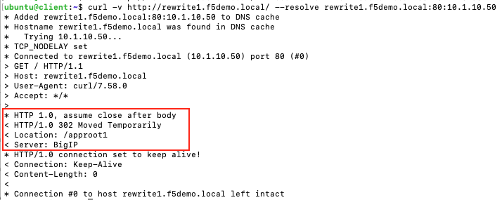

# Rewrite Examples

In this section we provide 2 Rewrite examples

- [AppRoot-Rewrite](#AppRoot-Rewrite)
- [URL-Rewrite](#URL-Rewrite)

## AppRoot-Rewrite
In the following example we deploy an Ingress resource with rewrite-app-root annotation that will redirect any traffic for the root path `/` to `/approot1`.

__http://rewrite1.f5demo.local/ => http://rewrite1.f5demo.local/approot1__

Create the Ingress resource.
```
kubectl apply -f rewrite-app-root.yml
```

Try accessing the service.

```
curl -v http://rewrite1.f5demo.local/ --resolve rewrite1.f5demo.local:80:10.1.10.50
curl -v http://rewrite2.f5demo.local/ --resolve rewrite2.f5demo.local:80:10.1.10.50
```

You should see that the path that was send on the backend application has been changed from `/` to `/approot1`.
Similarly if accessing the service `rewrite2.f5demo.local` the path will change to `approot2`




## URL-Rewrite
In the following example we deploy an Ingress resource that rewrites the URL from `lab.f5demo.local/mylab` to `laboratory.f5demo.local/mylaboratory`.

Create the Ingress resource.
```
kubectl apply -f url-rewrite-ingress.yml
```

Try accessing the service.
```
curl http://lab.f5demo.local/mylab --resolve lab.f5demo.local:80:10.1.10.50
```

You should see that the Hostname and Path that was send on the backend application has been changed as per the Ingress resource configuration.


