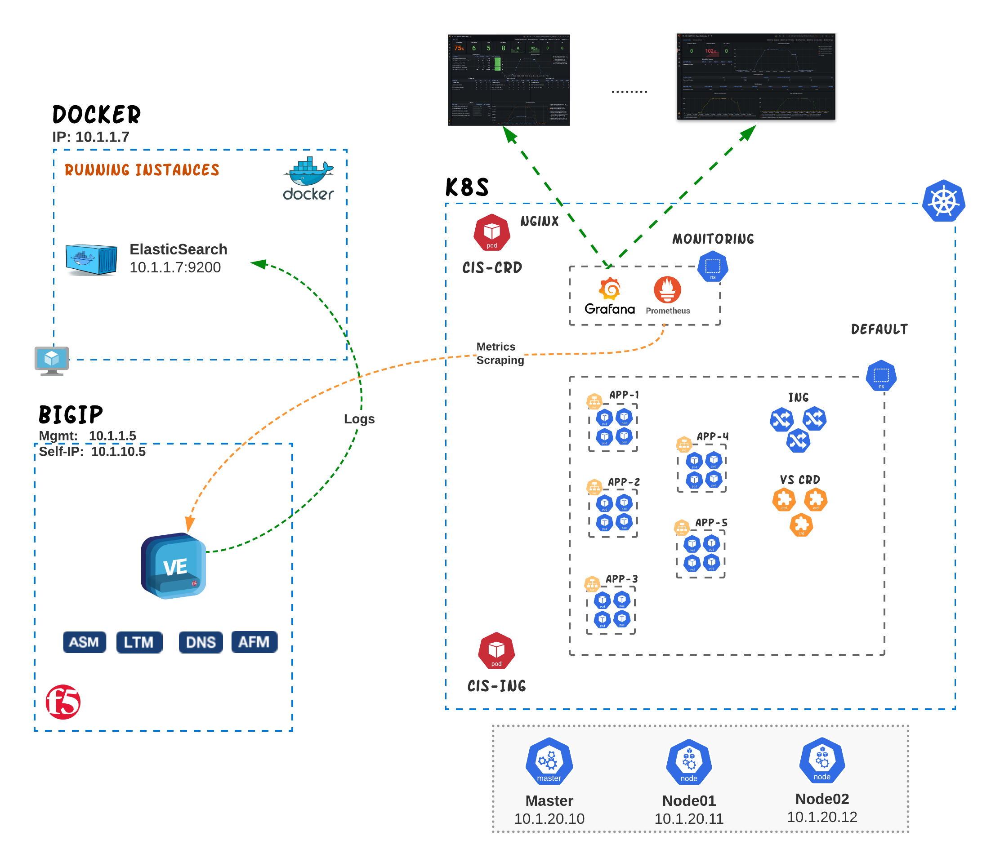
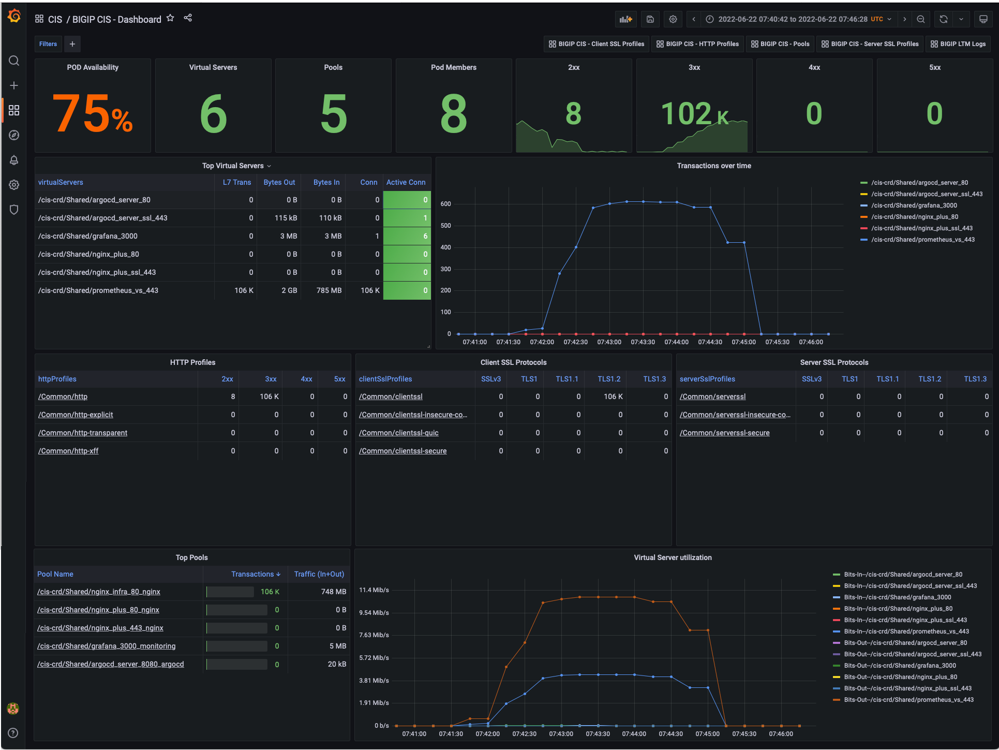
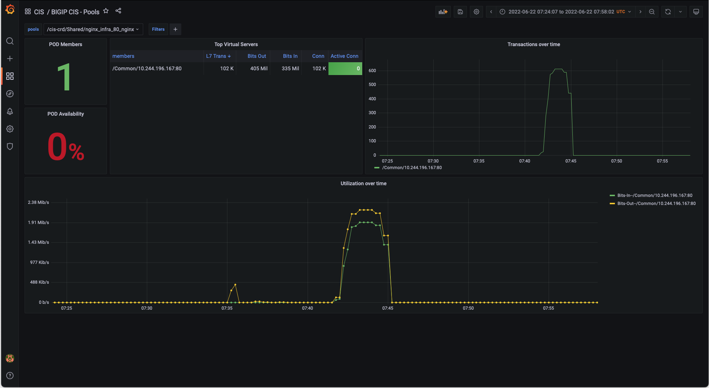
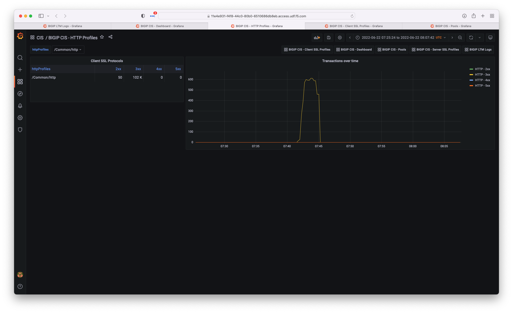
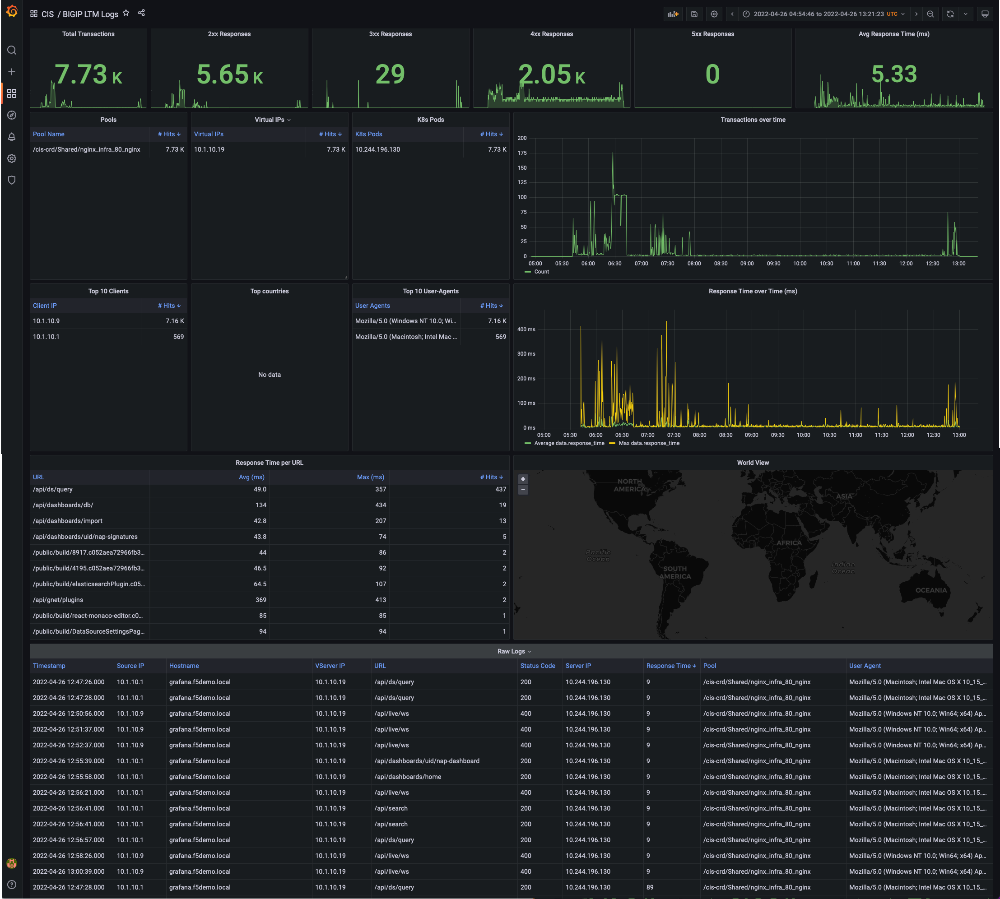
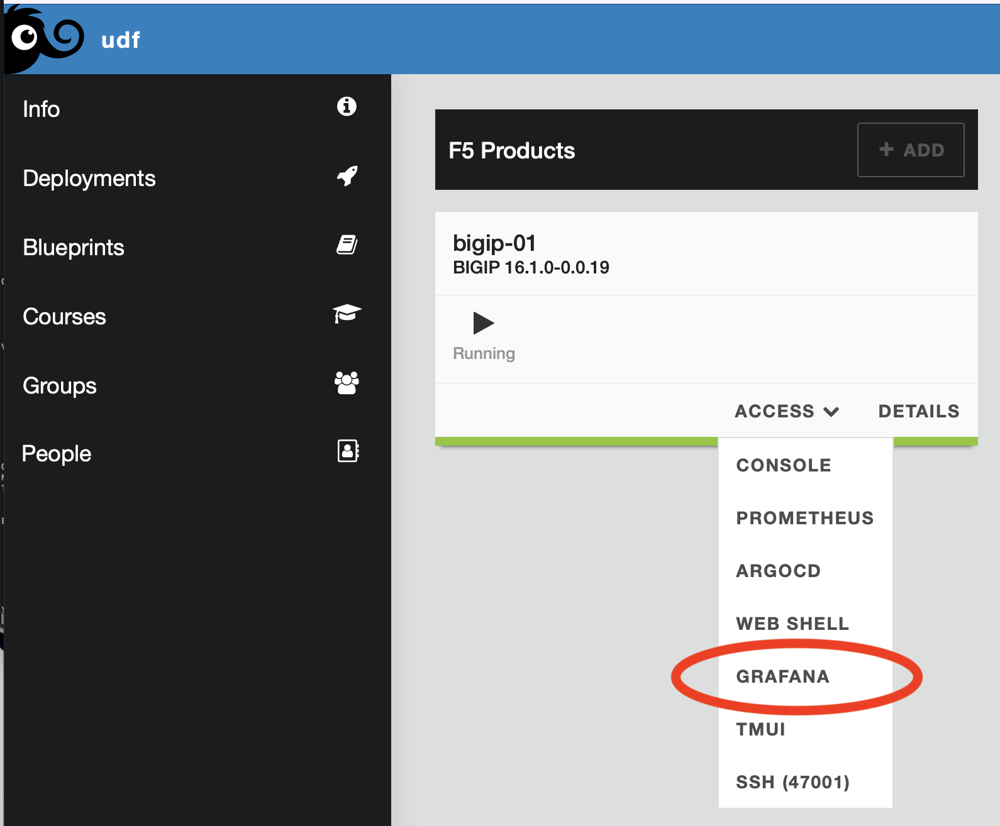
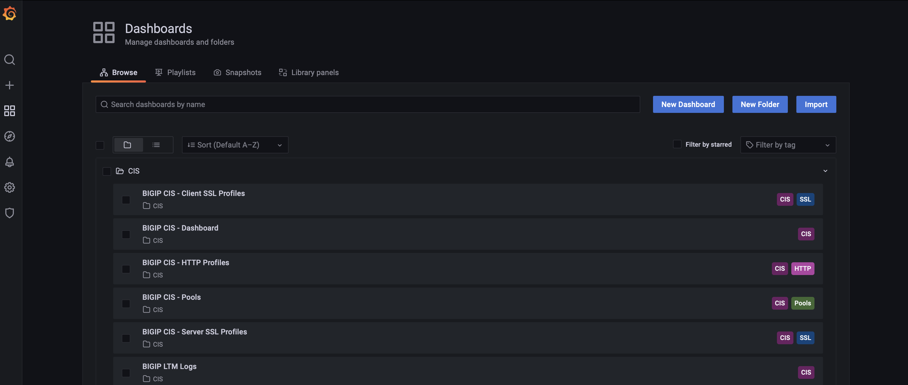

# Monitoring BIGIP services with Prometheus, Grafana and Elastic
In this section we go through how you can efectively to monitor K8s services that are being delivered by BIGIP/CIS. The technologies that are part of the observability platform are [**Prometheus**](#prometheus), [**Elasticsearch**](#elasticsearch), [**Grafana**](#grafana) and [**Telemetry Streaming (F5)**](#telemetry-streaming). 

<p align="center">
  
</p>

The dashboards that have been created to assist with the monitoring of the K8s services are:
  - [**CIS Dashboard**](#cis-dashboard)
  - [**Client/Server SSL Performance**](#clientserver-ssl-dashboard)
  - [**HTTP Profiles**](#http-profile-dashboard) 
  - [**Pools**](#pools-dashboard)
  - [**VS Access Logs**](#vs-access-logs-dashboard)
  - BIGIP Error Logs (**pending**)

## CIS Dashboard
This dashboard provides an overall view on the utilization and performance of the applications handled by BIGIP. 
The dashboard provides visibility on the following:
- Total number of Virtual Servers, Pools and Members on the BIGIP appliances
- HTTP Reponse Codes (2xx, 3xx, 4xx and 5xx) for the specific period across the entire appliance
- Pool availability (requires a monitor to be assinged to the pool)
- Virtual Servers statistics (with drill in capabiltiy)
- Pool statistics (with drill in capabiltiy)
- Client/Server SSL Profile stastics 
- HTTP Profile stastics 
- Utilization and L7 TPS over time



>:information_source:
>  The source of information used to create this dashboard is Prometheus.

## Client/Server SSL Dashboard
Both Client and Server SSL dashboards provide insight on multiple SSL metrics. The information provided on this dashboard includes:
- SSL transaction over time
- SSL transaction offloaded on software vs Hardware
- SSL Failure
- SSL Version
- SSL Cipher used
- SSL Key exchange


>:information_source:
>  The source of information used to create this dashboard is Prometheus.

## Pools Dashboard
In the Pool dashboard we provide more details on the utilization and transaction for a specific pool and its members. The information provided from this dashboard includes:
- Total number of Pool Members
- Pool member availability (%)
- Usage stastitics per member
- Transactions over time (per member)
- Utilization over time (per memeber)



>:information_source:
>  The source of information used to create this dashboard is Prometheus.

## HTTP Profile Dashboard
In the HTTP Profile dashboard we get a detail view on the HTTP response code (2xx, 3xx, 4xx, 5xx) per HTTP Profile and can observe the trend over time.



>:information_source:
>  The source of information used to create this dashboard is Prometheus.

## VS Access Logs Dashboard
VS Access logs dashboard provides insight on the HTTP Request/Response transaction details. The transactions details have been recorded on BIGIP thought the use of an iRule that has been enabled for specific Virtual Servers. The iRule can record all transactions proccessed by a VS (and send to Elastic via Telemetry streaming) but it is recommended to be modified to record "key" transactions, like slow and/or failed transactions. In addition the iRule can be modified to record additional information like a specific HTTP Header/cookie.   
 The information provided from this dashboard includes:
- Total transactions
- HTTP Responses (2xx, 3xx, 4xx, 5xx)
- Avg Response Time
- Top Virutal Servers 
- Top Pools
- Top Pool Members
- Top Clients 
- Top Countries
- Top User Agents
- Transactions over time
- Response time over time
- Response time per URL
- World Map View
- Detail Logs per transaction




>:information_source:
>  The source of information used to create this dashboard is Elasticsearch.

## How to Demo
In order to demo the usefullness of the dashboards we are to create traffic through the BIGIP. 

#### Step 1 - Create multiple Ingress and VS CRDs
Change the working directory to `bigip-monitoring`.
```
cd ~/oltra/use-cases/bigip-monitoring/
```

Scale the deployment of `echo-svc` to 5 pods
```
kubectl scale deployment echo --replicas=5
```

Run the following script that will deploy multiple HTTP/HTTPS VirtualServer CRDs so that we prepare the BIGIP to receive traffic. 
```
kubectl apply -f deploy_services.yml

###############   expected result   ###############
tlsprofile.cis.f5.com/reencrypt-tls created
virtualserver.cis.f5.com/reencrypt-tls-vs created
policy.cis.f5.com/xff-policy created
virtualserver.cis.f5.com/xff-policy-vs created
virtualserver.cis.f5.com/vs-test1 created
virtualserver.cis.f5.com/vs-test2 created
virtualserver.cis.f5.com/vs-test3 created
virtualserver.cis.f5.com/vs-test4 created
virtualserver.cis.f5.com/readiness-vs created
####################################################
```

Verify that the VirtualServers have been configured correctly.
```
kubectl get vs
```
```
###############   expected result   ###############
NAME                  HOST                       TLSPROFILENAME        HTTPTRAFFIC   IPADDRESS    IPAMLABEL   IPAMVSADDRESS   STATUS   AGE
reencrypt-tls-vs      reencrypt.f5demo.local     reencrypt-tls                       10.1.10.69               None            Ok       2d
vs-test1                                                                             10.1.10.79               None            Ok       2m13s
vs-test2                                                                             10.1.10.80               None            Ok       2m13s
vs-test3                                                                             10.1.10.81               None            Ok       2m13s
vs-test4                                                                             10.1.10.82               None            Ok       2m13s
readiness-vs                                                                         10.1.10.83               None            Ok       2m13s
xff-policy-vs         policy.f5demo.local                                            10.1.10.66               None            Ok       2m13s
####################################################
```


#### Step 2 - Send traffic to the BIGIP Virtual Servers** 
The second script will send traffic to BIGIP's VIPs for about 1-2 minutes in order to populate the graphs with meaningful data.

```
./traffic.sh
```
>**Note:** You might want to run the script multiple times to collect more logs/statistics.

#### Step 3 - Review Dashboards in Grafana
Once the script has been completed we should be able to see statistics/events on the Grafana dasbboards such as:
- Utilization per virtual server
- Traffic per pool and pool memebers
- HTTP Response Code statistics
- SSL utilization
- SSL failures
- SSL version used
- URLs that have slow response time and URLs that generate 500 and 404 errors

On the UDF you can acess Grafana from BIGIP "Access" methods as per the image below.

<p align="left">
  
</p>

Login to Grafana (credentials **admin/IngressLab123**)
<p align="left">
  
</p>


Go to **Dashboards->Browse**

<p align="left">
  
</p>


Select any Dashboard you want to review under CIS

<p align="left">
  
</p>


## Technologies

#### **Telemetry Streaming**

Telemetry Streaming (TS) enables you to declaratively aggregate, normalize, and forward statistics and events from the BIG-IP to a consumer application. There are multiple consumers supported by Telemetry streaming. You can find more information about Telemetry streaming on the following <a href="https://clouddocs.f5.com/products/extensions/f5-telemetry-streaming/latest"> link </a> <br><br>
There are 2 types of consumers that we will be using for the BIGIP dashboard; Elasticsearch consumer (Push) and Prometheus consumer (Pull). <br>
The **Elasticsearch** consumer has been configured is sending all the access logs that are collected via an iRule to ElasticSearch. This is achieved by attaching the **iRule** called *"/Common/Shared/telemetry_log_iRule"* to the desired VirtualServer CRD.<br>
The **Prometheus** consumer has also been enabled in order to expose a new HTTP API endpoint that will be scraped by Prometheus for metrics. The consumer outputs the telemetry data according to the Prometheus data model specification. <br><br>

You can find more information on how Telemetry Streaming has been configured on the following links:
- <a href="https://github.com/F5EMEA/oltra/blob/main/setup/prometheus-grafana/7-telemetry-log-irule.txt"> iRule to collect logs </a>
- <a href="https://github.com/F5EMEA/oltra/blob/main/setup/prometheus-grafana/6-setup-f5-telemetry.txt"> Telemetry streaming declaration </a>


#### **Prometheus**
Prometheus is an open-source systems monitoring and alerting toolkit originally built at SoundCloud. Since its inception in 2012, many companies and organizations have adopted Prometheus, and the project has a very active developer and user community. It is now a standalone open source project and maintained independently of any company. To emphasize this, and to clarify the project's governance structure, Prometheus joined the Cloud Native Computing Foundation in 2016 as the second hosted project, after Kubernetes.

In our environemnt Prometheus has been configured to scrape BIGIP for all metrics every 30 seconds.
You can find more information on how Prometheus has been configured to scrape BIGIP can be found on the link below:

- <a href="https://github.com/F5EMEA/oltra/blob/main/setup/prometheus-grafana/1-scraping-bigip.yml"> Scraping BIGIP </a>

#### **Elasticsearch**

Elasticsearch is a distributed, free and open search and analytics engine for all types of data, including textual, numerical, geospatial, structured, and unstructured. Elasticsearch is built on Apache Lucene and was first released in 2010 by Elasticsearch N.V. (now known as Elastic). Known for its simple REST APIs, distributed nature, speed, and scalability, Elasticsearch is the central component of the Elastic Stack, a set of free and open tools for data ingestion, enrichment, storage, analysis, and visualization. Commonly referred to as the ELK Stack (after Elasticsearch, Logstash, and Kibana), the Elastic Stack now includes a rich collection of lightweight shipping agents known as Beats for sending data to Elasticsearch.

In our environment Elasticsearch is been used to store the logs and events that are generated from BIGIP.


#### **Grafana**
 
Grafana is an open source solution for running data analytics, pulling up metrics that make sense of the massive amount of data & to monitor our apps with the help of cool customizable dashboards.
Grafana connects with every possible data source, commonly referred to as databases such as Graphite, Prometheus, Influx DB, ElasticSearch, MySQL, PostgreSQL etc.

In our environment we connected Grafana to Elasticsearch and Prometheus. The Dashboards created can be found on Grafana Hub:
- <a href="https://grafana.com/grafana/dashboards/16176">BIGIP CIS - Dashboard</a>
- <a href="https://grafana.com/grafana/dashboards/16174">BIGIP CIS - Client SSL Profiles</a>
- <a href="https://grafana.com/grafana/dashboards/16172">BIGIP CIS - Server SSL Profiles</a>
- <a href="https://grafana.com/grafana/dashboards/16173">BIGIP CIS - Pools</a>
- <a href="https://grafana.com/grafana/dashboards/16171">BIGIP CIS - LTM Logs</a>


