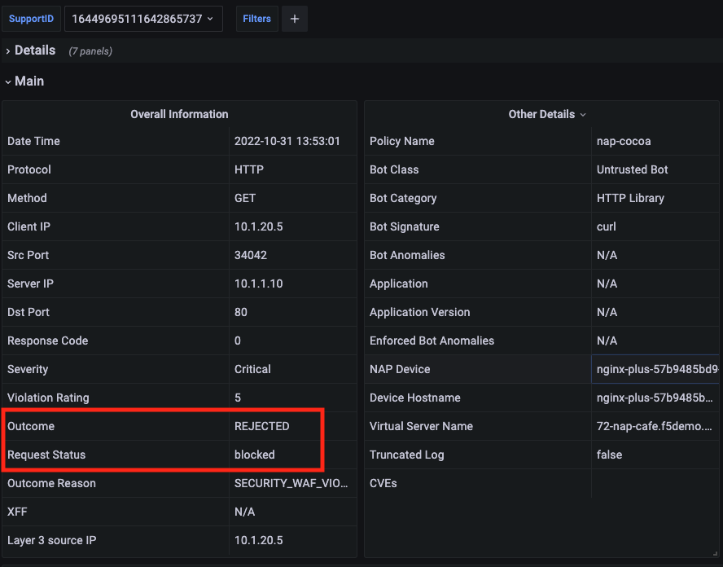

# Protecting against multiple attack types

In this section we will configure **NGINX App Protect** for different type of attacks. For these type of attacks we will enable Blocking mode but also review the logs on the Grafana Dashboard and create exceptions assuming the attack was a *False Positive*. The attack types include the following:

- [Attack Signatures](#working-with-attack-signatures)
- [HTTP Methods](#working-with-http-methods)


### Pre-requisites
Deploy an application and apply the Base WAF policy to protect it. 

> *To run the demos, use the terminal on VS Code. VS Code is under the `bigip-01` on the `Access` drop-down menu. Click <a href="https://raw.githubusercontent.com/F5EMEA/oltra/main/vscode.png"> here </a> to see how.*

Change the working directory to `path-based`.
```
cd ~/oltra/use-cases/app-protect/attacks
```

1. Deploy the application manifest and service:
  ```
  kubectl create namespace nap
  kubectl apply -f app.yml
  ```

2. Create the App Protect policy.
  ```
  kubectl apply -f appolicy.yml
  ```
3. Create APLogConf resource:
  ```
  kubectl apply -f log.yml
  ```
4. Create the NGINX policy to reference the AP Policy, the AP Log profile and the log destination.
  ```
  kubectl apply -f policy.yml
  ```
5. Create the VirtualServer resource:
  ```
  kubectl apply -f virtual-server.yml
  ```

6. Test the application by sending a legitimate request to it:
  ```
  curl http://nap.f5demo.cloud/

  ###############   expected result   ###############
  Server address: 10.244.140.114:80
  Server name: portal-7c674cffbd-nkzrx
  Date: 15/Aug/2022:06:57:25 +0000
  URI: /
  Request ID: 19ed141c6c09aa8833f86c40b6780308
  ####################################################
  ```

7. Verify that the WAF has been applied by sending a malicious request to the application. 
  ```
  curl "http://nap.f5demo.cloud/?test=<script>"

  ###############   expected result   ###############

  <html><head><title>Request Rejected</title></head><body>The requested URL was rejected. Please consult with your administrator.<br>
  <br>Your support ID is: 742177367032758723<br><br><a href='javascript:history.back();'>[Go Back]</a></body></html>
  ```

8. Login to Grafana and verify that the violation is showing on the Dashboard. More information about Grafana can be found on the [**NAP Dashboard**](https://github.com/F5EMEA/oltra/tree/main/use-cases/app-protect/monitoring) lab.


## Working with Attack Signatures
The base policy has the High Accuracy signatures in Blocking mode while many others are in Alarm only mode. 
To review the signature sets that have included on the Base policy please visit the link https://docs.nginx.com/nginx-app-protect/configuration-guide/configuration/#signature-sets-in-default-policy.

### Disabling Signatures
We will send one request that contains High Accuracy Signature which is in blocking mode.
```
curl "http://nap.f5demo.cloud/index.php?id=0;%20ls%20-l"
```

Verify that the response has been blocked.
```
<html><head><title>Custom Reject Page</title></head><body>Blocked from NAP. <br><br>Your support ID is: 16449695111642865737<br><br></body></html>
```

Copy the `support id` from the response, open the Grafana SupportID dashboard and search for the violation with the `support id`.

Verify that the request status is blocked.

<p align="center">
  
</p>

To relax the specific signatures (assuming they are false positive), replace the APPolicy manifest with the new one below that has the 2 triggered signatures disabled. 
Run the following command to modify the APPolicy.
```
cat <<EOF | kubectl apply -f -
apiVersion: appprotect.f5.com/v1beta1
kind: APPolicy
metadata:
  name: nap-demo
  namespace: nap
spec:
  policy:
    applicationLanguage: utf-8
    enforcementMode: blocking
    name: nap-demo
    template:
      name: POLICY_TEMPLATE_NGINX_BASE
    signatures:
    - signatureId: 200003041
      enabled: false
    - signatureId: 200003913
      enabled: false      
EOF
```

Wait few seconds (5-10 sec) and then run the same request and verify that the transaction is not getting blocked.
```
curl "http://nap.f5demo.cloud/index.php?id=0;%20ls%20-l"
```

### Enabling Signatures
We will try now to trigger a Medium accuracy signature (phpinfo.php) that has been configured, as per the base policy, to be in Alarm mode. 

```
curl "http://nap.f5demo.cloud/phpinfo.php"
```

The transaction should be successfull and should not get blocked from NGINX App Protect.

Open the Grafana Main dashboard and look at the URL list. You should see a URL `phpinfo.php`.
Filter on this URL and verify that the transaction was **Alerted** but not **Blocked**.

Now let's change the configuration by enabling this particular signature. This can be achieved by creating a custom signature-set and adding this particular signature.
Run the following command to modify the APPolicy.
```
cat <<EOF | kubectl apply -f -
apiVersion: appprotect.f5.com/v1beta1
kind: APPolicy
metadata:
  name: nap-demo
  namespace: nap
spec:
  policy:
    applicationLanguage: utf-8
    enforcementMode: blocking
    name: nap-demo
    template:
      name: POLICY_TEMPLATE_NGINX_BASE
    signature-sets:
      - name: Custom-picked-signatures
        block: true
        alarm: true
        signatureSet:
          signatures:
            - signatureId: 200010015
EOF
```

Wait few seconds (5-10 sec) and then execute the same transaction again. We expect that the transaction will be blocked by **NGINX App Protect**.
```
curl "http://nap.f5demo.cloud/phpinfo.php"
```

Now let's change the configuration by enabling all Medium accuracy signatures.
Run the following command to modify the APPolicy.
```
cat <<EOF | kubectl apply -f -
apiVersion: appprotect.f5.com/v1beta1
kind: APPolicy
metadata:
  name: nap-demo
  namespace: nap
spec:
  policy:
    applicationLanguage: utf-8
    enforcementMode: blocking
    name: nap-demo
    template:
      name: POLICY_TEMPLATE_NGINX_BASE
    signature-sets:
    - name: "Medium Accuracy Signatures"
      block: true
      alarm: true
EOF
```

Execute the same transaction again and we expect that the transaction will be again blocked by **NGINX App Protect** since all Medium accuracy signatures are now in blocking mode.
```
curl "http://nap.f5demo.cloud/phpinfo.php"
```


## Working with HTTP Methods
`Illegal Methods` are configured by default to be only in Alarm mode. The base policy also includes a pre-defined list of `allowed` HTTP Methods. These are GET, HEAD, POST, PUT, PATCH, DELETE and OPTIONS.

Now lets try to access the application with an HTTP method that is not defined on the above list (LINK). 
```
curl -X LINK "http://nap-vs.f5demo.cloud"
```
Since the violation is on Alarm only mode, the expected result is
```
Server address: 10.244.196.173:80
Server name: webapp-59c68cd89b-cfqkj
Date: 01/Nov/2022:05:42:31 +0000
URI: /
Request ID: bb48eb820a90abb0ebfd4745479d93de
```

Altough the transaction was successfull since NAP is configured with `Alarm` set as true, then the transaction has been logged by NAP. 

Open the Grafana Main dashboard and look at the last transactions. You should see the `LINK` method.
Click on the SupportID of this transaction and review the details. Verify that the transaction was **Alerted** but not **Blocked**.

Now lets change the NAP configuration to block `Illegal Methods` violation.
Run the following command to modify the APPolicy.

```
cat <<EOF | kubectl apply -f -
apiVersion: appprotect.f5.com/v1beta1
kind: APPolicy
metadata:
  name: nap-demo
  namespace: nap
spec:
  policy:
    applicationLanguage: utf-8
    enforcementMode: blocking
    name: nap-demo
    template:
      name: POLICY_TEMPLATE_NGINX_BASE
    blocking-settings:
      violations:
      - name: VIOL_METHOD
        alarm: true
        block: true
EOF
```

Run the `curl` command again and verify that the transaction is getting blocked.

```
<html><head><title>Custom Reject Page</title></head><body>Blocked from NAP. <br><br>Your support ID is: 16449695111642865737<br><br></body></html>
```

