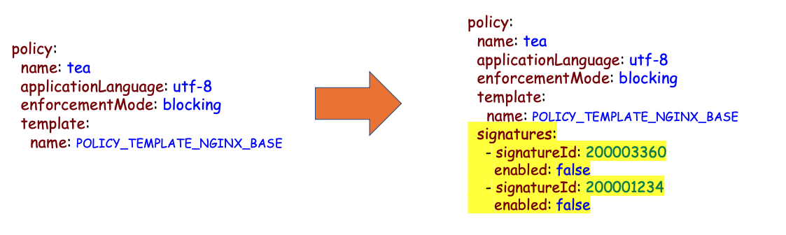

# Building a DevSecOps infrastructure with NGINX Ingress Controller
With more and more application workloads moving into Kubernetes, organizations are looking into moving also their security controls, inlcuding Web Application Firewall (WAF), inside the Kubernetes environment. This would allow them to continue their modernization journey, creating an agile, elastic and distributed infrastructure without compromising security. 
In order to achieve this, organizations are having the SecOps and DevOps teams working closer together, each team maintaining their own goals and responsibilities  

SecOps responsibilities are:
- Identifying the security controls required by the applications.
- Maintaining/Managing the policies that have been applied in production.
- Creating WAF templates based on the selected security controls that the devops teams can consume.

DevOps responsibilities are:
- Consume the security templates as a service.
- Include the security policies as part of their code.
- Maintain the same speed and agility, by integrating the security policies on the CI/CD pipelines.

## Table of Contents 
- [**Required Components**](#required-components)
- [**Demo**](#demo)


## Required Components
In order to build an infrastructure that can accomodate for both SecOps and DevOps, we will need the following:

- Ingress Controller with Web Application Firewall module
- Git repository 
- Observability Platform
- Policy Management Process
- CI/CD tool(s)

<p align="center">
  
</p>


### Ingress Controller with WAF
Ingress Controller (IC) is the gateway to the applications that live inside the Kubernetes platform. Whether it is Ingress, Routes, or custom resources like VirtualServer and VirtualServerRoute, Ingress Controller is most common way to achieve application traffic routing and provide a bridge between Kubernetes services and external ones.
Having a WAF enabled on the Ingress controller layer, is the most effient way to apply the security controls inside Kubernetes   

In our environment we will be using NGINX App Protect WAF module, that can be configured as part of Ingress Resources (with annotations) or as pat of Custom Resources (VirtualServer, VirtualServerRoute). 

<p align="center">
  
</p>


### Git repository
Git should be utilized as the single **source of truth** where the SecOps and DevOps will store their respective code. Git is the most popular and widely used version control system today. It has many benefits like code changes can be easily committed, version branches can be effortlessly compared and merged, and code can also be optimized to perform better. 
Git would enable the DevOps and SecOps team to work better and closer together by:
- Allowing them to track changes in their code, 
- Review, comment and approve with Merge Requests
- Provide an audit log where all assignees and reviewers are indicated. 


### Observabilty platform
Building an observability platform is essential for managing a Web application Firewall solution. The data collected from the Ingress Controller pods can help the SecOps teams determine the threats/risks assosiated with the published applications.
For our demo we deployed Logstash/Elastic/Grafana to build the observability platform for the NGINX App Protect. All the NAP pod instances will send their events/logs to the observability platform so that the SecOps teams can have a single Dashboard that they can monitor all the security events.

<p align="center">
  
</p>

More information regarding NAP Grafana Dashboard can be found on the [**NAP Dashboard**](https://github.com/F5EMEA/oltra/tree/main/use-cases/app-protect/monitoring) lab


### Managing NAP policies
An important part of the WAF policy lifecycle, is managing potential False Positives. Although NAP’s algorithms try to minimize the chance that we would have false positives in our production environments it is always a possibility that the SecOps teams need to be prepared for.
The observability platform plays a critical role on assisting the SecOps teams to identify false positives, by aggregating and visualizating the metrics/events that are collected from the multiple NAP Pods.

To convert a violation into a false positive exception on the NAP configurations, the SecOps teams have to modify the NAP policy with the required YAML key/value pairs. The example below shows how a policy needs to be modified to exclude particular signatures from a policy.

<p align="center">
  
</p>

There are mulitple ways for the NAP policies to be fine-tuned based on the events that have been Blocked/Alarmed. Some of the common ways are:
- **Manual**. SecOps teams can edit manually the JSON/YAML files that are stored on GitLab.
- **Automated**. Tools like Ansible, Puppet, Terraform and many others can provide an automated procedure for the SecOps to make the necessary changes on the YAML policies stored on GitLab
- **Purpose-built**. The other alternative is to develop or use an opensource project that is designed specifically for modifying NAP policies based on the recorded events. 

In this demo we will be using a purpose-built opensource project, NAP-FPM, to modify the policies. Details on this project can be found on the following repository [**NAP Policy Management**](https://github.com/f5devcentral/nap-policy-management).  

This project has a simple UI build on PHP, that retrieves the violation log from Elasticsearch based on the SupportID requested and presents the user the summary of the event
 
<p align="center">
  
</p>

Depending on the violations that were identified on the NAP log, the tool provides the user predefined actions for disabling these violations. For example, as seen on the above picture, `Disable Signature` and `Disable Signature on URL`.

<p align="center">
  
</p>

Once the user confirms the details and the tool is configured to pull the current policy from GitLab, make the required changes on the policy’s YAML file and save it back to GitLab.


### CI/CD tool
Each customer is using different methodologies and potentially different tools to implent their CI/CD pipelines. In our demo, we are mainly interested to reflect any modifications made to the 2 repositories (**devsecops/nap** and **devsecops/apps**) to the Kubernetes environment.
For this task, we will be using Argo CD. Argo CD is implemented as a kubernetes controller which continuously monitors running applications and compares the current, live state against the desired target state (as specified in the Git repo). Any modifications made to the desired target state in the Git repo can be automatically applied and reflected in the target Kubernetes environments.
With Argo CD we can overwrite any configuration drift, manual changes, and/or errors, ensuring that the environment converges on the state as defined in Git.

<p align="center">
  
</p>


## Demo
In order to successfully go through the demo below, we suggest you first complete the following labs that will help you become familiar with the NAP-Dashboard and Argo CD.
- [**NAP Dashboard**](https://github.com/F5EMEA/oltra/tree/main/use-cases/app-protect/monitoring)
- [**Argo CD**](https://github.com/F5EMEA/oltra/tree/main/use-cases/app-protect/argocd)


### Step 1. Manifests stored on GitLab 
In our environment we are using GitLab. The design is fairly straightforward and it is based on two repositories. The first repository will be for the NGINX App Protect resources (APPolicy, APLogConf) where the SecOps team will be resposible for and the second repository will be for the application resources (Deployments, Services, Ingress Rules, Configmaps, etc.) where the DecOps team will be resposible for.
The following two repositories will be used:

- **devsecops/nap** for the NAP resources
- **devsecops/apps** for the Application resources

We will be using VirtualServer CR. The NGINX custom resources (VirtualServer, Policy) along with the application Deployment and Service will be configured on the `apps` namespace while the WAF resources `APPolicy`, `APLogConf` will be configured on the `secops` namespace. The NGINX Policy is able to work with `APPolicy` and `APlogConf` cross-namespaces.

<p align="center">
  
</p>


Currently all Kubernetes manifests have been configured on the 2 repositories. 

Log on to GitLab and review the manifests for both repos. 

<p align="center">
  
</p>


Verify that a GitLab webhook is already configured to notify Argo CD for any changes on the code.  
Go to repository under **Settings** -> **Webhooks** and scroll to the end. You should see a webhook already created for Argo CD (`https://10.1.10.18/api/webhook`)  

<p align="center">
  
</p>

### Step 2. Continuous Deployment with ArgoCD 
First we will deploy the NAP policies to Kubernetes. To do that we will create a new application on Argo CD for the **devsecops/nap** repository.
Find below the information that needs to inserted in the form. 
  
  - Application Name -> **nap-policies**
  - Project -> **default**
  - Sync Policy -> **Automatic**
  - Prune Resources -> **Enabled**
  - Repository URL -> **https://git.f5demo.cloud/devsecops/nap.git**
  - Revision -> **HEAD**
  - Path -> **.**
  - Cluster URL -> **https://kubernetes.default.svc**
  - Namespace  -> **secops**

Press `Create` and wait to see that the Argo CD application being created.

<p align="center">
  
</p>


Then we will deploy the Application manifests. To do that we will create a new application on Argo CD for the **devsecops/apps** repository.
Find below the information that needs to inserted in the form. 
  
  - Application Name -> **apps**
  - Project -> **default**
  - Sync Policy -> **Automatic**
  - Prune Resources -> **Enabled**
  - Repository URL -> **https://git.f5demo.cloud/devsecops/apps.git**
  - Revision -> **HEAD**
  - Path -> **.**
  - Cluster URL -> **https://kubernetes.default.svc**
  - Namespace  -> **apps**

Press `Create` and wait to see that the Argo CD application being created.


### Step 3. Executing Attacks 

Verify that you can succesfully access the application. Go to VSCode and run the following commands

```
curl "http://portal.f5demo.cloud/tea/"
curl "http://portal.f5demo.cloud/coffee/"
curl "http://portal.f5demo.cloud/"

###############################################################
#####################  EXPECTED OUTPUT  #######################
Server address: 10.244.140.109:8080
Server name: <endpoint>-7586895968-r26zn
Date: 12/Sep/2022:14:12:25 +0000
URI: /
Request ID: 0495d6a17797ea9776120d5f4af10c1a
###############################################################
```

Run the following commands to execute some malicious requests towards the website.
```
curl "http://portal.f5demo.cloud/index.php?pass=0%22%20or%201%3D1%20%22%0A"
curl "http://portal.f5demo.cloud/tea/index.php?pass==0'%20or%205=5'"
curl "http://portal.f5demo.cloud/tea/index.php?id=%'%20or%200=0%20union%20select%20null,%20version()%23"
curl "http://portal.f5demo.cloud/index.php?username=<script>"
curl "http://portal.f5demo.cloud/coffee/index.php?id=0;%20ls%20-l"
curl "http://portal.f5demo.cloud/index.php?pass=0%22%20or%201%3D1%20%22%0A"
curl "http://portal.f5demo.cloud/index.php?pass==0'%20or%201=1'"
curl "http://portal.f5demo.cloud/coffee/index.php?id=%'%20or%200=0%20union%20select%20null,%20version()%23"
curl "http://portal.f5demo.cloud/index.php?username=<script>"
curl "http://portal.f5demo.cloud/index.php?id=0;%20ls%20-l"
curl "http://portal.f5demo.cloud/index.php?pass=0%22%20or%201%3D1%20%22%0A"
curl "http://portal.f5demo.cloud/tea/index.php?pass==0'%20or%205=5'"
curl "http://portal.f5demo.cloud/tea/index.php?id=%'%20or%200=0%20union%20select%20null,%20version()%23"
curl "http://portal.f5demo.cloud/index.php?username=<script>"
curl "http://portal.f5demo.cloud/coffee/index.php?id=0;%20ls%20-l"
curl "http://portal.f5demo.cloud/index.php?pass=0%22%20or%201%3D1%20%22%0A"
curl "http://portal.f5demo.cloud/index.php?pass==0'%20or%201=1'"
curl "http://portal.f5demo.cloud/coffee/index.php?id=%'%20or%200=0%20union%20select%20null,%20version()%23"
curl "http://portal.f5demo.cloud/index.php?username=<script>"
curl "http://portal.f5demo.cloud/index.php?id=0;%20ls%20-l"
```

Login to Grafana and review the above violations.

### Step 4. Managing False Positives

Now we will execute some requests that will be blocked by NGINX App Protect but are considered as `False Positives` by the secuirty teams.  The first request is accessing a URL that matches a known signature (phpinfo) and it is consider as `Medium Accuracy` Signature, while the second request is sending a Header name with no header value on a GET request that violates the HTTP Protocol Compliance.


Run the following command.
```
curl "http://portal.f5demo.cloud/phpinfo.php"
```

The expected output is:
```
<html><head><title>Request Rejected</title></head><body>
The requested URL was rejected. Please consult with your administrator.<br><br>
Your support ID is: 4045204596866416688 <br><br>
<a href='javascript:history.back();'>[Go Back]</a></body></html>
```

Assuming this is a `False Positive` we will use the NAP-FPM UI to modify the policy.

Login to the False Positive Management tool (Credentials: **admin/Ingresslab123**). NAP-FPM UI can be found under `docker` on the `Access` drop-down menu.

<p align="center">
  
</p>

Search with the supportID.
<p align="center">
  
</p>

Review the violation Details
<p align="center">
  
</p>

Expand Attack signature details and select `Disable Signature`.
<p align="center">
  
</p>

Enter the Commit message, select the repository and apply the changes. 
<p align="center">
  
</p>

Make sure that you received `Success` message when you apply the changes. 

Log on to GitLab, go to  **devsecops/nap** repository and review the **Portal** NAP policy (`portal.yaml`). Verify that the Signature ***200010015*** has been disabled.

Run again the same transaction and verify that NAP is not blocking this request. 
```
curl "http://portal.f5demo.cloud/phpinfo.php"
```

Repeat the same process but with a different False positive.
```
curl "http://portal.f5demo.cloud/index.php" -H "Header1;"
```

Search with the supportID to find this particular transaction and then select `Disable` on the Violation section.


Once the change has been deployed re-run the transaction and verify that now it is not getting blocked from NAP.
```
curl "http://portal.f5demo.cloud/index.php" -H "Header1;"
```

