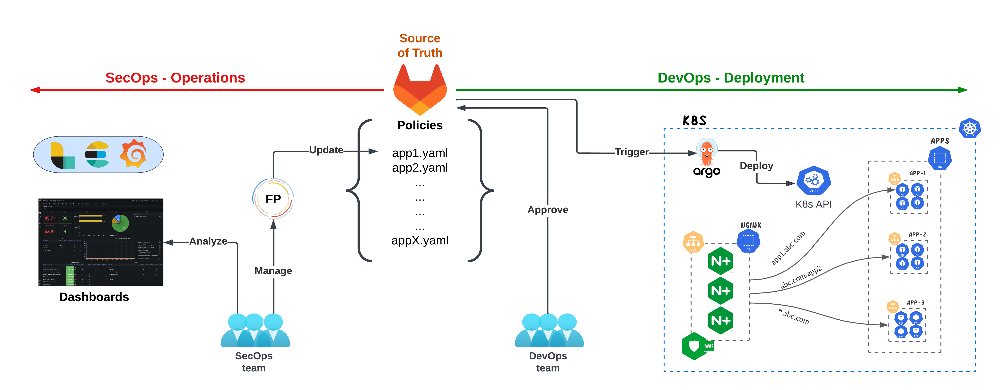
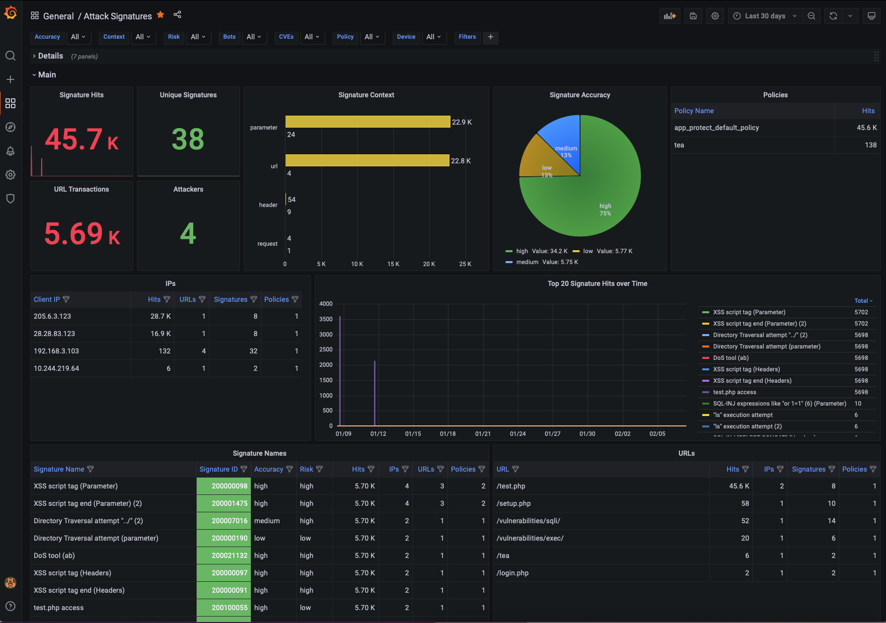
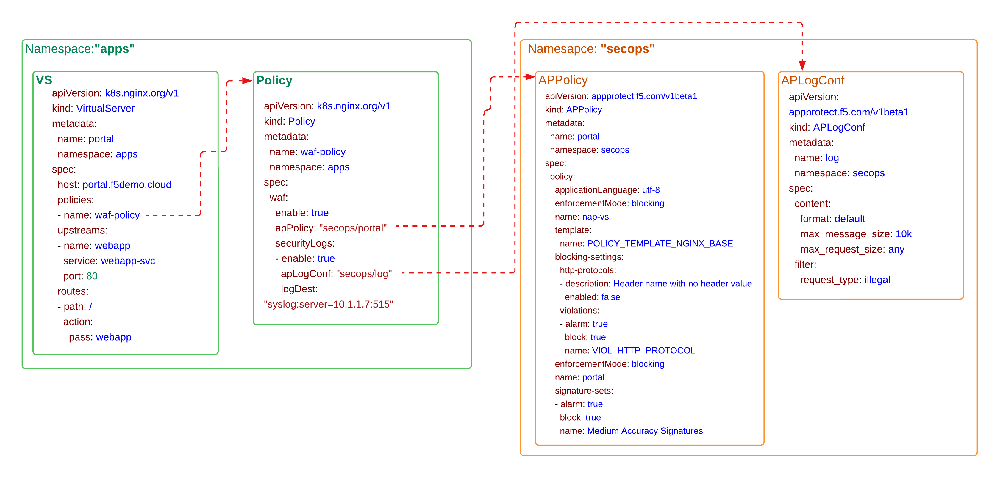

# Building an infrastructure for DevSecOps with NGINX Ingress Controller
With more and more application workloads moving into Kubernetes, creating an agile, flexible, /multi-cloud (cluster) infrastructure, orginizations are looking into moving also the Web Application Firewall (WAF) security controls inside the Kubernetes environment. This would allow them to continue their modernization journey without compromising security. 
What we are seeing as a common practice in Medium/Large orginizations that are adapting this strategy is to have the SecOps and the DevOps teams work closer together, but each team maintains their own goals and responsibilities.  

SecOps responsibilities in terms of the WAF policies are:
- Identifying the security controls required by the applications.
- Creating different secrity templates based on the security controls.
- Maintaining/Managing the policies that have been applied in production.

DevOps responsibilities in terms of the WAF policies are:
- Consume the security templates as a service.
- Include the security policies as part of their code.
- Include the security policies as part of their CI/CD lifecycle.


## What is required?
In order to build an infrastructure that can accomodate for both SecOps and DevOps personas, we will need the following:

- Git repository 
- Observability Platform
- Policy Management Process
- NGINX Ingress Controller with App Protect enabled.
- CI/CD tool(s)

<p align="center">
  
</p>


### Git repository
Git will be utilized as the single **source of truth** where the SecOps and DevOps will store their code. Git will be used as a way to track code/version changes in the code, allow the teams (SecOps & DevOps)  to work together through reviews and comments on Merge Requests and also provide an audit log where all assignees and reviewers are indicated. 

In our environment we are using GitLab. The design is fairly straightforward as we will maintain one repository for the NGINX App Protect resources and a separate repository for each application, that will include resources like Deployments, Services, Ingress Rules, Configmaps, etc.  
For our Demo we will use the following two repositories:

- **devsecops/nap** for the NAP resources
- **devsecops/cafe** for the Application resources

### Monitoring security events
We have deployed Logstash/Elastic/Grafana to build a observability dashboard for the NAP events. All the NGINX App Protect instances will send their events/logs to the observability platform so that the SecOps teams can have a single Dashboard that they can monitor all the security events.

<p align="center">
  
</p>

More information regarding NAP Grafana Dashboard can be found on the [**NAP Dashboard**](https://github.com/F5EMEA/oltra/tree/main/use-cases/app-protect/monitoring) lab

### Managing NAP policies
An important part of the WAF policy lifecycle, is managing potential False Positives (FP). Although NAP’s algorithms try to minimize the chance that we would have false positive in our production environments it is always a possibility that the SecOps teams need to be prepared for.
The Grafana operational Dashboards through its aggregation and visualization provide to the SecOps teams an easy and quick way to identify any false positives.
To convert a violation into a false positive exception on the NAP configurations, the SecOps teams have to modify the NAP policy with the required YAML key/value pairs. The example below shows how a policy needs to be modified to exclude particular signatures from a policy.

<p align="center">
  
</p>

There are mulitple ways that the NAP policies can be fine-tuned based on the events that have been Blocked/Alarmed.
- **Manual**. SecOps teams can edit the JSON/YAML files that are stored on GitLab
- **Automation**. Tools like Ansible, Jenkins and many others can enable the SecOps team to insert the required changes (like disabled a signatureID) into the YAML files stored on GitLab
- **OpenSource**. The other alternative is to develop or use an opensource tool that is designed specifically for modifying NAP policies based on the recorded events. In this demo we will use an Opensource tool, NAP-FPM to modify the policies. Details on this tool can be found on the following repository [**NAP Policy Management**](https://github.com/f5devcentral/nap-policy-management).  


This project has a simple UI build on PHP, that retrieves the violation log from Elasticsearch based on the SupportID requested and presents the user the summary of the event
 
<p align="center">
  
</p>

Depending on the violations that were identified on the violation log, the tool provides the user with the option of executing preconfigured actions, of example `Disable Signature`, `Disable Signature on URL`.
Once the user confirms the details and sends the required information to the application endpoint, that will execute the required changes.

<p align="center">
  
</p>

The application is configured to pull the current policy from GitLab, make the required changes on the policy’s YAML file and save it back to GitLab.

### NGINX Ingress Controller with App Protect enabled.
NGINX App Protect WAF module can be configured on the Custom Resources (VirtualServer, VirtualServerRoute) or on the Ingress-resources. In our example we will be using VirtualServer custom resources. The NGINX custom resources (VirtualServer, Policy) along with the application Deployment and Service will be configured on the `devops` namespace while the WAF resources APPolicy, APLogConf will be configured on the `secops` namespace. The NGINX Policy is able to work with APPolicy and APlogConf cross-namespaces.

<p align="center">
  
</p>


### CI/CD tool
Each customer is using different methodologies and potentially different tools to implent their CI/CD pipelines. In our case, since we are not doing any intergations, testing, approval flows, etc that would require a CI tool, we are using Argo CD for the Continuous Delivery.
Argo CD is implemented as a kubernetes controller which continuously monitors running applications and compares the current, live state against the desired target state (as specified in the Git repo). Any modifications made to the desired target state in the Git repo can be automatically applied and reflected in the target Kubernetes environments.
With Argo CD we can overwrite any configuration drift, manual changes, and/or errors, ensuring that the environment converges on the state as defined in Git.

<p align="center">
  
</p>


## Demo
In order to successfully go through the demo below, we suggest you first complete the following labs that will help you become familiar with the NAP-Dashboard and Argo CD.
- [**NAP Dashboard**](https://github.com/F5EMEA/oltra/tree/main/use-cases/app-protect/monitoring)
- [**Argo CD**](https://github.com/F5EMEA/oltra/tree/main/use-cases/app-protect/argocd)


### Initial Deployment
Currently all Kubernetes manifests have been configured on the 2 repositories. 
- **devsecops/nap**
- **devsecops/cafe**

> You can review the files by logging on to GitLab. 

1. First we will deploy the NAP policies to Kubernetes. To do that we will create a new application on Argo CD for the **devsecops/nap** repository.

  Find below the information that needs to inserted in the form. 
  
  - Application Name -> **nap-policies**
  - Project -> **default**
  - Sync Policy -> **Automatic**
  - Prune Resources -> **Enabled**
  - Repository URL -> **https://git.f5demo.cloud/devsecops/nap.git**
  - Revision -> **HEAD**
  - Path -> **.**
  - Cluster URL -> **https://kubernetes.default.svc**
  - Namespace  -> **secops**

    Press `Create` and wait to see that the Argo CD application being created.

<p align="center">
  
</p>

2. Secondly we will deploy the Application/Ingress manifests to Kubernetes. To do that we will create a new application on Argo CD for the **devsecops/nap** repository.

  Find below the information that needs to inserted in the form. 
  
  - Application Name -> **nap-policies**
  - Project -> **default**
  - Sync Policy -> **Automatic**
  - Prune Resources -> **Enabled**
  - Repository URL -> **https://git.f5demo.cloud/devsecops/cafe.git**
  - Revision -> **HEAD**
  - Path -> **.**
  - Cluster URL -> **https://kubernetes.default.svc**
  - Namespace  -> **devops**

    Press `Create` and wait to see that the Argo CD application being created.

<p align="center">
  
</p>


3. Verify that you can succesfully access the application. Go to VSCode and run the following commands

```
curl "http://cafe.f5demo.cloud/tea/"
curl "http://cafe.f5demo.cloud/coffee/"
curl "http://cafe.f5demo.cloud/"

###############################################################
#####################  EXPECTED OUTPUT  #######################
Server address: 10.244.140.109:8080
Server name: <endpoint>-7586895968-r26zn
Date: 12/Sep/2022:14:12:25 +0000
URI: /
Request ID: 0495d6a17797ea9776120d5f4af10c1a
###############################################################
```


### Running Malicious requests against the application
Run the following commands to execute some malicious requests towards the website.

```
curl "http://cafe.f5demo.cloud/index.php?password=0%22%20or%201%3D1%20%22%0A"
curl "http://cafe.f5demo.cloud/tea/index.php?password==0'%20or%205=5'"
curl "http://cafe.f5demo.cloud/tea/index.php?id=%'%20or%200=0%20union%20select%20null,%20version()%23"
curl "http://cafe.f5demo.cloud/index.php?username=<script>"
curl "http://cafe.f5demo.cloud/coffee/index.php?id=0;%20ls%20-l"
curl "http://cafe.f5demo.cloud/index.php?password=0%22%20or%201%3D1%20%22%0A"
curl "http://cafe.f5demo.cloud/index.php?password==0'%20or%201=1'"
curl "http://cafe.f5demo.cloud/coffee/index.php?id=%'%20or%200=0%20union%20select%20null,%20version()%23"
curl "http://cafe.f5demo.cloud/index.php?username=<script>"
curl "http://cafe.f5demo.cloud/index.php?id=0;%20ls%20-l"
curl "http://cafe.f5demo.cloud/index.php?password=0%22%20or%201%3D1%20%22%0A"
curl "http://cafe.f5demo.cloud/tea/index.php?password==0'%20or%205=5'"
curl "http://cafe.f5demo.cloud/tea/index.php?id=%'%20or%200=0%20union%20select%20null,%20version()%23"
curl "http://cafe.f5demo.cloud/index.php?username=<script>"
curl "http://cafe.f5demo.cloud/coffee/index.php?id=0;%20ls%20-l"
curl "http://cafe.f5demo.cloud/index.php?password=0%22%20or%201%3D1%20%22%0A"
curl "http://cafe.f5demo.cloud/index.php?password==0'%20or%201=1'"
curl "http://cafe.f5demo.cloud/coffee/index.php?id=%'%20or%200=0%20union%20select%20null,%20version()%23"
curl "http://cafe.f5demo.cloud/index.php?username=<script>"
curl "http://cafe.f5demo.cloud/index.php?id=0;%20ls%20-l"
```

Login to Grafana and review the above violations.

### Managing False Positives

We will execute some requests that will appear as a `False Positives` to NGINX App Protect. 

The first request is accessing a URL that matches a known signature (phpinfo) and it is consider as `Medium Accuracy` Signature, while the second request is sending a Header name with no header value on a GET request that violates the HTTP Protocol Compliance.


Run the following command.
```
curl "http://cafe.f5demo.cloud/phpinfo.php"
```

The expected output is:
```
<html><head><title>Request Rejected</title></head><body>
The requested URL was rejected. Please consult with your administrator.<br><br>
Your support ID is: 4045204596866416688<br><br>
<a href='javascript:history.back();'>[Go Back]</a></body></html>
```

Assuming this is a `False Positive` we will use the NAP-FPM tool to modify the policy.

To access the tooll.....

Login to the False Positive Management tool (Credentials: **admin/Ingresslab123**)....

<p align="center">
  
</p>

Search with the supportID.
<p align="center">
  
</p>

Review the violation Details
<p align="center">
  
</p>


Expand Attack signature details and select `Disable Signature`.
<p align="center">
  
</p>

Enter the Commit message, select the repository and apply the changes. 
<p align="center">
  
</p>

Make sure that you received `Success` message.

Then open GitLab go to  **devsecops/nap** repository. Open `cocoa.yml` and review the **Cocoa** NAP policy.
Verify that the Signature 123123123 has been disabled.
<p align="center">
  
</p>

Run again the malicious payload and verify that NAP is not blocking this request. 


Repeat the same process but with a different False positive.
```
curl "http://cafe.f5demo.cloud/index.php" -H "Header1:"
```

Search with the supportID to find this particular transaction and then select `Disable` on the Violation section.
<p align="center">
  
</p>

Once the change has been deployed re-run the transaction and verify that now it is not getting blocked from NAP.

```
curl "http://cafe.f5demo.cloud/index.php" -H "Header1:"
```

