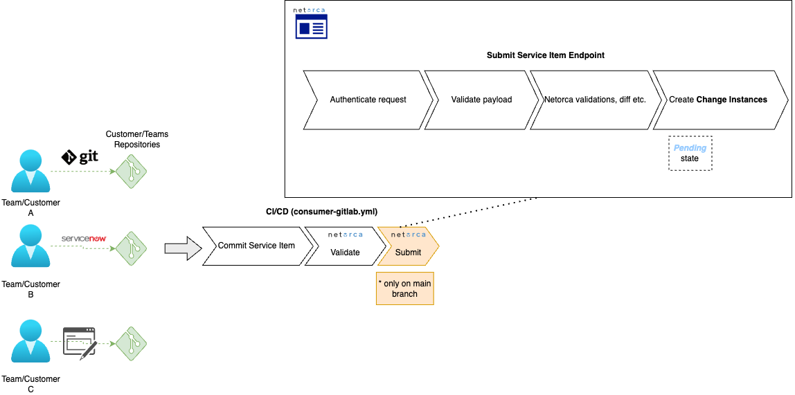
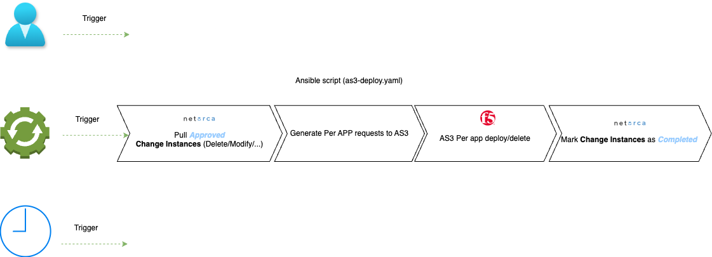

# Automating BIG-IP with Per-App AS3 Deployment using Netorca
This use-case presents aletrnative way of automating BIG-IP with Per-App AS3 Deployment using netorca and ansible.


## Table of Contents 
- [**Technologies used**](#technologies-used)
- [**Configuration files (YAML)**](#configuration-files-yaml)
- [**Consumer repositories and pipeline**](#consumer-repositories-and-pipeline)
- [**Service Owner repositories and pipeline**](#service-owner-repositories-and-pipeline)
- [**Service Item deployment**](#service-item-deployment)
- [**Demo**](#demo)


### Technologies used
- **AS3.** AS3 furnishes a declarative interface, enabling the management of application-specific configurations on a BIG-IP system. By providing a JSON declaration rather than a series of imperative commands, AS3 ensures precise configuration orchestration. We utilize the latest Per-App AS3 feature to optimize configuration granularity.
- **YAML.** YAML serves as a lightweight, human-readable data serialization format, ideal for expressing structured data in an intuitive manner. Its simplicity and readability make it well-suited for defining the intended configurations of our customers' services.
- **Jinja2.** Jinja2 empowers us with a fast, expressive templating engine, streamlining the AS3 configuration process. By crafting templates for AS3 configuration files, we can effortlessly generate configurations by supplying the requisite data from the YAML files created by our customers.
- **JSON Schema** While JSON is probably the most popular format for exchanging data, JSON Schema is the vocabulary that enables JSON data consistency, validity, and interoperability at scale. In Netorca we use JSON Schema format to describe Services.  
- **Git.** Git serves as the backbone of our GitOps approach, acting as the repository for storing desired configurations. It not only serves as the source of truth for AS3 configurations but also provides an audit trail and history of all changes made throughout the application lifecycle. In this use-case, organizations maintain separate Git repositories for different aspects of the automation workflow:
  - ***Customer repositories***: Customers have their dedicated repositories for creating and managing YAML configuration files. Each customer owns a separate repository with CI/CD plugged in to validate and submit Service Instances to Netorca.  
  - ***Serivice Owner repositories***: Service owners use repositories to track changes in services offered to customers within organisation. 
  CI/CD uses SDK to validate and submit Services to Netorca instance.  
- **Ansible**  Ansible plays a crucial role in automating the tasks and processes required to manage F5 BIG-IP configurations and other components within the GitOps workflow. This use case shows scenario that leverages Netorca to find and handle changes in service instances deployed on BIG-IP.   
- **CI/CD.** A Continuous Integration and Continuous Deployment (CI/CD) tool is pivotal in automating the identification of changes in YAML configuration files, conversion of YAML configurations into AS3 declarations using Jinja2 templates, and subsequent deployment of changes to the BIG-IP repositories. Additionally, CI/CD orchestrates the deployment of AS3 declarations to BIG-IP and other automation workflows, ensuring a seamless and efficient process.
- **Netorca** NetOrca enables organisations to define and consume all of their Services in code, whether your organisation is just beginning it's automation journey or is already utilising it extensively. SDK allows easy

By combining these components into a cohesive automation framework, organizations can achieve greater agility, scalability, and reliability in managing their F5 BIG-IP deployments. This approach empowers teams to focus on innovation and value delivery, while automation handles the repetitive and error-prone tasks associated with infrastructure configuration and deployment.


### Configuration files (YAML)
To enhance usability, users only need to define the parameters of the service they intend to publish and save them in a YAML file format. YAML was selected for its user-friendly interface, which is both intuitive and familiar to DevOps practitioners. Alternatively, customers may opt to utilize a ServiceNow ticket or a web form, enabling their users to input the required information seamlessly. 


### Service Owner repositories and pipeline
Each `Service Owner` creates their configuration files in `JSON` format on their repository - in `config` folder.

When a new file is added, modified, or deleted, the pipeline is triggered, proceeding through the following stages:
  - **Validation**: Here, the pipeline verifies the correctness of the committed configurations a Netorca validates given `JSON`. We use https://json-schema.org/ format to ensure data consitency and validity.
  SDK returns human readable errors and it allows you to fix `Service` definitions before merging to `main` branch.   
  - **Submission**: In this final stage, the pipeline pushes the file to `Netorca` and creates new `Service` based on provided `JSON` file.
  

Example file:
```{
    "$schema": "http://json-schema.org/draft-07/schema#",
    "type": "object",
    "$id": "https://example.com/service.schema.json",
    "title": "as3-lb",
    "description": "New load balancer on as3",
    "metadata": {},
    "properties": {
      "name": {
        "type": "string",
        "description": "Name of the application/service."
      },
      "vip": {
        "type": "string",
        "description": "Virtual IP address for the service.",
        "pattern": "^([0-9]{1,3}\\.){3}[0-9]{1,3}$"
      },
      "port": {
        "type": "integer",
        "description": "Virtual port for the service.",
        "minimum": 1,
        "maximum": 65535
      },
      "partition": {
        "type": "string",
        "description": "Partition name for WAF policy (if applicable).",
        "default": "default"
      },
      "waf": {
        "type": "boolean",
        "description": "Boolean indicating whether WAF (Web Application Firewall) is enabled."
      },
      "pool-name": {
        "type": "string",
        "description": "Name of the pool associated with the service.",
        "pattern": "^pool-.*$"
      },
      "monitor": {
        "type": "string",
        "description": "Type of monitor for the pool (optional).",
        "enum": ["http", "https", "tcp", "udp"]
      },
      "members": {
        "type": "array",
        "description": "List of members (servers) in the pool.",
        "items": {
          "type": "object",
          "properties": {
            "port": {
              "type": "integer",
              "description": "Port number of the member.",
              "minimum": 1,
              "maximum": 65535
            },
            "ip": {
              "type": "string",
              "description": "IP address of the member.",
              "pattern": "^([0-9]{1,3}\\.){3}[0-9]{1,3}$"
            },
            "ratio": {
              "type": "integer",
              "description": "Ratio for load balancing (optional).",
              "minimum": 1
            },
            "connectionlimit": {
              "type": "integer",
              "description": "Connection limit for the member (optional).",
              "minimum": 1
            }
          },
          "required": ["port", "ip"]
        }
      }
    },
    "required": ["name", "vip", "port", "waf", "pool-name", "members"]
  }
```
  - **AS3 Pipeline**. The purpose of the this pipeline, is to identify the new AS3 declarations and push them down to the corresponding BIGIP. The pipeline is split in 3 stages
    - **Changes Detection**: This initial stage identifies AS3 declarations that have been added, modified, or deleted. The filenames are recorded for subsequent processing in later stages.
    - **Update**: In the final stage, the pipeline adds or removes the AS3 declarations from the respective BIG-IP devices, ensuring consistent configuration across the infrastructure.
 
<p align="center">
  
</p>

`Service Owner` pipeline for validation and submission to `Netorca`:

```
stages:
  - validate
  - submit

image: python:3.10-buster
before_script:
  - pip install -q --upgrade pip
  - pip install -q netorca-sdk

validate:
  stage: validate
  variables:
    NETORCA_VALIDATE_ONLY: "True"
  script:
    - wget -q 'https://netautomate.gitlab.io/netorca_tools/cicd/latest/serviceowner_submission.py'
    - python serviceowner_submission.py
  rules:
    - if: $CI_COMMIT_BRANCH != $CI_DEFAULT_BRANCH

submit:
  stage: submit
  variables:
    NETORCA_VALIDATE_ONLY: "False"
  script:
    - wget -q 'https://netautomate.gitlab.io/netorca_tools/cicd/latest/serviceowner_submission.py'
    - python serviceowner_submission.py
  rules:
    - if: $CI_COMMIT_BRANCH == $CI_DEFAULT_BRANCH

include:
  - template: 'Workflows/MergeRequest-Pipelines.gitlab-ci.yml'

```


### Consumer repositories and pipeline
Each `Consumer` creates their configuration files in YAML format on their repository - in `config` folder.

When a new file is added, modified, or deleted, the pipeline is triggered, proceeding through the following stages:

  - **Validation**: Here, the pipeline verifies the correctness of the committed configurations and validates the values for accuracy and integrity. Netorca validates given `yaml` based on available `Service` definitions.  
  - **Submission**: In this final stage, the pipeline pushes the file to `Netorca` and creates new `Service Item` based on provided yaml file.
  
<p align="center">
  
</p>

`Consumer` pipeline for validation and submission to `Netorca`:

```
stages:
  - validate
  - submit

image: python:3.10-buster
before_script:
  - pip install -q --upgrade pip
  - pip install -q netorca-sdk

validate:
  stage: validate
  variables:
    NETORCA_VALIDATE_ONLY: "True"
  script:
    - wget -q 'https://netautomate.gitlab.io/netorca_tools/cicd/latest/consumer_submission.py'
    - python consumer_submission.py
  rules:
    - if: $CI_COMMIT_BRANCH != $CI_DEFAULT_BRANCH

submit:
  stage: submit
  variables:
    NETORCA_VALIDATE_ONLY: "False"
  script:
    - wget -q 'https://netautomate.gitlab.io/netorca_tools/cicd/latest/consumer_submission.py'
    - python consumer_submission.py
  rules:
    - if: $CI_COMMIT_BRANCH == $CI_DEFAULT_BRANCH

include:
  - template: 'Workflows/MergeRequest-Pipelines.gitlab-ci.yml'

```


### Service Item Deployment
Service item deployment is based on `Change Instances` declarations saved in `Netorca`.  
Every time `Consumer` makes a change to `Service Item` a new `Change Instance` is created with `declaration` field that stores `Service Instance details`.  


<p align="center">
  
</p>


### WAF Repository
The WAF repository functions as the storage location for declarative WAF policies. After an AS3 declaration is created on BIG-IP, BIG-IP retrieves the WAF policy from this repository. To ensure efficient operation, we have enabled the "ignoreChanges": true flag on the AS3 policies. This setting ensures that the WAF policy is only pulled once, and subsequent changes to the AS3 declaration will not trigger a re-download of the WAF policy.

In this use-case, the WAF repository does not feature any pipelines for updating the WAF policies. Instead, we anticipate that the SecOps team will utilize the BIG-IP UI to manage the WAF policies directly. For customers seeking to manage WAF policies in a DevSecOps manner, we recommend reviewing the following [**use-case**](https://github.com/f5emea/oltra/use-cases/devsecops/bigip), which enhances this use-case with DevSecOps practices.


## Demo
In order to successfully go through the demo below you will need to go through the following 7 steps:


## Netorca

### Step 1. Setup Netorca
- Get your Netorca instance up and running Docs:[link-to-netorca-setup]
- Login as `lb_team` `Service Owner` account to obtain key required for `Netorca` repo setup.  
- Login as `alpha` `Consumer` account to obtain key required for `Netorca` repo setup.


### Step 2. Create repositories
- Create `lb_team` `Service Owner` repository.  Add `config` folder with configuration. Example `config.json`: 
```
{
  "netorca_global": {"base_url": "https://api-oltrademo.demo.netorca.io/v1"}
}
```  
- Create `alpha` `Consumer` repository.  Add `config` folder with configuration. 
Example `config.yaml`: 
```
netorca_global:
  base_url: https://api-oltrademo.demo.netorca.io/v1
  metadata:
    team_name: alpha
```
- For each repo use pipeline example provided above in `Consumer/Service Owner repository and pipeline` sections.  
- By default our pipeline uses `NETORCA_API_KEY` variable for each repository.  Set it as `CI/CD` variable in your project.  
You can obtain it in netorca interface (`Teams->API Keys`).  


### Step 3. Create the JSON file that represents provisioned Service

We will create a new file on the `lb_team` repository called **`as3-lb.yaml`** and the file will contain the following configuration

```yaml
{
    "$schema": "http://json-schema.org/draft-07/schema#",
    "type": "object",
    "$id": "https://example.com/service.schema.json",
    "title": "as3-lb",
    "description": "New load balancer on as3",
    "metadata": {},
    "properties": {
      "name": {
        "type": "string",
        "description": "Name of the application/service."
      },
      "vip": {
        "type": "string",
        "description": "Virtual IP address for the service.",
        "pattern": "^([0-9]{1,3}\\.){3}[0-9]{1,3}$"
      },
      "port": {
        "type": "integer",
        "description": "Virtual port for the service.",
        "minimum": 1,
        "maximum": 65535
      },
      "partition": {
        "type": "string",
        "description": "Partition name for WAF policy (if applicable).",
        "default": "default"
      },
      "waf": {
        "type": "boolean",
        "description": "Boolean indicating whether WAF (Web Application Firewall) is enabled."
      },
      "pool-name": {
        "type": "string",
        "description": "Name of the pool associated with the service.",
        "pattern": "^pool-.*$"
      },
      "monitor": {
        "type": "string",
        "description": "Type of monitor for the pool (optional).",
        "enum": ["http", "https", "tcp", "udp"]
      },
      "members": {
        "type": "array",
        "description": "List of members (servers) in the pool.",
        "items": {
          "type": "object",
          "properties": {
            "port": {
              "type": "integer",
              "description": "Port number of the member.",
              "minimum": 1,
              "maximum": 65535
            },
            "ip": {
              "type": "string",
              "description": "IP address of the member.",
              "pattern": "^([0-9]{1,3}\\.){3}[0-9]{1,3}$"
            },
            "ratio": {
              "type": "integer",
              "description": "Ratio for load balancing (optional).",
              "minimum": 1
            },
            "connectionlimit": {
              "type": "integer",
              "description": "Connection limit for the member (optional).",
              "minimum": 1
            }
          },
          "required": ["port", "ip"]
        }
      }
    },
    "required": ["name", "vip", "port", "waf", "pool-name", "members"]
  }
```
Create new PR request and Merge it to `main` branch.  


### Step 4. (Optional) Log in to Netorca UI as service owner
To validate that process went well you can login as service owner and check `Services` list in UI.  


### Step 5. Create the YAML file that represents Service instance
We will create a new file on the `alpha` consumer repository called **`app02-lb.yaml`** and the file will contain the following configuration:

```
app02:
  metadata:
    budget_code: 67890
  services:
    as3-lb:
      - name: app02_lb
        vip: 10.1.4.53
        port: 443
        waf: false
        members:
          - ip: 10.10.10.13
            port: 443
            ratio: 5
            connectionlimit: 200
          - ip: 10.10.10.14
            port: 443
            ratio: 10
            connectionlimit: 100
        monitor: https
        partition: default
        pool-name: pool-app02
```

### Step 6. Review Change instances  
`Netorca` allows service owners to have control over changes in `Consumer` `Service Instances`.  As `Service Owner` you can review and `reject/approve` any change instance or automatically `approve` all `change instances`.  


### Step 7. Run Service item deployment
In `Netorca` we encourage the creation of well defined Services within your organisation. We allow teams to build a Service Catalogue that is immediately ready to consume.  Deployment of the service is within responisbility of the `Service Owner`.  
We strongly encourage to use `ansible` with official [ansible-netorca module](https://galaxy.ansible.com/ui/repo/published/netautomate/netorca/).
Example of [netorca_ansible example](./ansible/netorca_example/deployment-tasks-netorca.yaml).  
In this script we use `netorca_ansible` module to pull latest `deployed_item` list, build AS3 declarations and generate requests using Jinja Templates.  
This ansible module is easy to integrate into existing `CI/CD` pipeline within organisation. 


