# Automating BIG-IP with Per-App AS3 and GitOps
This use-case presents a comprehensive approach to automate the management of F5 BIG-IP using Per-App AS3 and GitOps principles. By adopting this automation workflow, organizations can significantly enhance their operational efficiency, ensure consistency in configuration management, and bolster the reliability of their F5 BIG-IP deployments. Furthermore, the integration of Git repositories and CI/CD pipelines facilitates seamless collaboration between stakeholders, streamlines the deployment process, and minimizes the risk of configuration errors.

<p align="center">
  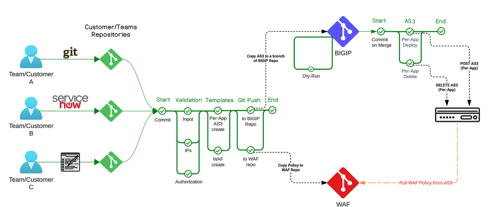
</p>

> Note: The picture outlines the  process flow, from the users creating their YAML specifications to the AS3 code getting applied on BIGIP devices.


## Table of Contents 
- [**Technologies used**](#technologies-used)
- [**Configuration files (YAML)**](#configuration-files-yaml)
- [**Per-App AS3**](#per-app-as3)
- [**Converting YAML to AS3 and WAF policies**](#converting-yaml-to-as3-and-waf-policies)
- [**GIT and Pipelines**](#git-and-pipelines)
  - [**User Repositories and pipeline**](#user-repositories-and-pipeline)
  - [**BIGIP Repositories and pipeline**](#bigip-repositories-and-pipeline)
  - [**WAF Repository**](#waf-repository)
- [**Demo**](#demo)


### Technologies used
To establish a GitOps environment for automation, we leverage a suite of technologies tailored to facilitate seamless configuration management and deployment. These technologies include:

- **AS3.** AS3 furnishes a declarative interface, enabling the management of application-specific configurations on a BIG-IP system. By providing a JSON declaration rather than a series of imperative commands, AS3 ensures precise configuration orchestration. We utilize the latest Per-App AS3 feature to optimize configuration granularity.

- **YAML.** YAML serves as a lightweight, human-readable data serialization format, ideal for expressing structured data in an intuitive manner. Its simplicity and readability make it well-suited for defining the intended configurations of our customers' services.

- **Jinja2.** Jinja2 empowers us with a fast, expressive templating engine, streamlining the AS3 configuration process. By crafting templates for AS3 configuration files, we can effortlessly generate configurations by supplying the requisite data from the YAML files created by our customers.

- **Git.** Git serves as the backbone of our GitOps approach, acting as the repository for storing desired configurations. It not only serves as the source of truth for AS3 configurations but also provides an audit trail and history of all changes made throughout the application lifecycle. In this use-case, organizations maintain separate Git repositories for different aspects of the automation workflow:
  - ***Customer repositories***: Customers have their dedicated repositories for creating and managing YAML configuration files. This segregation ensures security and isolation of customer configurations.
  - ***BIGIP repositories***: These repositories house AS3 declaration files generated from YAML specifications. They serve as the source of truth for F5 BIG-IP configurations and facilitates version-controlled management.
  - ***WAF policies repository*** (optional): If WAF functionality is required, organizations can maintain a separate repository for storing WAF policies. This separation allows for independent management of security policies by dedicated security operations (DevSecOps) teams.

- **CI/CD.** A Continuous Integration and Continuous Deployment (CI/CD) tool is pivotal in automating the identification of changes in YAML configuration files, conversion of YAML configurations into AS3 declarations using Jinja2 templates, and subsequent deployment of changes to the BIG-IP repositories. Additionally, CI/CD orchestrates the deployment of AS3 declarations to BIG-IP and other automation workflows, ensuring a seamless and efficient process.

By combining these components into a cohesive automation framework, organizations can achieve greater agility, scalability, and reliability in managing their F5 BIG-IP deployments. This approach empowers teams to focus on innovation and value delivery, while automation handles the repetitive and error-prone tasks associated with infrastructure configuration and deployment.

## Putting it all together

### Configuration files (YAML)
To enhance usability, users only need to define the parameters of the service they intend to publish and save them in a YAML file format. YAML was selected for its user-friendly interface, which is both intuitive and familiar to DevOps practitioners. Alternatively, customers may opt to utilize a ServiceNow ticket or a web form, enabling their users to input the required information seamlessly. An example of the YAML parameters is shown below 

```yml
# Filename app01.yaml
---
name: app01
fqdn: app01.test.com
vip: 10.1.4.52
port: 80
template: http    #<------ this refers to the JINJA2 Template that we will be using.
waf: true
members:
  - ip: 10.10.10.11
    port: 80
  - ip: 10.10.10.12
    port: 80
```

### Per-App AS3
BIG-IP AS3 3.47 introduces a feature for a per-application deployment model, which enables AS3 declarations to include only some tenant applications, leaving other applications in a tenant unaltered. This can greatly simplify updating the BIG-IP AS3 configuration (especially when the initial declaration is very large with many applications), and ease automated deployments.

In previous releases, BIG-IP AS3 only supported a tenant-based model. This meant all applications had to be included in the tenant; if you posted a declaration that did not include existing applications in that tenant, AS3 deleted them. With the per-application deployment model, you send a request to a new endpoint, which includes the tenant as a part of the URI. This allows you post a declaration that contains only one or more applications, and AS3 leaves the other applications in the tenant untouched.

A per-application declaration is similar to a traditional declaration, but there is no Tenant class and the per-application declaration uses a different AS3 endpoint. The per-application declaration allows all CRUD operations to a specific tenant and application in the URI path without specifying the tenant in the declaration. The following is an example per-application declaration (note the lack of the Tenant class).

```json
{
    "Application1": {
        "class": "Application",
        "service": {
            "class": "Service_HTTP",
            "virtualAddresses": [
                "192.0.2.1"
            ],
            "pool": "pool"
        },
        "pool": {
            "class": "Pool",
            "members": [
                {
                    "servicePort": 80,
                    "serverAddresses": [
                        "192.0.2.10",
                        "192.0.2.20"
                    ]
                }
            ]
        }
    }
}
```

More information regarding Per-App AS3 can be found on the following <a href="https://clouddocs.f5.com/products/extensions/f5-appsvcs-extension/latest/userguide/per-app-declarations.html">link</a>.

### Converting YAML to AS3 and WAF policies
To streamline the conversion of YAML to AS3 JSON, we leverage JINJA2 templates. These templates dynamically incorporate input from YAML file(s) as variables, facilitating the generation of the final AS3 JSON format. The resulting AS3 configurations are being stored in the BIG-IP repository. This seamless integration occurs within the CI/CD pipeline framework and is orchestrated through an Ansible playbook for efficiency

<p align="center">
  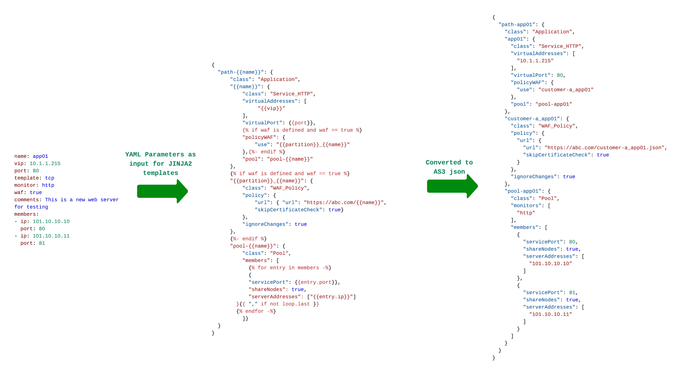
</p>

Below you can find the ansible playbook that we are using to achieve the transformation
```yml
- name: Create AS3 configurations
  hosts: localhost
  gather_facts: no

  tasks:
    - name: Create per-App AS3 config
      ansible.builtin.template:
        src: templates/http.j2
        dest: temp_as3

    - name: Pretty Print AS3
      shell: jq . temp_as3 > as3/{{name}}.json

```


### GIT and Pipelines
In section we will go in to details on how each repository is used and what pipelines have been configured. The following picture shows the dependencies between the files saved in each repository.

<p align="center">
  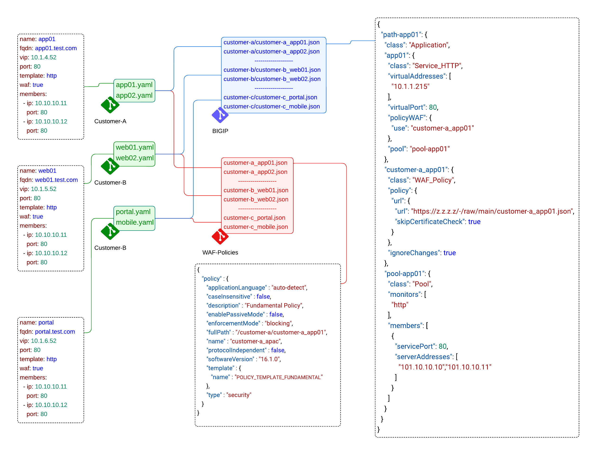
</p>


### User Repositories and pipeline
Each customer creates their configuration files in YAML format on their repository. When a new file isadded, modified, or deleted, the pipeline is triggered, proceeding through the following stages:

  - **Changes Detection**: This initial stage identifies YAML files that have been added, modified, or deleted. The filenames are recorded for subsequent processing in later stages.   
  - **Validation**: Here, the pipeline verifies the correctness of the committed configurations and validates the values for accuracy and integrity. In our example, we make sure that the name of the application matches the name of the file, excluding the extension that should be either ".yaml" or ".yml"
  - **Template Conversion**: This pivotal stage utilizes JINJA2 templates to translate the YAML files into corresponding AS3 declarations and WAF policies. The resultant output is stored in two distinct directories, namely AS3 and WAF, and passed on to the next stage as an artifact.
  - **Update**: In this final stage, the pipeline pushes the files residing in the AS3 and WAF directories to the respective repositories dedicated to BIG-IP and WAF policies. This ensures seamless integration of the generated configurations with the infrastructure.
  
<p align="center">
  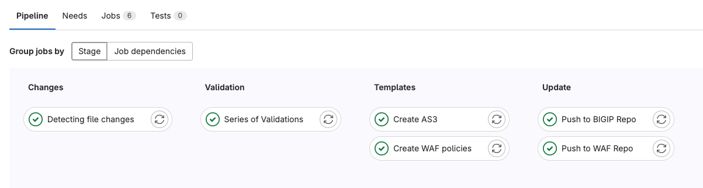
</p>

The pipeline configuration for the user repos can be found on the following [file](https://github.com/f5emea/oltra/use-cases/automation/bigip/pipelines/user-pipeline.yml)


### BIGIP Repositories and pipeline
The BIG-IP repositories serve as repositories for AS3 declaration files generated from YAML specifications. They act as the definitive source of truth for configuring each F5 BIG-IP pair and facilitate version-controlled management. While our example employs a single BIG-IP, the use-case can be adapted to utilize either one repository per BIG-IP or one branch per BIG-IP.

Changes to the BIG-IP repositories are exclusively propagated from the upstream (customer) repositories. When a modification occurs in a customer repository, the "user-pipeline" converts the YAML specification into AS3 and stores the new configuration in a dedicated branch on the BIG-IP repository.

Within the BIG-IP repository, we've implemented two pipelines:

  - **Merge Pipeline**. his pipeline is designed to prevent the merging of code that could potentially fail upon deployment to BIG-IP. Therefore, the pipeline must succeed before allowing administrators to merge the branch to the main branch. To mitigate the risk of failures in AS3 configurations, the pipeline executes a "dry-run" against the BIG-IP (or a UAT environment) to ensure that the final pipeline will consistently succeed post-merger. 
    > Note: Per-App dry-run configuration has been removed as a bug was identified. Once it is fixed, we will include the "dry-run" configuration.

  - **AS3 Pipeline**. The purpose of the this pipeline, is to identify the new AS3 declarations and push them down to the corresponding BIGIP. The pipeline is split in 3 stages
    - **Changes Detection**: This initial stage identifies AS3 declarations that have been added, modified, or deleted. The filenames are recorded for subsequent processing in later stages.
    - **Update**: In the final stage, the pipeline adds or removes the AS3 declarations from the respective BIG-IP devices, ensuring consistent configuration across the infrastructure.
 
<p align="center">
  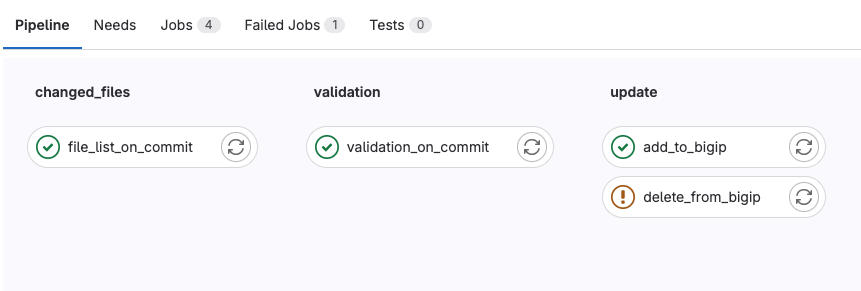
</p>

The pipeline configuration for the bigip repos can be found on the following [file](https://github.com/f5emea/oltra/use-cases/automation/bigip/pipelines/bigip-pipeline.yml)


### WAF Repository
The WAF repository functions as the storage location for declarative WAF policies. After an AS3 declaration is created on BIG-IP, BIG-IP retrieves the WAF policy from this repository. To ensure efficient operation, we have enabled the "ignoreChanges": true flag on the AS3 policies. This setting ensures that the WAF policy is only pulled once, and subsequent changes to the AS3 declaration will not trigger a re-download of the WAF policy.

In this use-case, the WAF repository does not feature any pipelines for updating the WAF policies. Instead, we anticipate that the SecOps team will utilize the BIG-IP UI to manage the WAF policies directly. For customers seeking to manage WAF policies in a DevSecOps manner, we recommend reviewing the following use-case, which enhances this use-case with DevSecOps practices.


## Demo
In order to successfully go through the demo below you will need to go through the following simple steps
  1. Review the repositories on Group `bigip`.
  2. Create a YAML file with the required key value pairs.
  3. Review the pipeline stages on `customer-a` repository
  4. Review the WAF repository
  5. Review the Merge Request (MR) on `prod` repository.
  6. Approve the MR and review the pipeline stages on `prod` repository.
  7. Log on to BIGIP to check the Virtual Server and WAF policy deployed.


### Step 1. Review the repositories
In our environment we are using GitLab. The design is fairly straightforward and it is based on 5 repositories. 
- `customer-A` and `customer-B` are the two repos that are used to save the highlevel VirtualServer configuraiton in a YAML format.
- `waf_policies` is the repo that holds the AWAF policies that will be created through AS3
- `prod` is the repository that holds all the AS3 JSON files that serve as the source of truth for the BIG-IP.
- `automation_files` is the repo that holds all the pipelines, Ansible playbooks and JINJA2 templates

For this step you need to log on to GitLab and go through the 5 repositories

<p align="center">
  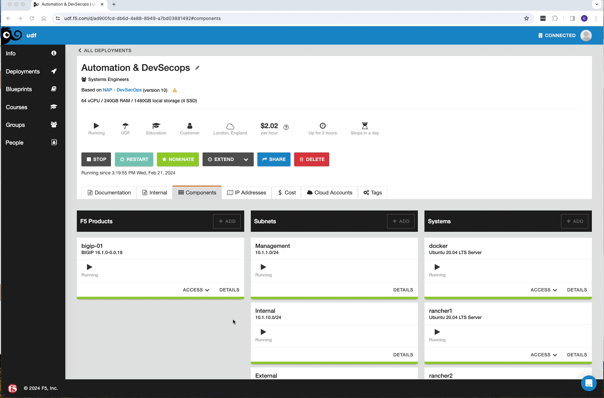
</p>

### Step 2. Create the YAML file with the required key value pairs

We will create a new file on the `customer-a` repository called **`app01.yaml`** and the file will contain the following configuration

<p align="center">
  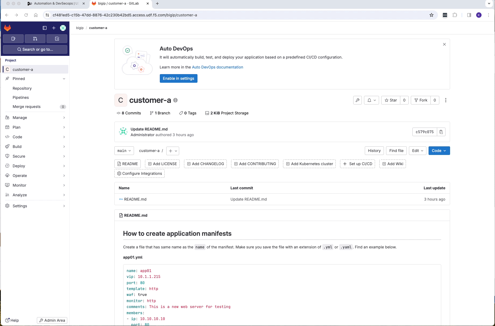
</p>


Click on add new file and copy&paste the following configuration

```yaml
name: app01
vip: 10.1.1.215
port: 80
template: http
waf: true
monitor: http
comments: This is a new web server for testing
members:
- ip: 10.10.10.10
  port: 80
- ip: 10.10.10.11
  port: 80
```


### Step 3. Review the pipeline stages on `customer-a` repository

Select "Pipelines" on the left side of the GitLab page and review the pipeline that was just executed from your latest commit


Log on to GitLab and review the manifests for both repos. 

<p align="center">
  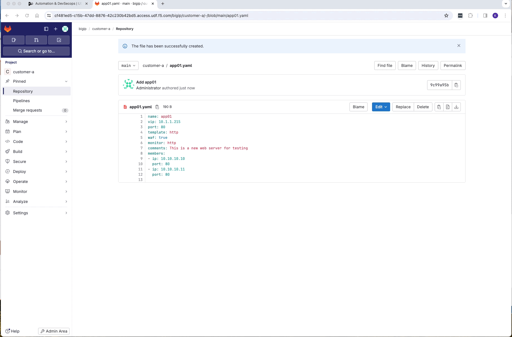
</p>


### Step 4. Review the WAF repository
Once the pipeline completes successfully go to the `waf` repository and review the AWAF declarative policy that has just been created. 

<p align="center">
  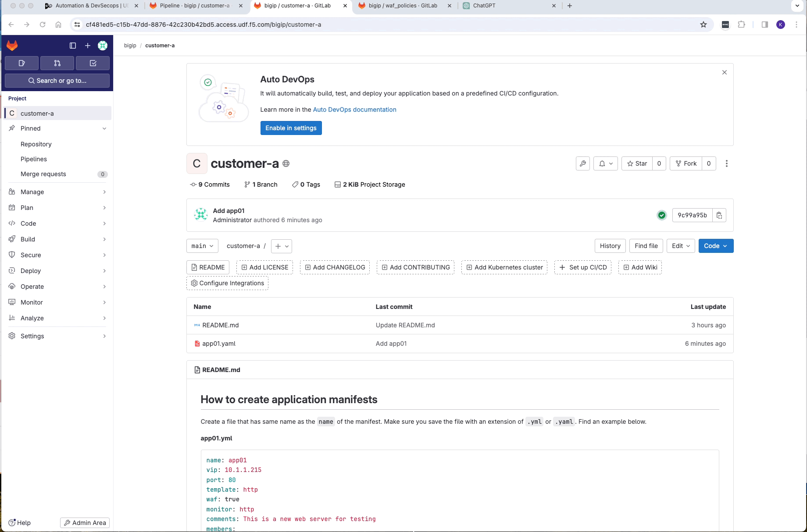
</p>


### Step 4. Review the WAF repository
Once the pipeline completes successfully go to the `waf` repository and review the AWAF declarative policy that has just been created. 

<p align="center">
  
</p>


### Step 5. Review the merge request on `prod` repository.
Go to the `Merge Request` on the `prod` repository and check what has changed on the repository and the details of the MR. Was the MR pipeline successful, what was added/modified/removed? 

<p align="center">
  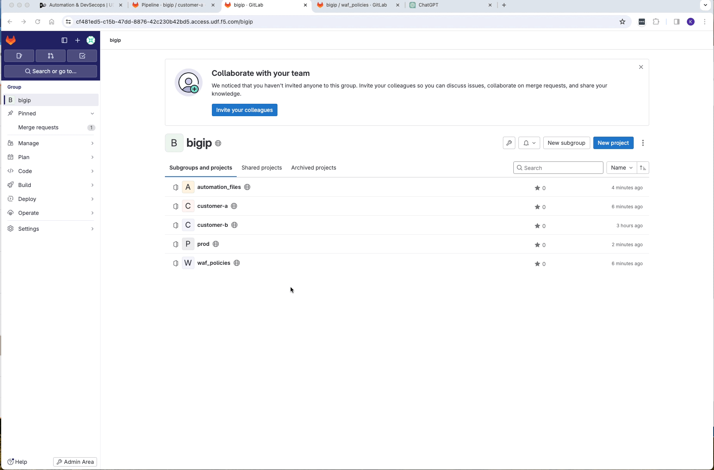
</p>

### Step 6. Approve the MR and review the pipeline stages on `prod` repository.
Once you have a complete understand of what are the proposed changes of the MR, approve it and go to the pipeline to review the details.

<p align="center">
  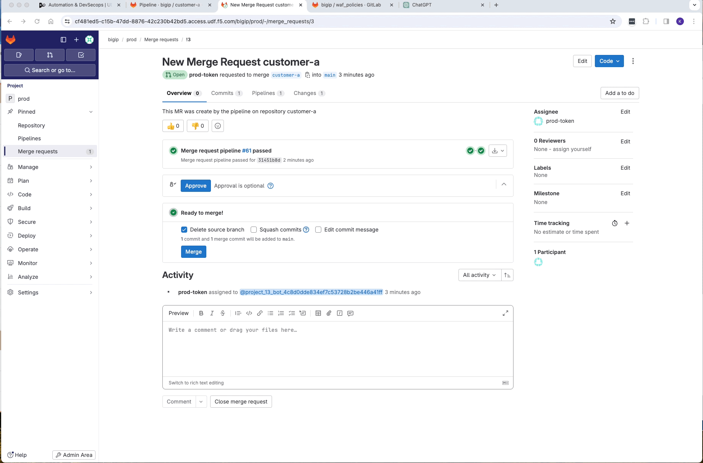
</p>

### Step 6. Log on to BIGIP to check the Virtual Server and WAF policy deployed.
Once the pipeline completes successfully go to **BIGIP** and review the configuration that has been applied with AS3 (Virtual Server, Pool, Pool members and WAF policies). 

<p align="center">
  
</p>
