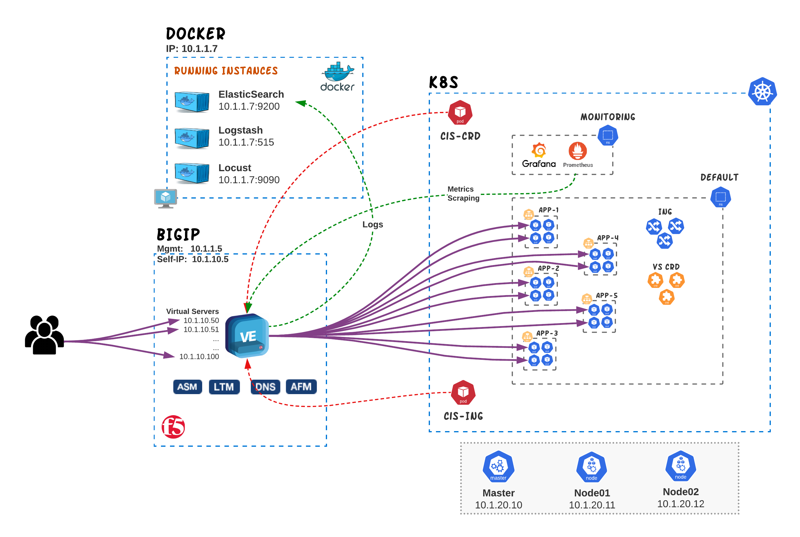

# Reverse Proxy capabilities with CIS

In this section we will be exploring the most common use-cases for the four ways that CIS can be configured for in order to publish Kubernetes services. These include:
- [Ingress Resources](#ingress-resource-examples)
- [VirtualServer CRDs](#virtualserver-crd-examples)
- [TransportServer CRDs](#transportserver-crd-examples)
- [Service Type LoadBalancer](#service-type-loadbalancer-examples)
- IngressLink (to be completed)
- EDNS (to be completed)

  

## Ingress Resource examples
In this section we provide examples for the most common use-cases of Ingress Resources with F5 CIS

* [Basic Ingress](cis-ingress/basic-ingress)
* [Host based routing](cis-ingress/host-routing)
* [Path based routing](cis-ingress/fanout)
* [Health Monitors](cis-ingress/health-monitor)
* [Rewrite](cis-ingress/rewrite)
* [TLS Ingress](cis-ingress/tls)

## VirtualServer CRD examples
In this section we provide examples for the most common use-cases of VirtualServer CRDs with F5 CIS

* [Basic VirtualServer ](cis-crd/VirtualServer/Basic/)
* [Wildcard VirtualServer ](cis-crd/VirtualServer/Wildcard/)
* [Host based routing](cis-crd/VirtualServer/HostGroup)
* [Rewrite](cis-crd/VirtualServer/Rewrite/)
* [HTTP Redirect](cis-crd/VirtualServer/httpTraffic/)
* [Dynamic IP Allocation (IPAM)](cis-crd/VirtualServer/IpamLabel)
* [Health Monitors](cis-crd/VirtualServer/HealthMonitor)
* [Wildcard Hostname](cis-crd/VirtualServer/Wildcard)
* [TLS VirtualServer](cis-crd/VirtualServer/TLS-Termination/)
* [Using iRules ](cis-crd/VirtualServer/PolicyCRD/README.md#iRules)
* [Managing Persistence](cis-crd/VirtualServer/PolicyCRD/README.md#Persistence)
* [Custom HTTP Profile](cis-crd/VirtualServer/PolicyCRD/README.md#custom-http-profile)
* [Enable WAF Policies](cis-crd/VirtualServer/PolicyCRD/README.md#waf-policies)
* [VirtualServer with custom Port](cis-crd/VirtualServer/CustomPort/)
* [VirtualServer with IPv6 Address](cis-crd/VirtualServer/IPv6/)

## TransportServer CRD examples
In this section we provide examples for the most common use-cases of TransportServer CRDs with F5 CIS
- [TCP TransportServer](cis-crd/TransportServer/#tcp-transport-server)
- [TCP TransportServer with IPAM](cis-crd/TransportServer/#tcp-transport-server-with-ipam)
- [UDP TransportServer](cis-crd/TransportServer/#udp-transport-server)

## Service Type LoadBalancer examples
In this section we provide examples for the most common use-cases of service type LoadBalancer with F5 CIS
- [Service Type LoadBalancer](cis-crd/serviceTypeLB/#service-type-loadbalancer)
- [Multiport Type LoadBalancer](cis-crd/serviceTypeLB/#create-multiport-type-loadbalancer)
- [Service Type LoadBalancer with Health monitor](cis-crd/serviceTypeLB/#service-type-loadbalancer-with-health-monitor)

## IngressLink examples
**(pending)**

## EDNS examples
**(pending)**
