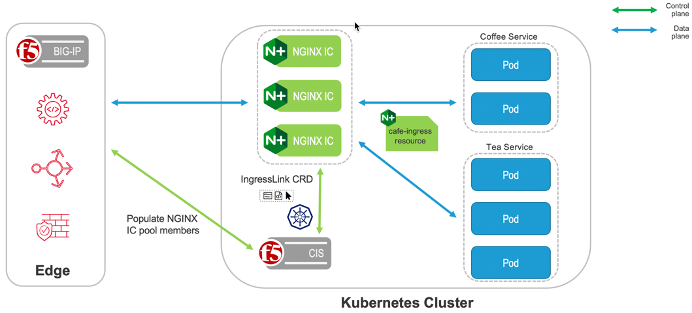

# Integration with Nginx Ingress Controller
In this section we provide examples for the most common use-cases of IngressLink with F5 CIS
- [IngressLink with dynamic IP](#ingresslink-with-dynamic-ip)
- [IngressLink with static IP](#ingressLink-with-static-ip)



F5 IngressLink is the first true integration between BIG-IP and NGINX technologies. F5 IngressLink was built to support customers with modern, container application workloads that use both BIG-IP Container Ingress Services and NGINX Ingress Controller for Kubernetes. It’s an elegant control plane solution that offers a unified method of working with both technologies from a single interface—offering the best of BIG-IP and NGINX and fostering better collaboration across NetOps and DevOps teams. The diagram below demonstrates this use-case.

> *To run the demos, use the terminal on VS Code. VS Code is under the `bigip-01` on the `Access` drop-down menu. Click <a href="https://raw.githubusercontent.com/F5EMEA/oltra/main/vscode.png"> here </a> to see how.*

### How does it work
IngressLink specification contains a label selector. The same label needs to exist on the service that is publishing the NGINX+ Ingress Controller. Only when there is a match, CIS will create a Layer 4 VirtualServer on the BIGP either with a staic or a dynamic IP address.

In the following manifests you can see the matchLabels selector on the IngressLink matching the label set on the NGINX+ service.
Eg: ingresslink.yml / nginx-svc.yml
```yml
apiVersion: "cis.f5.com/v1"
kind: IngressLink
metadata:
  name: nginx-ingress
  namespace: nginx
spec:
  ipamLabel: "dev"
  selector:
    matchLabels:
      app: ingresslink    <==== Label to match
---
apiVersion: v1
kind: Service
metadata:
  name: nginx-plus
  namespace: nginx
  labels:
    app: ingresslink     <==== Label on NGINX+ svc
spec:
  type: ClusterIP 
  ports:
  - port: 80
    targetPort: 80
    protocol: TCP
    name: http
  - port: 443
    targetPort: 443
    protocol: TCP
    name: https
  selector:
    app: nginx-plus
```


## IngressLink with dynamic IP
This section demonstrates how deploy an IngressLink with a dynamic IP.


Change the working directory to `IngressLink`.
```
cd ~/oltra/use-cases/cis-examples/cis-crd/IngressLink
```

Verify that the NGINX+ IC is running 
```
kubectl get po -n nginx

########################  Expected Output  #########################
NAME                           READY   STATUS    RESTARTS      AGE
nginx-plus-778ff965c9-9kbbr    1/1     Running   3 (35m ago)   2d16h
nginx-plus-778ff965c9-h7ssx    1/1     Running   2 (37m ago)   2d16h
####################################################################
```

Deploy a new service that will contain the label which IngressLink will match. In this case we are using the following label `app: ingresslink`
```
kubectl apply -f svc-plus.yml
```

Deploy the IngressLink resource.
```
kubectl apply -f ingresslink.yml
```

Deploy the Ingress resources behind NGINX+ IC.
```
kubectl apply -f ingress.yml
```

Review that the Ingress has been deployed
```
kubectl get ingress ingresslink

########################  Expected Output  #########################
NAME                  HOSTS                      ADDRESS   PORTS   AGE
ingresslink-static    ingresslink.f5demo.local             80      115s
####################################################################
```

Save the IP adresses that was assigned by the IPAM for this TS
```
IP=$(kubectl get ingresslink nginx-ingress -n nginx --output=jsonpath='{.status.vsAddress}')
```

Try accessing the service as per the example below. 
```
curl http://ingresslink.f5demo.local --resolve ingresslink.f5demo.local:80:$IP 
curl http://ingresslink.f5demo.local/app2 --resolve ingresslink.f5demo.local:80:$IP 
```

The output should be similar to:
```
Server address: 10.244.140.103:8080
Server name: app1-6cc75dfc85-qhk5d
Date: 14/Jul/2022:06:17:19 +0000
URI: /
Request ID: 18c2b70bcca18c590a0125db04be5661
```

***Clean up the environment (Optional)***
```
kubectl delete -f ingress.yml
kubectl delete -f svc-plus.yml
kubectl delete -f ingresslink.yml
```

## IngressLink with static IP
This section demonstrates how deploy an IngressLink with a static IP.

Change the working directory to `IngressLink`.
```
cd ~/oltra/use-cases/cis-examples/cis-crd/IngressLink
```

Verify that the NGINX+ IC is running 
```
kubectl get po -n nginx

########################  Expected Output  #########################
NAME                           READY   STATUS    RESTARTS      AGE
nginx-plus-778ff965c9-9kbbr    1/1     Running   3 (35m ago)   2d16h
nginx-plus-778ff965c9-h7ssx    1/1     Running   2 (37m ago)   2d16h
####################################################################
```

Deploy a new service that will contain the label which IngressLink will match. In this case we are using the following label `app: ingresslink`
```
kubectl apply -f svc-plus.yml
```

Deploy the IngressLink resource.
```
kubectl apply -f ingresslink-static.yml
```

Deploy the Ingress resources behind NGINX+ IC.
```
kubectl apply -f ingress.yml
```

Review that the Ingress has been deployed
```
kubectl get ingress ingresslink

########################  Expected Output  #########################
NAME                  HOSTS                      ADDRESS   PORTS   AGE
ingresslink-static    ingresslink.f5demo.local             80      115s
####################################################################
```

Try accessing the service as per the example below. 
```
curl http://ingresslink.f5demo.local --resolve ingresslink.f5demo.local:80:10.1.10.112 
curl http://ingresslink.f5demo.local/app2 --resolve ingresslink.f5demo.local:80:10.1.10.112 
```

The output should be similar to:
```
Server address: 10.244.140.103:8080
Server name: app1-6cc75dfc85-qhk5d
Date: 14/Jul/2022:06:17:19 +0000
URI: /
Request ID: 18c2b70bcca18c590a0125db04be5661
```

***Clean up the environment (Optional)***
```
kubectl delete -f ingress.yml
kubectl delete -f svc-plus.yml
kubectl delete -f ingresslink-static.yml
```
