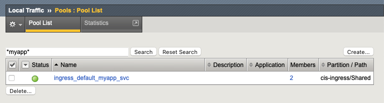
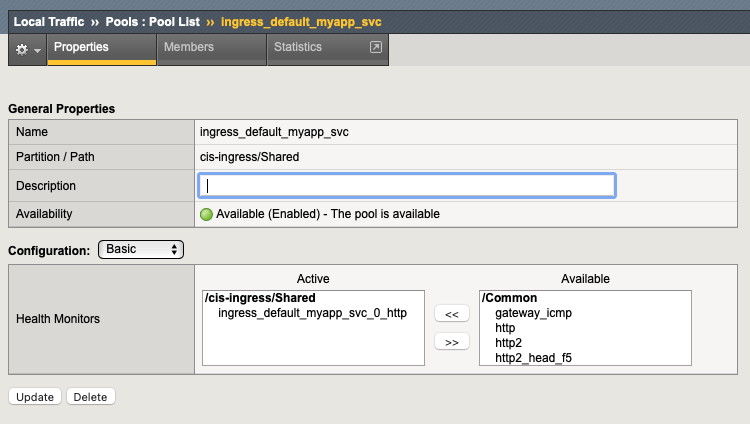

# Health Monitors
The following example deploys an Ingress resource with a BIGIP health monitor to verify that the K8S service is working properly.


Eg: health-monitor.yml
```yml
apiVersion: networking.k8s.io/v1
kind: Ingress
metadata:
  name: health-monitor
  namespace: default
  annotations:
    # BIG-IP Virtual Server IP address
    virtual-server.f5.com/ip: "10.1.10.50"
    # BIG-IP Health Monitor
    virtual-server.f5.com/health: |
      [
       {
          "path":     "health1.f5demo.local/myapp",
          "send":     "GET /health/myapp",
          "interval": 3,
          "timeout":  8
        }
      ]
spec:
  ingressClassName: f5
  rules:
  - host: health1.f5demo.local
    http:
      paths:
      - backend:
          service:
            name: myapp-svc
            port:
              number: 80
        path: /myapp
        pathType: Prefix
```

Access the terminal on the VS Code.


Change the working directory to `health-monitor`
```
cd ~/oltra/use-cases/cis-examples/cis-ingress/health-monitor
```

Create the Ingress resource.
```
kubectl apply -f health-monitor.yml
```

Confirm that the Ingress is deployed correctly. Run the describe command to get more information on the ingress.
```
kubectl describe ing health-monitor

------------------------   OUTPUT   ------------------------
Name:             health-monitor
Labels:           <none>
Namespace:        default
Address:          10.1.10.50
Default backend:  default-http-backend:80 (<error: endpoints "default-http-backend" not found>)
Rules:
  Host                  Path  Backends
  ----                  ----  --------
  health1.f5demo.local  
                        /myapp   myapp-svc:80 (10.244.140.99:8080,10.244.196.164:8080)
Annotations:            virtual-server.f5.com/health:
                          [
                           {
                              "path":     "health1.f5demo.local/myapp",
                              "send":     "GET /health/myapp",
                              "interval": 3,
                              "timeout":  8
                            }
                          ]
                        virtual-server.f5.com/ip: 10.1.10.50
Events:
  Type    Reason              Age   From            Message
  ----    ------              ----  ----            -------
  Normal  ResourceConfigured  8s    k8s-bigip-ctlr  Created a ResourceConfig ingress_10-1-10-50_80 for the Ingress.

------------------------------------------------------------

```
Notice the annotation section where the health monitors have been defined.


On the BIGIP UI, you should see the application pool marked as green and a custom monitor assigned to the pool

| BIGIP Pool             |  Pool Details |
:-------------------------:|:-------------------------:
  |  


***Clean up the environment (Optional)***
```
kubectl delete -f health-monitor.yml
```