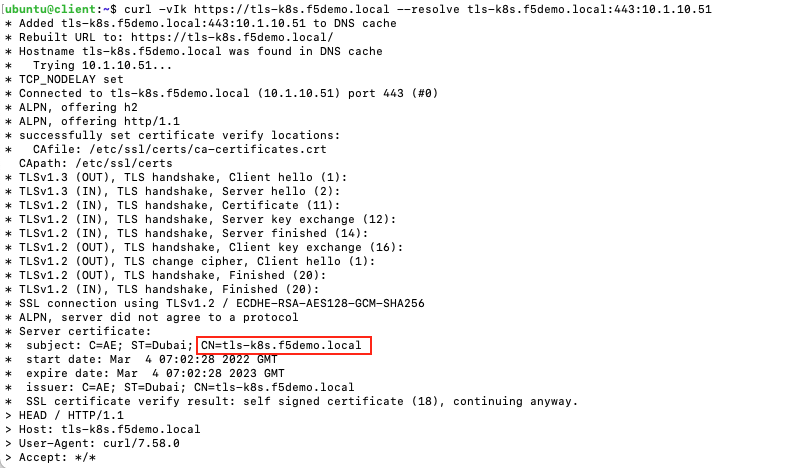
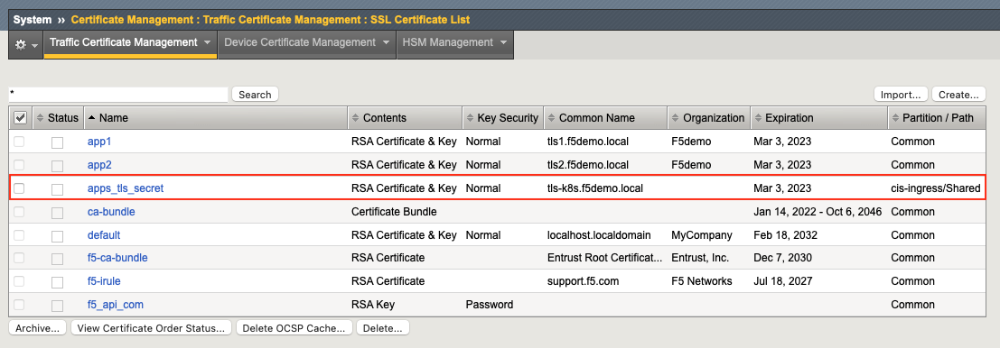
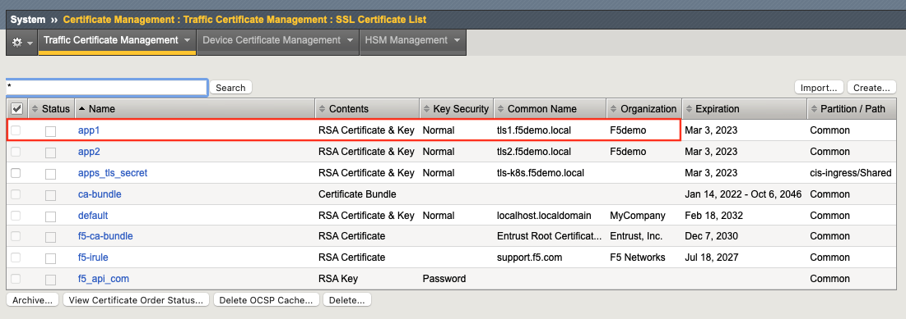
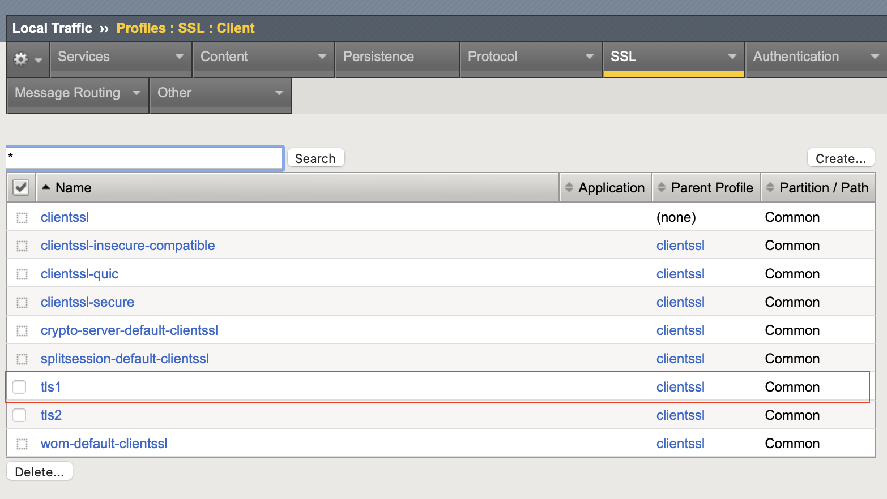
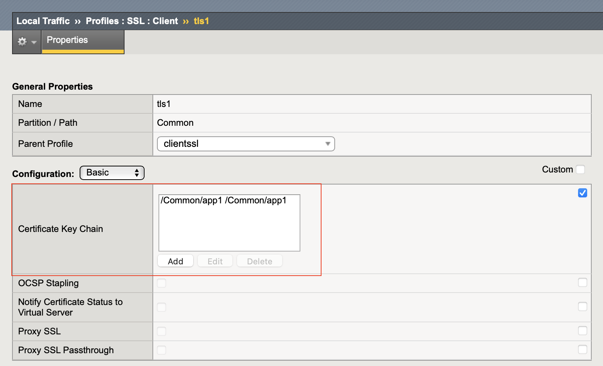
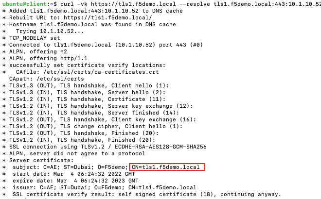
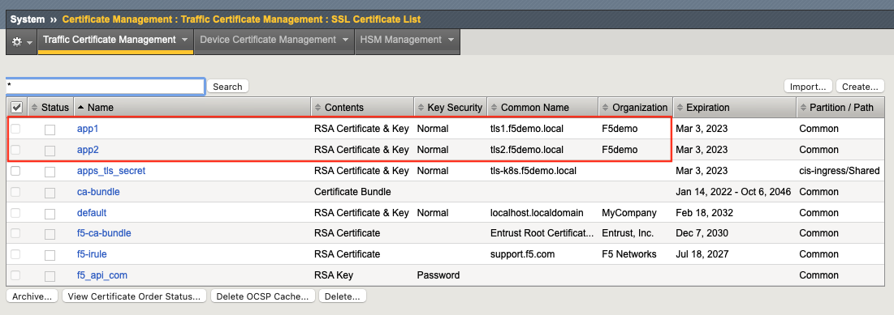
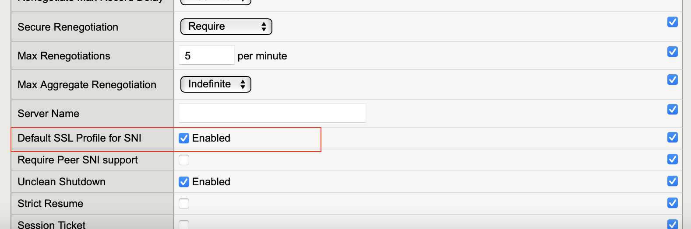
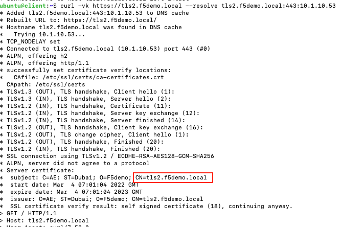

# Ingress Examples

In this section we provide 3 TLS examples

- [TLS Ingress (certificate on K8s)](#tls-ingress-certificate-on-k8s)
- [TLS Ingress (certificate on BIGIP)](#tls-ingress-certificate-on-bigip)
- [Multi-TLS Ingress (certificate on BIGIP)](#multi-tls-ingress-certificate-on-bigip)

## TLS Ingress (certificate on K8s)
In the following example we deploy a TLS ingress resource that has the certificate stored on K8s as a secret.

Eg: apps-tls-secret.yml
```yml
apiVersion: v1
kind: Secret
metadata:
  name: apps-tls-secret
  namespace: default
data:
  tls.crt: LS0tLS1CRUdXXXXXXXXXXXXXXXX
  tls.key: LS0tLS1CRUdJXXXXXXXXXXXXXXXX
type: kubernetes.io/tls
```

Eg: tls-cert-k8s.yml
```yml
apiVersion: networking.k8s.io/v1
kind: Ingress
metadata:
  name: tls-cert-k8s
  annotations:
    virtual-server.f5.com/ip: "10.1.10.51"
    ingress.kubernetes.io/ssl-redirect: "true"
    ingress.kubernetes.io/allow-http: "false"
spec:
  ingressClassName: f5
  tls:
  - hosts:
    - tls-k8s.f5demo.local
    secretName: apps-tls-secret
  rules:
    - host: tls-k8s.f5demo.local
      http:
        paths:
        - path: /
          pathType: Prefix
          backend:
            service:
              name: echo-svc
              port:
                number: 80
```

Access the terminal on the VS Code.


Change the working directory to `tls`.
```
cd ~/oltra/use-cases/cis-examples/cis-ingress/tls
```

Deploy the secret on Kubernetes that holds the certificate
```
kubectl apply -f apps-tls-secret.yml
```

Create the Ingress resource
```
kubectl apply -f tls-cert-k8s.yml
```

Confirm that the Ingress is deployed correctly. Run the describe command to get more information on the ingress.
```
kubectl describe ingress tls-cert-k8s

------------------------   OUTPUT   ------------------------

Name:             tls-cert-k8s
Labels:           <none>
Namespace:        default
Address:          10.1.10.51
Default backend:  default-http-backend:80 (<error: endpoints "default-http-backend" not found>)
TLS:
  apps-tls-secret terminates tls-k8s.f5demo.local
Rules:
  Host                  Path  Backends
  ----                  ----  --------
  tls-k8s.f5demo.local  
                        /   echo-svc:80 (10.244.140.93:80,10.244.196.135:80)
Annotations:            ingress.kubernetes.io/allow-http: false
                        ingress.kubernetes.io/ssl-redirect: true
                        virtual-server.f5.com/ip: 10.1.10.51
Events:
  Type    Reason              Age   From            Message
  ----    ------              ----  ----            -------
  Normal  ResourceConfigured  23s   k8s-bigip-ctlr  Created a ResourceConfig ingress_10-1-10-51_80 for the Ingress.
  Normal  ResourceConfigured  23s   k8s-bigip-ctlr  Created a ResourceConfig ingress_10-1-10-51_443 for the Ingress.
------------------------------------------------------------
```

Try accessing the service with the use of curl as per the example below. We use curl's -k option to turn off certificate verification and the -v option to get the TLS certificate details
```
curl -vk https://tls-k8s.f5demo.local --resolve tls-k8s.f5demo.local:443:10.1.10.51
```

You should see the following output. Please notice the `CN` value configured on the certificate



Verify that on BIGIP a new certificate has been created under `cis-ingress` partition



***Clean up the environment (Optional)***
```
kubectl delete -f basic-ingress.yml
```

## TLS Ingress (certificate on BIGIP)
In the following example we deploy a TLS Ingress resource that has the certificate stored on BIGIP as a SSL Client Profile.

Eg: tls-cert-bigip.yml
```yml
apiVersion: networking.k8s.io/v1
kind: Ingress
metadata:
  name: tls-cert-bigip
  annotations:
    virtual-server.f5.com/ip: "10.1.10.52"
    virtual-server.f5.com/clientssl: '[ { "hosts": [ "tls1.f5demo.local" ], "bigIpProfile": "/Common/tls1" } ]'
    ingress.kubernetes.io/ssl-redirect: "true"
    ingress.kubernetes.io/allow-http: "false"
spec:
  ingressClassName: f5
  rules:
    - host: tls1.f5demo.local
      http:
        paths:
          - path: /
            pathType: Prefix
            backend:
              service:
                name: app1-svc
                port:
                  number: 80
```

Verify that the certificate exists (see below)



Verify that the SSL Client Profile exists and is assigned the above certificate (see below)

| SSL Client Profile       |  Profile Details |
:-------------------------:|:-------------------------:
 |  


Access the terminal on the VS Code.


Create the Ingress resource.
```
kubectl apply -f tls-cert-bigip.yml
```

Confirm that the Ingress is deployed correctly. Run the describe command to get more information on the ingress.
```
kubectl describe ingress tls-cert-bigip

------------------------   OUTPUT   ------------------------
Name:             tls-cert-bigip
Labels:           <none>
Namespace:        default
Address:          10.1.10.52
Default backend:  default-http-backend:80 (<error: endpoints "default-http-backend" not found>)
Rules:
  Host               Path  Backends
  ----               ----  --------
  tls1.f5demo.local  
                     /   app1-svc:80 (10.244.140.122:8080,10.244.196.145:8080)

Annotations:         ingress.kubernetes.io/allow-http: false
                     ingress.kubernetes.io/ssl-redirect: true
                     virtual-server.f5.com/clientssl: [ { "hosts": [ "tls1.f5demo.local" ], "bigIpProfile": "/Common/tls1" } ]
                     virtual-server.f5.com/ip: 10.1.10.52
Events:
  Type    Reason              Age   From            Message
  ----    ------              ----  ----            -------
  Normal  ResourceConfigured  19s   k8s-bigip-ctlr  Created a ResourceConfig ingress_10-1-10-52_80 for the Ingress.
  Normal  ResourceConfigured  19s   k8s-bigip-ctlr  Created a ResourceConfig ingress_10-1-10-52_443 for the Ingress.
------------------------------------------------------------
```

Try accessing the service.
```
curl -vk https://tls1.f5demo.local --resolve tls1.f5demo.local:443:10.1.10.52
```

You should see the following output. Please notice the `CN` value configured on the certificate. We use curl's -k option to turn off certificate verification and the -v option to get the TLS certificate details




***Clean up the environment (Optional)***
```
kubectl delete -f tls-cert-bigip.yml
```

## Multi-TLS Ingress (certificate on BIGIP)
In the following example we deploy an Ingress resource with 2 FQDNs that require different TLS certificates (stored on BIGIP).

Eg: tls-cert-bigip.yml
```yml
apiVersion: networking.k8s.io/v1
kind: Ingress
metadata:
  name: multi-tls-cert-bigip
  annotations:
    virtual-server.f5.com/ip: "10.1.10.53"
    virtual-server.f5.com/clientssl: '[ { "hosts": [ "tls1.f5demo.local" ], "bigIpProfile": "/Common/tls1" }, { "hosts": [ "tls2.f5demo.local" ], "bigIpProfile": "/Common/tls2" } ]'
    ingress.kubernetes.io/ssl-redirect: "true"
    ingress.kubernetes.io/allow-http: "false"
spec:
  ingressClassName: f5
  rules:
    - host: tls1.f5demo.local
      http:
        paths:
          - path: /
            pathType: Prefix
            backend:
              service:
                name: app1-svc
                port:
                  number: 80
    - host: tls2.f5demo.local
      http:
        paths:
          - path: /
            pathType: Prefix
            backend:
              service:
                name: app2-svc
                port:
                  number: 80
```

Verify that both certificates exists (see below)



Verify that the SSL Client Profile exists for both certificates and that at least one of the certificates (in this case tls1) is configured as the SNI default profile. Please select the tls1 profile and verify the configuration (marked in RED)

| SSL Client Profiles      |  Profile SNI Details for TLS1 |
:-------------------------:|:-------------------------:
 | 


Access the terminal on the VS Code.


Change the working directory to `tls`.
```
cd ~/oltra/use-cases/cis-examples/cis-ingress/tls
```

Create the ingress resource
```
kubectl apply -f multi-tls-cert-bigip.yml
```

Confirm that the Ingress is deployed correctly. Run the describe command to get more information on the ingress.
```
kubectl describe ingress multi-tls-cert-bigip

------------------------   OUTPUT   ------------------------

Name:             multi-tls-cert-bigip
Labels:           <none>
Namespace:        default
Address:          10.1.10.53
Default backend:  default-http-backend:80 (<error: endpoints "default-http-backend" not found>)
Rules:
  Host               Path  Backends
  ----               ----  --------
  tls1.f5demo.local  
                     /   app1-svc:80 (10.244.140.122:8080,10.244.196.145:8080)
  tls2.f5demo.local  
                     /   app2-svc:80 (10.244.140.116:8080,10.244.196.165:8080)
Annotations:         ingress.kubernetes.io/allow-http: false
                     ingress.kubernetes.io/ssl-redirect: true
                     virtual-server.f5.com/clientssl:
                       [ { "hosts": [ "tls1.f5demo.local" ], "bigIpProfile": "/Common/tls1" }, { "hosts": [ "tls2.f5demo.local" ], "bigIpProfile": "/Common/tls2"...
                     virtual-server.f5.com/ip: 10.1.10.53
Events:
  Type    Reason              Age   From            Message
  ----    ------              ----  ----            -------
  Normal  ResourceConfigured  13m   k8s-bigip-ctlr  Created a ResourceConfig ingress_10-1-10-53_80 for the Ingress.
  Normal  ResourceConfigured  13m   k8s-bigip-ctlr  Created a ResourceConfig ingress_10-1-10-53_443 for the Ingress.
------------------------------------------------------------
```


Try accessing both services as per the examples below. We use curl's -k option to turn off certificate verification and the -v option to get the TLS certificate details

```
curl -vk https://tls1.f5demo.local --resolve tls1.f5demo.local:443:10.1.10.53
curl -vk https://tls2.f5demo.local --resolve tls2.f5demo.local:443:10.1.10.53
```

You should see the following output. Notice that the `CN` value change based on the FQDN as a different certificate gets presented to the client.



***Clean up the environment (Optional)***
```
kubectl delete -f multi-tls-cert-bigip.yml
```