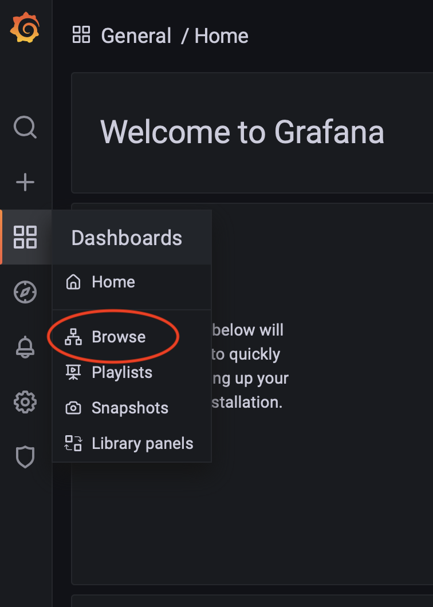

# Implementing DevSecOps Framework for BIGIP
With the successful deployment of Virtual Servers and WAF policies streamlined through [BIGIP automation use-case](https://github.com/F5EMEA/oltra/tree/main/use-cases/automation/bigip), our focus now shifts to establishing a robust DevSecOps framework. This framework empowers SecOps teams to automate Day 2 operations related to WAF policies, enhancing operational efficiency and security posture.


Before delving into the details, it's imperative to familiarize yourself with the foundational [use-case](https://github.com/F5EMEA/oltra/tree/main/use-cases/automation/bigip), Automating BIG-IP with Per-App AS3 and GitOps, as this initiative extends upon its principles.


To ensure the effectiveness of the DevSecOps framework for Day 2 operations of WAF policies, the following components are indispensable:

- **Automated Virtual Server Deployment**: Building upon the BIGIP automation use-case, automating the deployment of Virtual Servers remains a cornerstone prerequisite for our DevSecOps framework.
- **Git Repository for WAF Declarations**: Utilizing Git to store WAF declarations allows for version control, collaboration, and streamlined management of policy changes.
- **CI/CD Toolchain for Deployment**: Introducing a CI/CD toolchain facilitates seamless deployment of WAF policy updates, ensuring rapid and reliable implementation of changes across the infrastructure.
- **Observability Platform Integration**: Integrating an observability platform provides critical insights into the performance and security posture of deployed WAF policies, enabling proactive monitoring and response.
- **WAF Policy Management Tool**: Implementing a dedicated WAF policy management tool simplifies the orchestration and administration of policies, enhancing governance and compliance efforts.


### VirtualServer Automation
As highlighted, automating the deployment of Virtual Servers on BIGIP has already been addressed in the foundational [BIGIP automation use-case](https://github.com/F5EMEA/oltra/tree/main/use-cases/automation/bigip), serving as a fundamental prerequisite for our DevSecOps framework.


### Git and CI/CD
Git serves as the authoritative source for storing both SecOps and DevOps code, offering unparalleled capabilities in version control and collaboration. Leveraging Git as the foundation for our DevSecOps workflows provides a centralized platform for managing code changes, facilitating seamless collaboration, and ensuring the integrity of our infrastructure.

In the context of the **Automation use-case**, WAF policies are initially created and stored in a dedicated repository separate from the VirtualServer configurations. Utilizing AS3, these policies are retrieved from the WAF repository during VirtualServer deployment. While manual management via the BIGIP UI remains an option, we advocate for Git as the primary source of truth for WAF configurations.

To operationalize Git as the source of truth for WAF configurations, the SecOps team follows a structured workflow:

**Branching Strategy**: SecOps save updated WAF configurations in dedicated branches for validation and review. Upon approval, these configurations are merged into the main branch, ensuring controlled and auditable changes.

**Pipeline Implementation**: Within the WAF repository, we've established two pipelines to automate the validation and deployment of WAF policies:

  - **Merge Pipeline**: This pipeline enforces rigorous validation of code changes before merging into the main branch. By leveraging the OpenAPI spec of the BIGIP WAF, it ensures that merged configurations will consistently succeed upon deployment, mitigating the risk of failures.

    <p align="center">
      
    </p>


  - **WAF Pipeline**: Designed to identify and deploy modified WAF policies to the corresponding BIGIP devices, this pipeline comprises three stages:
    - **Changes Detection**: Identifies WAF declarations that have been added, modified, or deleted, preparing them for subsequent processing.
    - **Validation**: Validates the identified changes to ensure compliance with predefined standards and configurations.
    - **Deployment**: Pushes validated WAF policies to the respective BIGIP devices, ensuring consistent configuration across the infrastructure.

    <p align="center">
      
    </p>


The configuration details of the WAF pipeline can be accessed in the following [**file**](https://github.com/f5emea/oltra/use-cases/devsecops/bigip/pipelines/waf-pipeline.yml), providing transparency and reproducibility in our CI/CD processes.


### Observabilty platform
Establishing an observability platform is essential for effective management of a Web Application Firewall (WAF) solution. The data collected from BIGIP AWAF aids SecOps teams in identifying and mitigating threats associated with published applications. In our setup, Logstash serves as both the log transformer and shipper. By leveraging Logstash, we ensure streamlined data collection and analysis, enhancing the scalability and efficiency of our observability platform.

In our environment, Logstash, is deployed alongside Elastic and Grafana to construct the observability platform for BIGIP AWAF. All BIGIP Devices send their events/logs to this platform, providing SecOps teams with a centralized dashboard for monitoring security events.

<p align="center">
  
</p>

More information regarding NAP Grafana Dashboard can be found on the [**BIGIP WAF Dashboard**](https://github.com/F5EMEA/oltra/tree/main/monitoring/bigip-waf) lab


### Managing NAP policies
Managing AWAF policies is integral to the policy lifecycle, especially in addressing potential false positives. While F5 AWAF algorithms strive to minimize false positives, readiness is key for SecOps teams. The observability platform aids in identifying false positives by aggregating and visualizing metrics/events from multiple BIGIP Devices and SecOps teams can then adjust the WAF policies accordingly, excluding specific signatures or any other configuration as needed.

There are mulitple ways for the WAF policies to be fine-tuned based on the events that have been identified as false positive. These are:
- **Manual**. SecOps teams can edit manually the JSON files that are stored on GitLab.
- **Automated**. Tools like Ansible, Puppet, Terraform and many others can provide an automated procedure for the SecOps to make the necessary changes on the JSON policies stored on GitLab

To convert a violation into a false positive exception on the WAF configurations, the SecOps teams have to modify the WAF policy with the required JSON key/value pairs. The example below shows how a policy needs to be modified to exclude particular signatures from a policy.

<p align="center">
  
</p>


In this demo we will be using a Ansible-Tower opensource project, AWX, to modify the WAF policies. Details on this project can be found on the following repository [**Managing WAF policies with Ansible**](https://github.com/F5EMEA/oltra/tree/main/use-cases/devsecops/managing-waf-policies).  

AWX provies a very capable UI, that  tool provides the user predefined templates for modifying the WAF configuration based on the events analyzed from Grafana.
 
<p align="center">
  
</p>

Depending on the template the user will select, AWX  provides the user predefined fields and drop-downs for modifying the WAF configuration. For example, as seen on the above picture, `Disable Signature` and `Disable Signature on URL`.

<p align="center">
  
</p>


## Demo

### Step 1-8. Automation Lab 
In order to successfully go through the demo below, you must first complete the [**BIGIP Automation lab**](https://github.com/F5EMEA/oltra/tree/main/use-cases/automation/bigip) that will deploy the VirtualServer and WAF policy that we will be using.

### Step 9. Generate attacks and a false positive
We will use the terminal on VS Code to generate traffic and a **False-Positive** transaction. VS Code is under the bigip-01 on the Access drop-down menu. Click <a href="https://raw.githubusercontent.com/F5EMEA/oltra/main/vscode.png"> here </a> to see how to access it.

Change the working directory to `devsecops/bigip`.
```
cd ~/oltra/use-cases/devsecops/bigip/script
```

Run the script `traffic.sh` that will create both legal and illegal transactions towards the VirtualServer that has been created from the Automation Lab (10.1.10.215). The script `traffic.sh` that will generate between 800 and 1000 different type of attacks from different sources in about 60 seconds.

> [Note]
> If you have changed the IP address of the VirtualServer please update it accordingly
```
./traffic.sh 10.1.10.215
```

### Step 10. Review the illegal transactions on Grafana

Login to Grafana (credentials **admin/Ingresslab123**)
<p align="left">
  
</p>


Go to **Dashboards->Browse**

<p align="left">
  
</p>


Select the ASM Dashboards that can be located under the BIGIP folder

<p align="left">
  
</p>

Navigate through the different Dashboards to review the attacks.

### Step 12. Create a False Positive transaction

As a next step we will simulate a **False Positive** transaction. Go to the VSCode and execute the following transaction.
```
curl 10.1.10.215/phpinfo.php
```

The expected result is the following

```html
<html><head><title>Request Rejected</title></head><body>The requested URL was rejected. Please consult with your administrator.<br><br>Your support ID is: 1357814220837637984<br><br><a href='javascript:history.back();'>[Go Back]</a></body></html>
```

Using the support ID and review the log on Grafana.

### Step 13. Create a WAF rule exception using the Signature IDs
Logon to AWX console (Credentials: **bigip/123**). AWX UI can be found under `bigip-01` on the `Access` drop-down menu.

<p align="center">
  
</p>

Go to Resources->Templates and launch the template called `ASM - Signature Global`.
<p align="center">
  
</p>

Put the name of the policy ***(without adding the extension .yaml)*** along with the SignatureID and **run** the template.\
<p align="center">
  
</p>

AWX should execute the Ansible playbook to to pull the ASM policy from GitLab, make the required changes on the policy’s JSON file and push it back to GitLab, creating a merge request in the process.
Review the logs from the template's playbook.
<p align="center">
  
</p>

### Step 14. Review and Accept changes on GitLab
Go to WAF repository on GitLab, review the Merge Request (MR) and then approve the change.

<p align="center">
  
</p>


### Step 13. Repeat the process
From AWX console, make additional modifications to the policy as per your requirements and follow the same process
