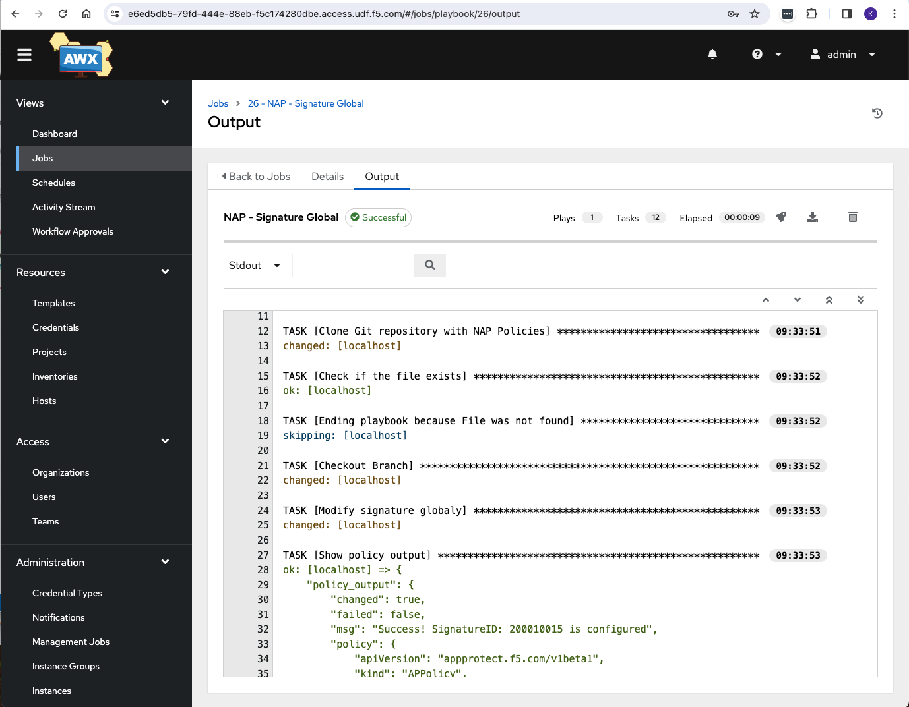

# Establishing a DevSecOps Framework with NGINX Ingress Controller
As organizations migrate their application workloads to Kubernetes, there's a growing imperative to integrate security controls, such as Web Application Firewall (WAF), within the Kubernetes environment. This facilitates a seamless modernization journey, fostering agility, elasticity, and distributed infrastructure while upholding robust security measures.

To realize this vision, organizations are fostering closer collaboration between SecOps and DevOps teams, enabling them to maintain their distinct objectives and responsibilities effectiv 

SecOps Responsibilities Include:

- Identifying requisite security controls for applications.
- Sustaining and managing production-applied policies.
- Crafting WAF templates aligned with chosen security controls for consumption by DevOps teams.

DevOps Responsibilities Include:
- Leveraging security templates as a service.
- Embedding security policies within their codebase.
- Preserving velocity and flexibility by integrating security policies within CI/CD pipelines.

This collaboration ensures that security remains integral throughout the development lifecycle, fortifying applications without impeding operational efficiency.

## Table of Contents 
- [**Required Components**](#required-components)
- [**Demo**](#demo)


## Required Components
To establish an infrastructure conducive to both SecOps and DevOps, the following components are essential:

- Ingress Controller with a Web Application Firewall module
- Git repository 
- Observability Platform
- Policy Management Process
- CI/CD tool(s)

<p align="center">
  
</p>


### Ingress Controller with WAF
The Ingress Controller (IC) serves as the primary gateway for applications within the Kubernetes platform, facilitating traffic routing and bridging Kubernetes services with external entities via Ingress, Routes, or custom resources like VirtualServer and VirtualServerRoute. Embedding a Web Application Firewall (WAF) module within the Ingress Controller layer is a highly efficient means of enforcing security controls within Kubernetes. 
In our setup, we will be using the NGINX App Protect WAF module, configurable through annotations in Ingress Resources or Custom Resources like VirtualServer and VirtualServerRoute.

<p align="center">
  
</p>


### Git repository
Git stands as the definitive source of truth for storing both SecOps and DevOps code. As the most popular and widely used version control system today, Git boasts numerous advantages: code changes are seamlessly committed, version branches effortlessly compared and merged, and code optimization facilitated.

Employing Git fosters enhanced collaboration between DevOps and SecOps teams, enabling:

- **Change Tracking**: Teams can meticulously monitor alterations in their codebase.
- **Collaborative Reviews**: Through Merge Requests, members can review, comment, and approve changes, fostering collaborative refinement.
- **Audit Trail**: Git maintains a comprehensive audit log, delineating all assignees and reviewers, ensuring accountability and transparency throughout the development lifecycle.


### Observabilty platform
Establishing an observability platform is essential for effective management of a Web Application Firewall (WAF) solution. The data collected from Ingress Controller pods aids SecOps teams in identifying and mitigating threats associated with published applications. In our setup, Fluentd serves as both the log transformer and shipper. By leveraging Fluentd, we ensure streamlined data collection and analysis, enhancing the scalability and efficiency of our observability platform.

Fluentd, is deployed alongside Elastic and Grafana to construct the observability platform for NGINX App Protect. All NAP pod instances send their events/logs to this platform, providing SecOps teams with a centralized dashboard for monitoring security events.

For further insights, refer to the NAP Dashboard lab.

<p align="center">
  
</p>

More information regarding NAP Grafana Dashboard can be found on the [**NAP Dashboard**](https://github.com/F5EMEA/oltra/tree/main/use-cases/app-protect/monitoring) lab


### Managing NAP policies
Managing NAP policies is integral to the WAF policy lifecycle, especially in addressing potential false positives. While NAP algorithms strive to minimize false positives, readiness is key for SecOps teams. The observability platform aids in identifying false positives by aggregating and visualizing metrics/events from multiple NAP Pods. SecOps teams can then adjust NAP policies accordingly, excluding specific signatures or any other configuration as needed.

There are mulitple ways for the NAP policies to be fine-tuned based on the events that have been identified as false positive. These are:
- **Manual**. SecOps teams can edit manually the JSON/YAML files that are stored on GitLab.
- **Automated**. Tools like Ansible, Puppet, Terraform and many others can provide an automated procedure for the SecOps to make the necessary changes on the YAML policies stored on GitLab
- **Purpose-built**. The other alternative is to develop or use an opensource project that is designed specifically for modifying NAP policies based on the recorded events. 

To convert a violation into a false positive exception on the NAP configurations, the SecOps teams have to modify the NAP policy with the required YAML key/value pairs. The example below shows how a policy needs to be modified to exclude particular signatures from a policy.

<p align="center">
  
</p>


In this demo we will be using a Ansible-Tower opensource project, AWX, to modify the NAP policies. Details on this project can be found on the following repository [**Managing WAF policies with Ansible**](https://github.com/F5EMEA/oltra/tree/main/use-cases/devsecops/managing-awaf-policies).  

AWX provies a very capable UI, that  tool provides the user predefined templates for modifying the NAP configuration based on the events analyzed from Grafana.
 
<p align="center">
  
</p>

Depending on the template the user will select, AWX  provides the user predefined fields and drop-downs for modifying the NAP configuration. For example, as seen on the above picture, `Disable Signature` and `Disable Signature on URL`.

<p align="center">
  
</p>

Once the user confirms the details and the AWX will execute the Ansible playbook to to pull the NAP policy from GitLab, make the required changes on the policy’s YAML file and push it back to GitLab, creating a merge request in the process.


### CI/CD tool
Each customer is using different methodologies and potentially different tools to implent their CI/CD pipelines. In our demo, we are mainly interested to reflect any modifications made to the 2 repositories (**devsecops/nap** and **devsecops/apps**) to the Kubernetes environment. Argo CD serves this purpose, functioning as a Kubernetes controller that continuously monitors running applications and aligns their live state with the desired target state specified in the Git repository. Argo CD automates the application of changes from the Git repository to the target Kubernetes environments, ensuring convergence on the defined state and mitigating configuration drift, manual errors, and inconsistencies.

<p align="center">
  
</p>


## Demo
In order to successfully go through the demo below, we suggest you first complete the following labs that will help you become familiar with the NAP-Dashboard and Argo CD.
- [**NAP Dashboard**](https://github.com/F5EMEA/oltra/tree/main/use-cases/app-protect/monitoring)
- [**Argo CD**](https://github.com/F5EMEA/oltra/tree/main/use-cases/app-protect/argocd)


### Step 1. Manifests stored on GitLab 
In our environment we are using GitLab. The design is fairly straightforward and it is based on two repositories. The first repository will be for the NGINX App Protect resources (APPolicy, APLogConf) where the SecOps team will be resposible for and the second repository will be for the application resources (Deployments, Services, Ingress Rules, Configmaps, etc.) where the DecOps team will be resposible for.
The following two repositories will be used:

- **devsecops/nap** for the NAP resources
- **devsecops/apps** for the Application resources

We will be using VirtualServer CR. The NGINX custom resources (VirtualServer, Policy) along with the application Deployment and Service will be configured on the `apps` namespace while the WAF resources `APPolicy`, `APLogConf` will be configured on the `secops` namespace. The NGINX Policy is able to work with `APPolicy` and `APlogConf` cross-namespaces.

<p align="center">
  
</p>


Currently all Kubernetes manifests have been configured on the 2 repositories. 

Log on to GitLab and review the manifests for both repos. 

<p align="center">
  
</p>


Verify that a GitLab webhook is already configured to notify Argo CD for any changes on the code.  
Go to repository under **Settings** -> **Webhooks** and scroll to the end. You should see a webhook already created for Argo CD (`https://10.1.10.18/api/webhook`)  

<p align="center">
  
</p>

### Step 2. Continuous Deployment with ArgoCD 
First we will deploy the NAP policies to Kubernetes. To do that we will create a new application on Argo CD for the **devsecops/nap** repository.
Find below the information that needs to inserted in the form. 
  
  - Application Name -> **nap-policies**
  - Project -> **default**
  - Sync Policy -> **Automatic**
  - Prune Resources -> **Enabled**
  - Repository URL -> **https://git.f5k8s.net/devsecops/nap.git**
  - Revision -> **HEAD**
  - Path -> **.**
  - Cluster URL -> **https://kubernetes.default.svc**
  - Namespace  -> **secops**

Press `Create` and wait to see that the Argo CD application being created.

<p align="center">
  
</p>


Then we will deploy the Application manifests. To do that we will create a new application on Argo CD for the **devsecops/apps** repository.
Find below the information that needs to inserted in the form. 
  
  - Application Name -> **apps**
  - Project -> **default**
  - Sync Policy -> **Automatic**
  - Prune Resources -> **Enabled**
  - Repository URL -> **https://git.f5k8s.net/devsecops/apps.git**
  - Revision -> **HEAD**
  - Path -> **.**
  - Cluster URL -> **https://kubernetes.default.svc**
  - Namespace  -> **apps**

Press `Create` and wait to see that the Argo CD application being created.


### Step 3. Executing Attacks 

Verify that you can succesfully access the application. Go to VSCode and run the following commands

```
curl "http://web.f5k8s.net/tea/"
curl "http://web.f5k8s.net/coffee/"
curl "http://web.f5k8s.net/"

###############################################################
#####################  EXPECTED OUTPUT  #######################
Server address: 10.244.140.109:8080
Server name: <endpoint>-7586895968-r26zn
Date: 12/Sep/2022:14:12:25 +0000
URI: /
Request ID: 0495d6a17797ea9776120d5f4af10c1a
###############################################################
```

Run the following commands to execute some malicious requests towards the website.
```
curl -H "X-Forwarded-For:20.44.5.56" "http://web1.f5k8s.net/index.php?pass=0%22%20or%201%3D1%20%22%0A"
curl -H "X-Forwarded-For:89.92.3.3" "http://web1.f5k8s.net/tea/index.php?pass==0'%20or%205=5'"
curl -H "X-Forwarded-For:89.92.3.3" "http://web1.f5k8s.net/tea/index.php?id=%'%20or%200=0%20union%20select%20null,%20version()%23"
curl -H "X-Forwarded-For:89.92.3.3" "http://web1.f5k8s.net/index.php?username=<script>"
curl -H "X-Forwarded-For:89.92.3.3" "http://web1.f5k8s.net/coffee/index.php?id=0;%20ls%20-l"
curl -H "X-Forwarded-For:89.92.3.3" "http://web2.f5k8s.net/index.php?pass=0%22%20or%201%3D1%20%22%0A"
curl -H "X-Forwarded-For:71.8.27.7" "http://web2.f5k8s.net/index.php?pass==0'%20or%201=1'"
curl -H "X-Forwarded-For:71.8.27.7" "http://web2.f5k8s.net/coffee/index.php?id=%'%20or%200=0%20union%20select%20null,%20version()%23"
curl -H "X-Forwarded-For:71.8.27.7" "http://web2.f5k8s.net/index.php?username=<script>"
curl -H "X-Forwarded-For:122.11.5.23" "http://web2.f5k8s.net/index.php?id=0;%20ls%20-l"
curl -H "X-Forwarded-For:122.11.5.23" "http://web3.f5k8s.net/index.php?pass=0%22%20or%201%3D1%20%22%0A"
curl -H "X-Forwarded-For:122.11.5.23" "http://web3.f5k8s.net/tea/index.php?pass==0'%20or%205=5'"
curl -H "X-Forwarded-For:201.34.1.22" "http://web3.f5k8s.net/tea/index.php?id=%'%20or%200=0%20union%20select%20null,%20version()%23"
curl -H "X-Forwarded-For:201.34.1.22" "http://web3.f5k8s.net/index.php?username=<script>"
curl -H "X-Forwarded-For:201.34.1.22" "http://web1.f5k8s.net/coffee/index.php?id=0;%20ls%20-l"
curl -H "X-Forwarded-For:201.34.1.22" "http://web2.f5k8s.net/index.php?pass=0%22%20or%201%3D1%20%22%0A"
curl -H "X-Forwarded-For:201.34.1.22" "http://web3.f5k8s.net/index.php?pass==0'%20or%201=1'"
curl -H "X-Forwarded-For:201.34.1.22" "http://web1.f5k8s.net/coffee/index.php?id=%'%20or%200=0%20union%20select%20null,%20version()%23"
curl -H "X-Forwarded-For:20.44.5.56" "http://web2.f5k8s.net/index.php?username=<script>"
curl -H "X-Forwarded-For:20.44.5.56" "http://web3.f5k8s.net/index.php?id=0;%20ls%20-l"
```

Login to Grafana and review the above violations.

### Step 4. Managing False Positives

Now we will execute some requests that will be blocked by NGINX App Protect but are considered as `False Positives` by the secuirty teams.  The first request is accessing a URL that matches a known signature (phpinfo) and it is consider as `Medium Accuracy` Signature, while the second request is sending a Header name with no header value on a GET request that violates the HTTP Protocol Compliance.


Run the following command.
```
curl "http://web.f5k8s.net/phpinfo.php"
```

The expected output is:
```
<html><head><title>Request Rejected</title></head><body>
The requested URL was rejected. Please consult with your administrator.<br><br>
Your support ID is: 4045204596866416688 <br><br>
<a href='javascript:history.back();'>[Go Back]</a></body></html>
```

Assuming this is a `False Positive` we will use the NAP-FPM UI to modify the policy.

Login to the AWX console (Credentials: **admin/Ingresslab123**). AWX UI can be found under `bigip-01` on the `Access` drop-down menu.

<p align="center">
  
</p>

Go to Resources->Templates and launch the template called `NAP - Signature Global`.
<p align="center">
  
</p>

Put the name of the policy ***(without adding the extension .yaml)*** along with the SignatureID and **run** the template.
<p align="center">
  
</p>

Review the logs from the template's playbook.
<p align="center">
  
</p>

Go to NAP repository on GitLab, review the Merge Request (MR) and then approve the change. 
<p align="center">
  
</p>


Run again the same transaction and verify that NAP is not blocking this request. 
```
curl "http://web1.f5k8s.net/phpinfo.php"
```


