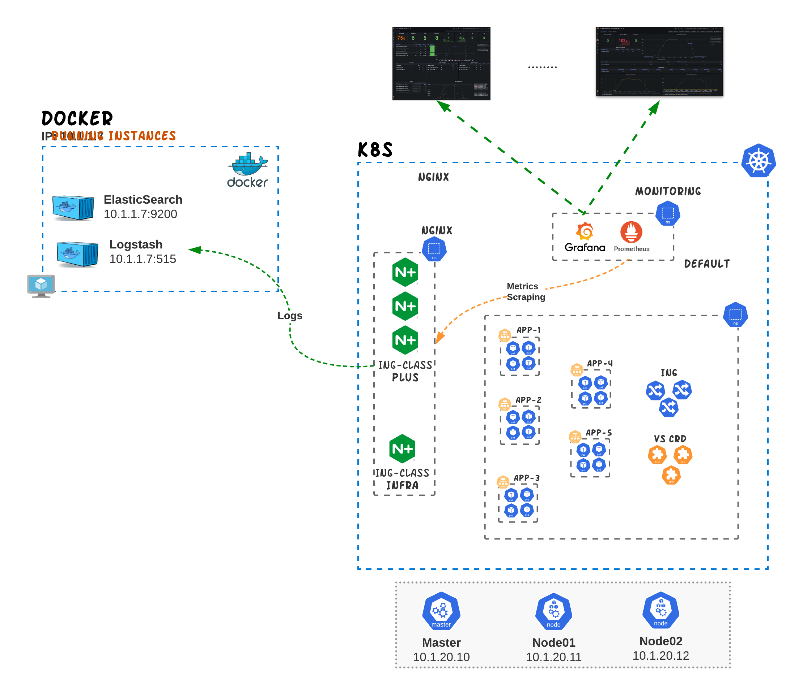
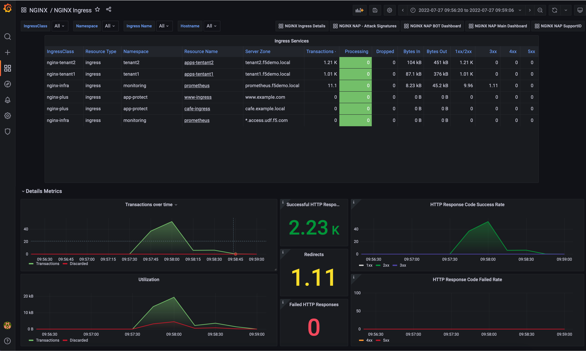
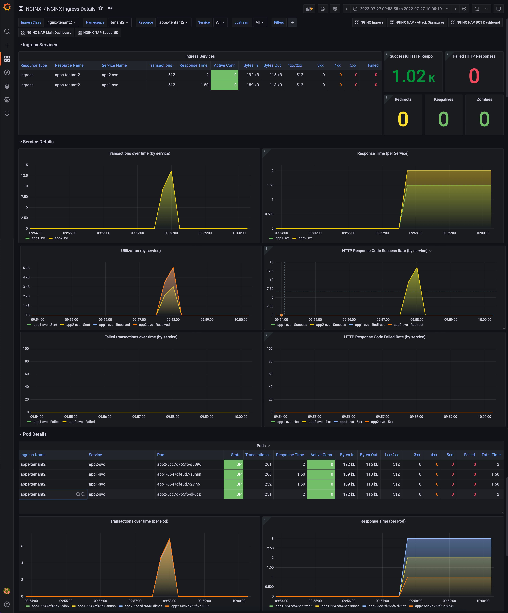
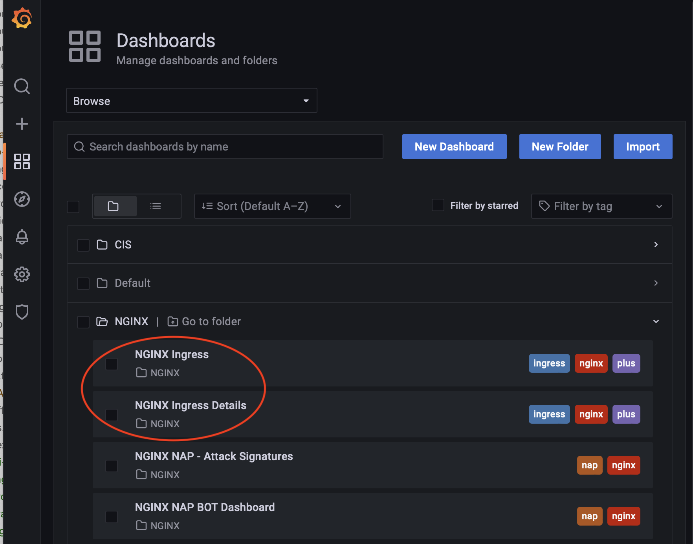

# Monitoring NGINX+ Ingress services with Prometheus, Grafana and Elastic
In this section we go through how you can efectively to monitor NGINX+ K8s services (Ingress and VirtualServer). The technologies that are part of the observability platform are [**Prometheus**](#prometheus) and [**Grafana**](#grafana). 

<p align="center">
  
</p>

The dashboards that have been created to assist with the monitoring of the K8s services are:
  - [**NGINX Ingress**](#nginx-ingress-dashboard)
  - [**NGINX Ingress Details**](#nginx-ingress-details-dashboard)
  - NGINX Access Logs (**pending**)
  - NGINX Error Logs (**pending**)

## NGINX Ingress Dashboard
This dashboard provides an overall view across all ingress resources and virtualserver CRDs managed by NGINX+ per hostname with the ability to filter per **IngressClass**, **Namespace**, **Ingress Name** and **Hostname**.
The collected metrics include the following:
- Total number of transactions
- HTTP Reponse Codes (2xx, 3xx, 4xx and 5xx)
- Open transactions (processing)
- Dropped transactions
- Bytes In/Out




>:information_source:
>  The data source for this dashboard is Prometheus.

## NGINX Ingress Details Dashboard
This dashboard provides for each IngressClass a view across all services that are part of the ingress resources and virtualserver CRDs of NGINX+. The dashboads gives the ability to filter per **Namespace**, **Resource**, **Service** and **Upstream**.
The collected metrics include the following:
- Total number of transactions
- Response Time (ms)
- HTTP Reponse Codes (2xx, 3xx, 4xx and 5xx)
- Actve connections
- Failed transactions
- Bytes In/Out



>:information_source:
>  The data source for this dashboard is Prometheus.


## How to Demo
In order to demo the usefullness of the dashboards we are to create traffic through the BIGIP. 

#### Step 1 - Create multiple Ingress and VS CRDs
Change the working directory to `bigip-monitoring`.
```
cd ~/oltra/use-cases/nginx-monitoring/
```

Scale the deployment of `echo-svc` to 5 pods
```
kubectl scale deployment echo --replicas=5
```

Run the following script that will deploy multiple HTTP/HTTPS VirtualServer CRDs so that we prepare the BIGIP to receive traffic. 
```
kubectl apply -f deploy_services.yml
```
```
##############################   Expected result   ##############################
ingress.networking.k8s.io/app1-ingress configured
ingress.networking.k8s.io/app2-ingress configured
ingress.networking.k8s.io/app3-ingress configured
ingress.networking.k8s.io/readiness-ingress configured
ingress.networking.k8s.io/echo-ingress configured
##################################################################################
```

Verify that the VirtualServers have been configured correctly.
```
kubectl get ingress | grep nginx
```
```
##############################   Expected result   ##############################
NAME                CLASS        HOSTS                   ADDRESS      PORTS   AGE
app1-ingress        nginx-plus   app1.nginx.local                     80      5h44m
app2-ingress        nginx-plus   app2.nginx.local                     80      5h44m
app3-ingress        nginx-plus   app3.nginx.local                     80      5h44m
echo-ingress        nginx-plus   echo.nginx.local                     80      5h44m
readiness-ingress   nginx-plus   readiness.nginx.local                80      5h44m
##################################################################################
```


#### Step 2 - Send traffic to the NGINX+** 
The following script will send traffic to the Ingress resources published on NGINX+ for about 1-2 minutes in order to populate the graphs with meaningful data.

```
./traffic.sh
```
>**Note:** You might want to run the script multiple times to collect more logs/statistics.

#### Step 3 - Review Dashboards in Grafana
Once the script has been completed we should be able to see statistics/events on the Grafana dasbboards such as:
- Utilization per Ingress Resources
- Traffic per service and pod
- HTTP Response Code statistics
- HTTP Response Time (ms)

> **Note 1:** Ingress Resource *echo.nginx.local* is configured to have random delays between 100ms and 1.5 seconds
> **Note 2:** Ingress Resource *readiness.nginx.local* is configured to provide 500 status code errors.

On the UDF you can acess Grafana from BIGIP "Access" methods as per the image below.

<p align="left">
  
</p>

Login to Grafana (credentials **admin/IngressLab123**)
<p align="left">
  
</p>


Go to **Dashboards->Browse**

<p align="left">
  
</p>


Select the two NGINX Ingress Dashboards under the NGINX folder

<p align="left">
  
</p>


## Technologies


#### **Prometheus**
Prometheus is an open-source systems monitoring and alerting toolkit originally built at SoundCloud. Since its inception in 2012, many companies and organizations have adopted Prometheus, and the project has a very active developer and user community. It is now a standalone open source project and maintained independently of any company. To emphasize this, and to clarify the project's governance structure, Prometheus joined the Cloud Native Computing Foundation in 2016 as the second hosted project, after Kubernetes.

In our environemnt Prometheus has been configured to scrape NGINX+ for all metrics every 30 seconds.
You can find more information on how Prometheus has been configured to scrape NGINX+ can be found on the link below:

- <a href="https://github.com/F5EMEA/oltra/blob/main/setup/prometheus-grafana/2-scraping-nginx.yml"> Scraping NGINX+ </a>


#### **Grafana**
 
Grafana is an open source solution for running data analytics, pulling up metrics that make sense of the massive amount of data & to monitor our apps with the help of cool customizable dashboards.
Grafana connects with every possible data source, commonly referred to as databases such as Graphite, Prometheus, Influx DB, ElasticSearch, MySQL, PostgreSQL etc.

In our environment we connected Grafana to Elasticsearch and Prometheus. The Dashboards created can be found on Grafana Hub:
- <a href="https://grafana.com/grafana/dashboards/15680">NGINX Ingress</a>
- <a href="https://grafana.com/grafana/dashboards/15679">NGINX Ingress Details</a>


