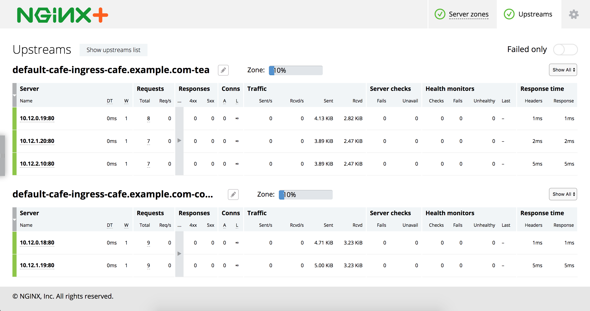

# Example

In this example we deploy the NGINX or NGINX Plus Ingress Controller, a simple web application and then configure load balancing for that application using the Ingress resource.

## Running the Example

## 1. Deploy the Ingress Controller

1. Follow the [installation](https://docs.nginx.com/nginx-ingress-controller/installation/installation-with-manifests/) instructions to deploy the Ingress Controller.

2. Save the public IP address of the Ingress Controller into a shell variable:
    ```
    $ IC_IP=XXX.YYY.ZZZ.III
    ```
3. Save the HTTPS port of the Ingress Controller into a shell variable:
    ```
    $ IC_HTTPS_PORT=<port number>
    ```

## 2. Deploy the Cafe Application

Create the coffee and the tea deployments and services:
```
$ kubectl create -f cafe.yaml
```

## 3. Configure Load Balancing

1. Create a secret with an SSL certificate and a key:
    ```
    $ kubectl create -f cafe-secret.yaml
    ```

2. Create an Ingress resource:
    ```
    $ kubectl create -f cafe-ingress.yaml
    ```

## 4. Test the Application

1. To access the application, curl the coffee and the tea services. We'll use ```curl```'s --insecure option to turn off certificate verification of our self-signed
certificate and the --resolve option to set the Host header of a request with ```cafe.example.com```

    To get coffee:
    ```
    $ curl --resolve cafe.example.com:$IC_HTTPS_PORT:$IC_IP https://cafe.example.com:$IC_HTTPS_PORT/coffee --insecure
    Server address: 10.12.0.18:80
    Server name: coffee-7586895968-r26zn
    ...
    ```
    If your prefer tea:
    ```
    $ curl --resolve cafe.example.com:$IC_HTTPS_PORT:$IC_IP https://cafe.example.com:$IC_HTTPS_PORT/tea --insecure
    Server address: 10.12.0.19:80
    Server name: tea-7cd44fcb4d-xfw2x
    ...
    ```

1. You can view an NGINX status page, either stub_status for NGINX, or the Live Activity Monitoring Dashboard for NGINX Plus:
    1. Follow the [instructions](https://docs.nginx.com/nginx-ingress-controller/logging-and-monitoring/status-page/) to access the status page.
    1. For NGINX Plus, If you go to the Upstream tab, you'll see: 
