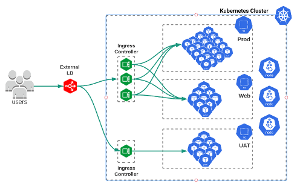

# Two Tier Architectures
When building your Kubernetes architecture on any public cloud provider (AWS, Azure, Google) you are working with a two tier architecture. Similarly in the following section we will show how you can build the same two tier architecture with CIS and NGINX+ to be used on your private or public cloud environments. 

  

Creating a two tier architecture has multiple advantages over a single tier architecture. Some of these advantages are:
- It is more **scalable**. You could have multiple Ingress Controllers, which means multiple control/data places, running inside Kubernetes handing most of the load.
- You could build easier Multi-tenant environments as each tenant would have its own Ingress Controller and therefore there wouldn't be any conflict among the different tenants. **Multi-tenancy** is easier to achieve.
- You can use Kubernetes native functionalities to **autoscale** the pods running your Ingress Controller and handle more load.  
- **Upgrading** and **Rolling back** can be simplified with Kubernetes rollout strategies.

We have created three two tier architectures that demonstrate how you can use BIGIP to publish NGINX+ Ingress Services. These are the following:
 - [Layer 4 Deployments](layer-4)
 - [Security on the Edge](edge-security)
 - [GitOps](gitops)

 
