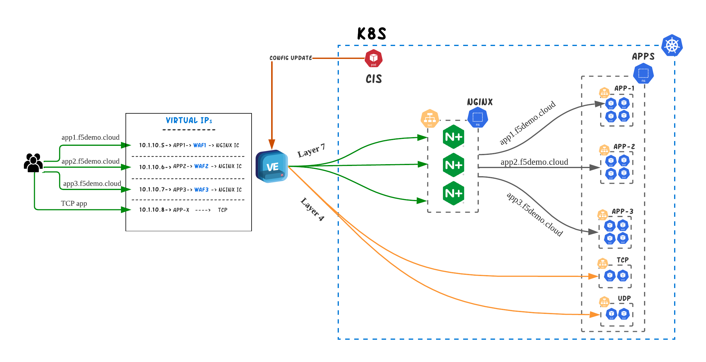

# Security on the Edge
DevOps teams need to integrate security controls like WAF or DDoS that are authorized/maintained by the security team without slowing release velocity or performance. In this use-case we will focus on how we can deploy multiple applications behind NGINX+ Ingress Controller and publish each one with a seperate WAF/DDoS Policy.

## Requirements
The usual requirements for such an environments are the following:
* DevOps team should be able to control the process of publishing resources.
* The process should happen in a Kubernetes-native way.
* DevOps teams shouldn’t have to manage the external IPs on BIGIP
* WAF/DDoS policies need to be applied on the applications that are getting published.
* While the main service that should be exposed is the NGINX+ Ingress Controller, DevOps teams might require also to expose TCP/UDP apps without going through the Ingress Controller.
* Multiple NGINX+ IC groups running per Kubernetes cluster.
* The design should be scalable to multiple Kubernetes clusters


## Proposed Architecture

<p align="center">
  
</p>

Having a single, standardized approach that runs everywhere Kubernetes runs, ensures that configurations are applied consistently, across all environments. This is one of the many benefits that **Kubernetes-native** configuration provides.

BIGIP can be configured in a kubernetes-native manner though the use of <a href="https://clouddocs.f5.com/containers/latest/userguide/what-is.html">CIS controller</a>. Altough CIS has multiple modes of operation (Ingress, Routes, CRDs, Configmaps) the most relevant for our use case are VirtualServer CRD and TransportServer CRDs and Service Type LoadBalancer. 

| Type | Functionality |
|---|---|
| VirtualServer | With VirtualServer Custom Resource you can forward all traffic to your service through a L7 Virtual Server on BIGIP. It provides functionalities such as **Reverse Proxy**, **DDoS**, **BoT protection**, **SSL offloading**, **HTTP2**, **OneConnect**, **iRules**, **WAF**, **SNAT** , **Cookie/IP Persistence** and **EDNS**. <br> It works with and without **IPAM** controller. <br> Examples on VirtualServer CRD can be found <a href="https://github.com/F5EMEA/oltra/blob/main/use-cases/cis-examples/README.md#virtualserver-crd-examples">here</a> |
| TransportServer |  With TransportServer Custom Resource you can forward all traffic to your service through a L4 Virtual Server on BIGIP. It provides functionalities such as **Reverse Proxy**,  **L4 DDoS**, **L4 iRules**, **SNAT pools**, **IP Persistence**.<br> It works with and without the **IPAM** controller.<br> Examples on TransportServer can be found <a href="https://github.com/F5EMEA/oltra/blob/main/use-cases/cis-examples/README.md#transportserver-crd-examples">here</a> |
| Service Type LB | Services of type LoadBalancer are natively supported in Kubernetes deployments. When you create a service of type LoadBalancer it spins up service in integration with F5 IPAM Controller which allocates an IP address that will forward all traffic to your service through a L4 Virtual Server on BIGIP. It provides functionalities such as **Reverse Proxy**,  **L4 DDoS**, **L4 iRules**, **SNAT pools**, **IP persistence**.<br> It works only with **IPAM** controller.<br> Examples on Service Type LB can be found <a href="https://github.com/F5EMEA/oltra/blob/main/use-cases/cis-examples/README.md#service-type-loadbalancer-examples">here</a> |

**VirtualServer** is the only option for publishing NGINX Ingress Controller since in this use case we need to attach WAF and/or DDoS profiles to the published services. VirtualServer Custom Resource creates a Layer 7 Virtual server on BIGIP and by using the Policy CRD it can attach pre-configured WAF, DDoS profile on the same BIGIP Virtual Server. 
If we want to have separate WAF/DDoS profiles per Hostname, then we would need to create separate multiple VirtualServer CRs, each with a different profile attached.  

### SSL Decryption
In order for BIGIP to be able to apply the WAF/DDoS policies on the traffic going through the Virtual Server, it needs first to decrypt the SSL. Therefore the SSL decoding will take place on BIGIP.
The SSL certificates can either be configured manually on BIGIP and referenced on VS CRD or they can be configured automatically through CIS from Kubernetes secrets. Examples on how to configure VirtualServer CR with TLS can be found <a href="https://github.com/F5EMEA/oltra/tree/multi-cluster/use-cases/cis-examples/cis-crd/VirtualServer/TLS-Termination">here</a>

**TransportServer** and **Service Type LB** are recommended methods to publish either TCP or UDP applications, since both provide Layer 4 Load Balancing and provide IPAM functionality.


## Demo 
In the following section we will demontrate how we can implement the above architecture. We will be using VirtualServer to publish both NGINX+ IC and Service Type LB for a UDP application (CoreDNS). Behind NGINX+ we will be deploying 3 different applications all protected with a different WAF policy:
- www.f5demo.local **waf_policy_www**
- app1.f5demo.local **app1_policy_www**
- app2.f5demo.local **app2_policy_www**

### Step 1. Verify NGINX+ and CIS are already running

Access the terminal on the VS Code.


Change the working directory to `edge-security`.
```
cd ~/oltra/use-cases/two-tier-architectures/edge-security
```

Run the following command to verify NGINX+ is running.
```
kubectl get po -n nginx 

############  Expected Output  #############
NAME                           READY   STATUS    RESTARTS      AGE
nginx-plus-778ff965c9-9kbbr    1/1     Running   3 (35m ago)   2d16h
nginx-plus-778ff965c9-h7ssx    1/1     Running   2 (37m ago)   2d16h
############################################
```

Run the following command to verify CIS and IPAM are running.
```
kubectl get po -n bigip 

############  Expected Output  #############
NAME                              READY   STATUS    RESTARTS      AGE
f5-cis-crd-bdb7bb4f4-lx2zp        1/1     Running   3 (9h ago)    12d
f5-cis-ingress-855fc6d6cc-9jv8l   1/1     Running   8 (37m ago)   2d16h
f5-ipam-7cd6975f88-hj9nx          1/1     Running   0             9h
############################################
```

### Step 2. Deploy services behind NGINX+ IC.
Create a new namespace `layer7` and deploy the demo apps and services.
```
kubectl create namespace layer7
kubectl apply -f  ~/oltra/setup/apps/apps.yml -n layer7
kubectl apply -f  ~/oltra/setup/apps/my-echo.yml -n layer7
kubectl apply -f  ~/oltra/setup/apps/dns.yaml -n layer7
```

Deploy Ingress resources for the demo apps.
```
kubectl apply -f ingress.yml
```

Review the Ingress resources created.
```
kubectl get ingress -n layer7
```

### Step 3. Publish NGINX+ with a VirtualServer CRD
Create the PolicyCRD and VirtualServerCRD resources to publish the applications behind NGINX+.
```
kubectl apply -f www-waf-policy.yml
kubectl apply -f www-vs.yml
kubectl apply -f app1-waf-policy.yml
kubectl apply -f app1-vs.yml
kubectl apply -f app2-waf-policy.yml
kubectl apply -f app2-vs.yml
```
> Note: For certificate on the VirtualServer you can also use Kubernetes secrets. Examples for this can be found on the following <a href="<a href="https://github.com/F5EMEA/oltra/tree/multi-cluster/use-cases/cis-examples/cis-crd/VirtualServer/TLS-Termination#certificate-as-k8s-secret">here</a>">link</a>

Confirm that the VS CRD is deployed correctly. You should see `Ok` under the Status column for the VirtualServers that was just deployed.
```
kubectl get vs -n layer7
```

Save the IP adresses that was assigned by the IPAM for this service
```
IP_www=$(kubectl get vs l7-www -n layer7 --output=jsonpath='{.status.vsAddress}')
IP_app1=$(kubectl get vs l7-app1 -n layer7 --output=jsonpath='{.status.vsAddress}')
IP_app2=$(kubectl get vs l7-app2 -n layer7 --output=jsonpath='{.status.vsAddress}')

```

Try accessing the applications as per the examples below. 
```
curl "http://l7-www.f5demo.local/index.php" --resolve l7-www.f5demo.local:80:$IP_www
curl "http://l7-app1.f5demo.local/index.php" --resolve l7-app1.f5demo.local:80:$IP_app1
curl "http://l7-app2.f5demo.local/index.php" --resolve l7-app2.f5demo.local:80:$IP_app2

```


On the BIGIP we created 3 WAF policies **www_policy**,  **app1_policy** and  **app2_policy** to block HTTP attacks, so we expect BIGIP to mitigate any L7 attack (according to the WAF policy) that is executed to the services running in K8S. The WAF policies have been referenced on the PolicyCRDs.

Access the service using the following example that contains a XSS violations. 
```
curl "http://l7-www.f5demo.local/index.php?parameter=<script/>" --resolve l7-www.f5demo.local:80:$IP_www
curl "http://l7-app1.f5demo.local/index.php?parameter=<script/>" --resolve l7-app1.f5demo.local:80:$IP_app1
curl "http://l7-app2.f5demo.local/index.php?parameter=<script/>" --resolve l7-app2.f5demo.local:80:$IP_app2

```

Verify that the transactions that contain XSS attack gets blocked by BIGIP WAF.
```html
<html>
  <head>
    <title>Request Rejected</title>
  </head>
  <body>
    The requested URL was rejected. Please consult with your administrator.<br><br>
    Your support ID is: 4045204596866416688<br><br>
    <a href='javascript:history.back();'>[Go Back]</a>
  </body>
</html>
```

Login to BIGIP and review the logs for all the policies.


### Step 5. Publish a UDP application with TransportServer CRD.

This step we will publish a UDP application (CoreDNS) with the use of TransportServer CRDs.

Eg: udp-transport-server.yml
```yml
apiVersion: "cis.f5.com/v1"
kind: TransportServer
metadata:
  labels:
    f5cr: "true"
  name: udp-transport-server
  namespace: layer4
spec:
  virtualServerAddress: "10.1.10.125"
  virtualServerPort: 53
  virtualServerName: svc-udp-ts
  type: udp
  mode: standard
  snat: auto
  pool:
    service: coredns
    servicePort: 5353
```

Create the TransportServer resource. 
```
kubectl apply -f udp-transport-server.yml
```

Confirm that TransportServer is deployed correctly. You should see `Ok` under the Status column for the TransportServer that was just deployed.
```
kubectl get ts udp-transport-server -n layer4
```

Try accessing any DNS service on the internet like `www.example.com` through the Transport Server VIP (`10.1.10.125`)

```
dig @10.1.10.125 www.example.com
```

The output should be similar to:
```
; <<>> DiG 9.11.3-1ubuntu1.13-Ubuntu <<>> @10.1.10.125 www.example.com
; (1 server found)
;; global options: +cmd
;; Got answer:
;; ->>HEADER<<- opcode: QUERY, status: NOERROR, id: 62205
;; flags: qr rd ra ad; QUERY: 1, ANSWER: 1, AUTHORITY: 0, ADDITIONAL: 1

;; OPT PSEUDOSECTION:
; EDNS: version: 0, flags:; udp: 4096
;; QUESTION SECTION:
;www.example.com.               IN      A

;; ANSWER SECTION:
www.example.com.        14244   IN      A       93.184.216.34

;; Query time: 4 msec
;; SERVER: 10.1.10.75#53(10.1.10.125)        <================ DNS Server
;; WHEN: Thu Jul 14 06:38:20 UTC 2022
;; MSG SIZE  rcvd: 75
```

> Note that the response comes from 10.1.10.125 which is the Transport Server IP


### Step 6. Clean up the environment

Delete the namespace `layer7`
```
kubectl delete ns layer7
```
