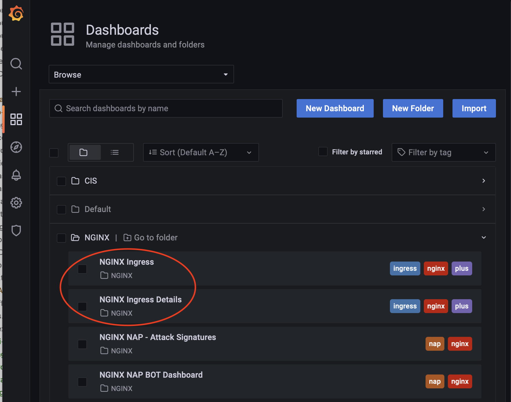

# GitOps Deployments
There are some cases that CIS might not be able to meet the customer requirements. 
* Load Balancing services that run on mulitple clusters with LTM
* Doing Canary or ab testing between 2 clusters
* Doing Canary or ab testing between 2 services on the same cluster
* Before the deployment, there has to be some sort of a validation plan.
* After the deployment, there needs to be a post deployment script. For example, registring the IPs to a DNS name or creating a firewall rule. 
* NetOps want to be in control of the process of deploying services in BIGIP. Possibly through an approval process

The above use-cases and many more could be addressed with a GitOps deployment of AS3 services.  

## Technologies used
To create a GitOps environment for these kind of deployments we would need the following technologies:
* **AS3.** AS3 provides a a declarative interface that can assist on managing application-specific configurations on a BIG-IP system. This means that we provide a JSON declaration rather than a set of imperative commands and AS3 will be responsible to make sure the BIGIP is configured accordingly. 
* **Git.** A repository where the users can store the configuration. Gitlab, which is the git that we will be using not only holds the source of truth for the AS3 configs, but can provide the audit trail and history of all the changes that have happened throughout the lifecycle of the applications.
* **CI/CD.** A Continuous Integration and Continuous Deployment tool is required to identify when there is a change on the configuraton files (maybe through a webhook) and then push down the changes to BIGIP. CI/CD tools also provide workflows that we can define *pre* and *post* stages of the deployment but also assist on the approval process if needed. We are going to be using Gitlab as our CI/CD tool.
* **Jinja2 Templates.** Jinja2 is a fast, expressive, extensible templating engine, that allows us to simplify the process of AS3 configuration. For example, you can create a template for an AS3 configuration file, then create that configuration file by simply providing the correct data/variables. 

## Putting it together
In order to have a successful solution, the most important part for such deployments is to make it simple for the users that are trying to configure the services. 

### Templates
For the purposes of this demo we have created 2 different templates with JINJA2; **HTTP** and a **TCP**. Below you can find the TCP template:

```
########################################################################
########################  JINJA2 TCP Template   ########################
########################################################################

"{{name}}": {
    "class": "Application",
    "{{name}}": {
    "class": "Service_TCP",
    "virtualAddresses": [
        "{{vip}}"
    ],
    "virtualPort": {{port}},
    "pool": "{{name}}_pool"
    },
    "{{name}}_pool": {
        "class": "Pool",
        
        "monitors": [
            
            "tcp"
            
            "http"
                   
         ],
                
        "members": [
        
            {
            "servicePort": {{entry.nodeport}},     
            
            "ratio": {{entry.ratio}},
            
            
            "connectionlimit": {{entry.connectionlimit}},
            
            "serverAddresses": [
            
                "{{line}}"{{ "," if not loop.last }}
            
            ]
        }{{ "," if not loop.last }}
        
    ]
    }
}
```
Both templates can be found on the following <a href="https://clouddocs.f5.com/containers/latest/userguide/what-is.html">link</a> and require the following parameters. Of course you can modify the templates to include any functionality supproted by AS3

| Parameter name | Description | Requirement | Default value | TCP |  HTTP |
|:-|:-|:-:|:-:|:-:|:-:|
| name| Application name | Mandatory |- | Yes| Yes |
| vip |VirtualServer IP | Mandatory |- | Yes| Yes |
| port |VirtualServer Port | Mandatory |- | Yes| Yes |
|cluster_name | Cluster name | Mandatory | - | Yes | Yes |
|nodeport |Node Port | Mandatory | - | Yes | Yes|
|monitor| Monitor name | Optional | none | Yes | Yes |
|ratio | Ratio | Optional | 0 | Yes | Yes |
|connectionlimit | ConnectionLimit | Optional | 0 | Yes | Yes |


### Configuration files
To achieve ease of use, the only thing that a user needs to create are the parameters of the service they want to publish and save them to the file in a YAML format. The YAML format was choosen as its interface is much more friendly and familiar to Devops users.

```yml
config: 
  - name: Portal
    vip: 10.1.1.214
    port: 80
    template: http    <------ using "http" Template
    monitor: http
    cluster:
    - cluster_name: primary
      nodeport: 33002
      ratio: 9
    - cluster_name: secondary
      nodeport: 33002
      ratio: 1

  - name: App_1
    vip: 10.1.1.215
    port: 8080
    template: tcp  <------ using "tcp" Template
    cluster:
    - cluster_name: primary
      nodeport: 33012
      connectionlimit: 500
      ratio: 9
    - cluster_name: secondary
      nodeport: 33012
      ratio: 1
      connectionlimit: 50
```

### Converting to AS3 from YAML
To make the process simple from converting YAML to AS3 JSON we are using the JINJA2 templates. The templates take the input from the configuration file(s) in YAML and use it to create the final AS3 JSON format. This process takes place as part of the CI/CD pipeline and can be implement either as an Ansible playbook or a Python script. For this demo we selected to use Python script to run the JINJA2 template conversion. 

<p align="center">
  
</p>

### Using CI/CD
When there is a commit on the repository we are using the CI/CD pipeline runs automatically. The is split into 3 stages. 
- The ***first stage*** is the verfication. In this stage we can review and validate multiple aspects. We can validate the YAML file format, we can verify that the VirtualServer IPs that are being used are correct and many more.
- The ***second stage*** is the deployment. In this stage we construct the AS3 with the help of JINJA2 templates and a python script <a href="https://clouddocs.f5.com/containers/latest/userguide/what-is.html">`build-as.py`</a> and deploy the AS3 configuraiton on the intented BIGIP platform. The Logs and the AS3 json file are saved as artifacts to be accessed if needed later. 
- The ***third stage*** is the validation. In this stage we validate the configuration that has been applied but we can also run a number of supporting post-deployment tasks. Things like DNS publishing, firewall policy configuration, email/slack notifactions and many others.

<p align="center">
  
</p>


## Demo 
In the following section we will demontrate how we can load balance 2 Ingress Controllers with a ratio of 10 to 1. This scenario is useful to test a new release of NGINX+ Ingress Controller or an application. 

### Step 1. Create two NGINX+ Ingress Controllers

Change the working directory to `gitops`.
```
cd ~/oltra/use-cases/two-tier-architectures/gitops
```

Create the namespace (ngnix1, nginx2) for each NGINX+ Ingress Controller that we are planning to deploy
```
kubectl create namespace nginx1
kubectl create namespace nginx2
```

Copy the NGINX plus deployment from the setup folder to 
```
mkdir nginx1
mkdir nginx2
cp -R ~/oltra/setup/nginx-ic/* nginx1
cp -R ~/oltra/setup/nginx-ic/* nginx2
```

Run the following command that will make all the necessary changes on the NGINX config files according to the new namespaces.
```
./rename.sh
```

Apply configurations
```
kubectl apply -f ~/oltra/use-cases/multi-tenancy/nginx1/rbac
kubectl apply -f ~/oltra/use-cases/multi-tenancy/nginx2/rbac
kubectl apply -f ~/oltra/use-cases/multi-tenancy/nginx1/resources
kubectl apply -f ~/oltra/use-cases/multi-tenancy/nginx2/resources
kubectl apply -f ~/oltra/use-cases/multi-tenancy/nginx1/nginx-plus
kubectl apply -f ~/oltra/use-cases/multi-tenancy/nginx2/nginx-plus

```

### Step 2. Deploy applications behind each IC
Create a test application and publish it behind on both ICs
```
kubectl create namespace layer4
```

### Step 3. Publish Ingress Controller 

1. Publish NGINX+ IC with a NodePort service.
```
cd ~/oltra/use-cases/two-tier-designs/layer4
mkdir layer4
cp -R ~/oltra/setup/nginx-ic/* .
```

2. Verify the Ports used for the NodePort services. 
```
```

### Step 3. Create the configruation on Gilab
1. Login to Gitlab

2. Go to `asfdasdas` Repository

3. Open the file `configuration.yml` 

4. Edit the file and replace the content with the one below

5. Go to CI/CD
```
asdasd
asd
asdsa
```
2. 

3. Access the services for both tenants as per the example below. 
```
curl http://tenant1.f5demo.local/ --resolve tenant1.f5demo.local:80:$IP_tenant1
curl http://tenant2.f5demo.local/ --resolve tenant2.f5demo.local:80:$IP_tenant2
curl http://tenant1.f5demo.local/app2 --resolve tenant1.f5demo.local:80:$IP_tenant1
curl http://tenant2.f5demo.local/app2 --resolve tenant2.f5demo.local:80:$IP_tenant2
```


### Step 4. (Optional) Grafana Dashboards 

1. Setup scraping for the new NGINX instances
```yml
cat <<EOF | kubectl apply -f -
apiVersion: v1
kind: Service
metadata:
  name: nginx-metrics-tenant1
  namespace: tenant1
  labels:
    type: nginx-metrics
spec:
  ports:
  - port: 9113
    protocol: TCP
    targetPort: 9113
    name: prometheus
  selector:
    app: nginx-tenant1
---
apiVersion: v1
kind: Service
metadata:
  name: nginx-metrics-tenant2
  namespace: tenant2
  labels:
    type: nginx-metrics
spec:
  ports:
  - port: 9113
    protocol: TCP
    targetPort: 9113
    name: prometheus
  selector:
    app: nginx-tenant2
---
apiVersion: monitoring.coreos.com/v1
kind: ServiceMonitor
metadata:
  name: nginx-metrics
  namespace: monitoring
  labels:
    type: nginx-plus
spec:
  selector:
    matchLabels:
      type: nginx-metrics
  namespaceSelector:
    matchNames:
    - nginx
    - tenant1
    - tenant2
  endpoints:
  - interval: 30s
    path: /metrics
    port: prometheus
EOF
```

2. Login to Grafana. On the UDF you can acess Grafana from BIGIP "Access" methods as per the image below.

<p align="left">
  
</p>

Login to Grafana (credentials **admin/IngressLab123**)
<p align="left">
  
</p>


Go to **Dashboards->Browse**

<p align="left">
  
</p>


Select any of the 2 Ingress Dashboards (NGINX Ingress / NGINX Ingress Details) which can be found on NGINX Folder

<p align="left">
  
</p>


2. Run the following script to generate traffic and review the Grafana Dashboards per tenant
```cmd
for i in {1..500} ; do curl http://tenant1.f5demo.local/ --resolve tenant1.f5demo.local:80:$IP_tenant1; \
curl http://tenant2.f5demo.local/ --resolve tenant2.f5demo.local:80:$IP_tenant2;  \
curl http://tenant1.f5demo.local/app2 --resolve tenant1.f5demo.local:80:$IP_tenant1; \
curl http://tenant2.f5demo.local/app2 --resolve tenant2.f5demo.local:80:$IP_tenant2; \
done
```

**Ingress Dashboard**

<p align="left">
  
</p>

**Ingress Dashboard Details**

<p align="left">
  
</p>
