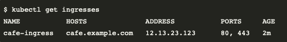

# Layer 4 Deployments
One of the most common deployments in regards to the external load balancer is Layer 4. The main requirement in this case is to provide L4 connectivity between the external environment and the Ingress Controller running inside Kubernetes. The typical customer environmnet will contain mutliple Ingress Controllers for different environments such as Production, UAT and Demo and probably multiple Kubernetes clusters. 

## Requirements
The usual requirements for such an environments are the following:
* DevOps teams should be able to control the process of publishing resources.
* The process should happen in a Kubernetes-native way.
* DevOps teams shouldn’t have to manage the external IPs on BIGIP.
* SSL termination should take place on Kubernetes Ingress Controller.
* While the main service that should be exposed is the NGINX+ Ingress Controller, DevOps teams might require also to expose TCP/UDP apps without going through the Ingress Controller.
* Multiple NGINX+ IC running per Kubernetes cluster.
* The design should be scalable to multiple Kubernetes clusters

## Proposed Architecture

<p align="center">
  
</p>

Having a single, standardized approach that runs everywhere Kubernetes runs, ensures that configurations are applied consistently, across all environments. This is one of the many benefits that **Kubernetes-native** configuration provides.

BIGIP can be configured in a kubernetes-native way though the use of <a href="https://clouddocs.f5.com/containers/latest/userguide/what-is.html">CIS controller</a>. Altough CIS has multiple modes of operation (Ingress, Routes, CRDs, Configmaps) the 3 most relevant for our use case are IngressLink and TransportServer and Service Type LoadBalancer. 

| Type | Functionality |
|---|---|
| TransportServer |  With TransportServer Custom Resource you can forward all traffic to your service through a L4 Virtual Server on BIGIP. It provides functionalities such as **Reverse Proxy**,  **L4 DDoS**, **L4 iRules**, **SNAT pools**, **IP Persistence**.<br> It works with and without the **IPAM** controller.<br> Examples on TransportServer can be found <a href="https://github.com/F5EMEA/oltra/blob/main/use-cases/cis-examples/README.md#transportserver-crd-examples">here</a> |
| Service Type LB | Services of type LoadBalancer are natively supported in Kubernetes deployments. When you create a service of type LoadBalancer it spins up service in integration with F5 IPAM Controller which allocates an IP address that will forward all traffic to your service through a L4 Virtual Server on BIGIP. It provides functionalities such as **Reverse Proxy**,  **L4 DDoS**, **iRules**, **SNAT**, **IP persistence** and **EDNS**.<br> It works only with **IPAM** controller.<br> Examples on Service Type LB can be found <a href="https://github.com/F5EMEA/oltra/blob/main/use-cases/cis-examples/README.md#service-type-loadbalancer-examples">here</a> |
| IngressLink | IngressLink Custom Resource is a dedicated CRD for integrating BIGIP with NGINX Ingress Controller. The integration is acheved through a Layer 4 Virtual Server on BIGIP that forwards all traffic to NGINX Ingress Controller. <br> It works with or without **IPAM** controller. <br> Examples on IngressLink can be found <a href="https://github.com/F5EMEA/oltra/blob/main/use-cases/cis-examples/README.md#ingresslink-examples">here</a> |

**IngressLink** and **Service Type LB** are the recommended methods for publishing NGINX Ingress Controller in our use case. Both methods provide Layer 4 Load Balancing from BIGIP to NGINX+ IC instances and therefore do not terminate SSL and both support IPAM so that IPs are not managed by the DevOps teams.

An intresting feature is that both methods can populate the Ingress resource Address information with the external IP that has been configured on BIGIP. To achieve this integration we need to enable the correct arguments on NGINX Ingress Controller deployment. These arguments are:
- "-ingresslink" for Ingresslink deployments
- "-external-service" for Type LB deployments

<p align="center">
  
</p>

More information on how to configure those arguments can be found on the link https://docs.nginx.com/nginx-ingress-controller/configuration/global-configuration/command-line-arguments/

**TransportServer** and **Service Type LB** are recommended methods to publish either TCP or UDP applications, since both provide Layer 4 Load Balancing and provide IPAM functionality.

> **Why select ServiceType LB?**
> - Easier deployment since it doesn;t require additional resources (TS CRD).
> - Makes the code portable to cloud environments that support ServiceType LB

> **Why select TransportServer (TS) or IngressLink instead?**
> - If you want to use a static IP address on the BIGIP
> - If, for RBAC purposes, you need to control the publishing of a service, then having a separate resource such as TransportServer or IngressLink can help you apply different clusterroles to them and therefore control who has access to the resource.


## Demo 
In the following section we will demontrate how we can implement the above architecture. We will be using ServiceType LB to publish both NGINX+ IC and a UDP application (CoreDNS). Behind NGINX+ we will be deploying 3 different applications:
- www.f5demo.local
- app1.f5demo.local
- app2.f5demo.local

### Step 1. Verify NGINX+ and CIS are already running

Change the working directory to `Layer4`.
```
cd ~/oltra/use-cases/two-tier-architectures/layer-4
```

Run the following command to verify NGINX+ is running.
```
kubectl get po -n nginx 

############  Expected Output  #############
NAME                           READY   STATUS    RESTARTS      AGE
nginx-plus-778ff965c9-9kbbr    1/1     Running   3 (35m ago)   2d16h
nginx-plus-778ff965c9-h7ssx    1/1     Running   2 (37m ago)   2d16h
############################################
```

Run the following command to verify CIS and IPAM are running.
```
kubectl get po -n bigip 

############  Expected Output  #############
NAME                              READY   STATUS    RESTARTS      AGE
f5-cis-crd-bdb7bb4f4-lx2zp        1/1     Running   3 (9h ago)    12d
f5-cis-ingress-855fc6d6cc-9jv8l   1/1     Running   8 (37m ago)   2d16h
f5-ipam-7cd6975f88-hj9nx          1/1     Running   0             9h
############################################
```


### Step 2. Deploy services behind NGINX+ IC.
Create a new namespace `layer4` and deploy demo apps and services.
```
kubectl create namespace layer4
kubectl apply -f  ~/oltra/setup/apps/apps.yml -n layer4
kubectl apply -f  ~/oltra/setup/apps/my-echo.yml -n layer4
kubectl apply -f  ~/oltra/setup/apps/dns.yaml -n layer4
```

Deploy Ingress services for demo apps.
```
kubectl apply -f ingress.yml
```


### Step 3. Publish NGINX+ with a Service Type LB
Publish NGINX+ IC with Service Type LB.
```
kubectl apply -f serviceLB.yml
```

Confirm that the service has been deployed correctly. You should see the Load Balancer IP address on the service that was just created.
```
kubectl get svc nginx-plus-layer4 -n nginx
```

Save the IP adresses that was assigned by the IPAM for this service
```
IP=$(kubectl get svc nginx-plus-layer4 -n nginx --output=jsonpath='{.status.loadBalancer.ingress[0].ip}')
```

Try accessing the service as per the example below. 
```
curl http://$IP
```

The output should be similar to:

```html
<html>
<head><title>404 Not Found</title></head>
<body>
<center><h1>404 Not Found</h1></center>
<hr><center>nginx/1.21.5</center>
</body>
</html>
```

### Step 4. Access services behind NGINX

Run the following commands to access the services behind NGINX and verify their responses
```
curl http://l4-app1.f5demo.local/ --resolve l4-app1.f5demo.local:80:$IP
curl http://l4-app2.f5demo.local/ --resolve l4-app2.f5demo.local:80:$IP
curl http://l4-www.f5demo.local/ --resolve l4-www.f5demo.local:80:$IP
```

Access an application with HTTPS to verify the SSL decryption takes place on NGINX+ IC.
```cmd
curl -kv https://l4-www.f5demo.local/ --resolve l4-www.f5demo.local:443:$IP

########################  Expected Output  #########################

...
...
...
* TLSv1.2 (OUT), TLS change cipher, Client hello (1):
* TLSv1.2 (OUT), TLS handshake, Finished (20):
* TLSv1.2 (IN), TLS handshake, Finished (20):
* SSL connection using TLSv1.2 / ECDHE-RSA-AES256-GCM-SHA384
* ALPN, server accepted to use http/1.1
* Server certificate:
*  subject: CN=NGINXIngressController         <=========  TLS Termination on Ingress Controller 
*  start date: Sep 12 18:03:35 2018 GMT
*  expire date: Sep 11 18:03:35 2023 GMT
*  issuer: CN=NGINXIngressController
*  SSL certificate verify result: self signed certificate (18), continuing anyway.
> GET / HTTP/1.1
> Host: l4-www.f5demo.local
> User-Agent: curl/7.58.0
...
...
...

################################################################################################
```

### Step 5. Publish a UDP application with TransportServer CRD.

This step we will publish a UDP application (CoreDNS) with the use of TransportServer CRDs.

Eg: udp-transport-server.yml
```yml
apiVersion: "cis.f5.com/v1"
kind: TransportServer
metadata:
  labels:
    f5cr: "true"
  name: udp-transport-server
  namespace: layer4
spec:
  virtualServerAddress: "10.1.10.125"
  virtualServerPort: 53
  virtualServerName: svc-udp-ts
  type: udp
  mode: standard
  snat: auto
  pool:
    service: coredns
    servicePort: 5353
```

Create the TransportServer resource. 
```
kubectl apply -f udp-transport-server.yml
```

Confirm that TransportServer is deployed correctly. You should see `Ok` under the Status column for the TransportServer that was just deployed.
```
kubectl get ts udp-transport-server -n layer4
```

Try accessing any DNS service on the internet like `www.example.com` through the Transport Server VIP (`10.1.10.125`)

```
dig @10.1.10.125 www.example.com
```

The output should be similar to:

```cmd
; <<>> DiG 9.11.3-1ubuntu1.13-Ubuntu <<>> @10.1.10.125 www.example.com
; (1 server found)
;; global options: +cmd
;; Got answer:
;; ->>HEADER<<- opcode: QUERY, status: NOERROR, id: 62205
;; flags: qr rd ra ad; QUERY: 1, ANSWER: 1, AUTHORITY: 0, ADDITIONAL: 1

;; OPT PSEUDOSECTION:
; EDNS: version: 0, flags:; udp: 4096
;; QUESTION SECTION:
;www.example.com.               IN      A

;; ANSWER SECTION:
www.example.com.        14244   IN      A       93.184.216.34

;; Query time: 4 msec
;; SERVER: 10.1.10.75#53(10.1.10.125)        <================ DNS Server
;; WHEN: Thu Jul 14 06:38:20 UTC 2022
;; MSG SIZE  rcvd: 75
```

> Note that the response comes from 10.1.10.125 which is the Transport Server IP


### Step 6. Clean up the environment

Delete the namespace `layer4`
```
kubectl delete ns layer4
```
