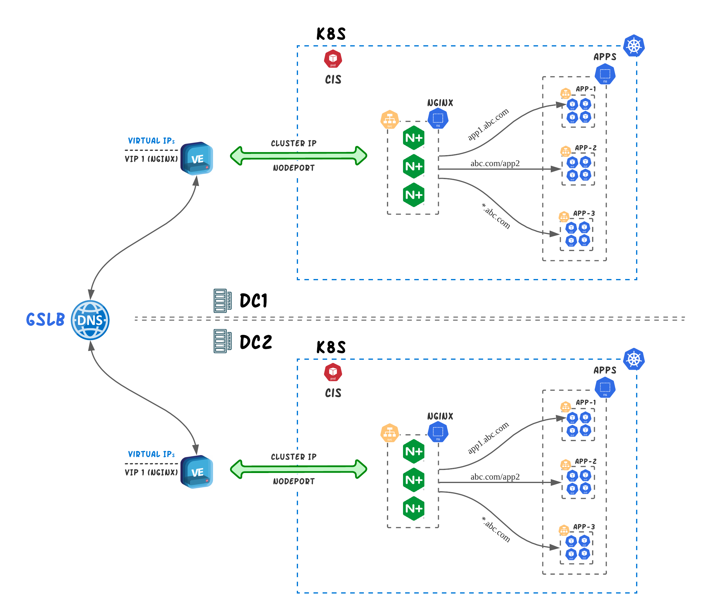

# Multi-cluster strategies
Today, organizations are increasingly deploying more Kubernetes clusters and are implementing multi-cluster strategies in an effort to improve availability, scalability and isolation. Multi-cluster strategy is achieved by deploying an application on multiple Kubernetes clusters. This can be architected with two fundamental ways; 
  - Global Server Load Balancing (DNS) 
  - Local Load Balancing (LTM) 

Although both ways can help an organization achieve multi-clustering, they have quite few differences on the capabilities of these two methods. **Global Server Load Balancing** is relying on the DNS protocol to direct the user to the Kubernetes cluster according to the GSLB distribution algorithm by resolving a DNS name to an IP address. **Local Load Balancing** is based on the typical reverse proxy functionality that the load balancer (BIGIP) will terminate the client's connection and distribute the traffic across a group of backend Kubernetes clusters. 


## LTM
For LTM multi-cluster, we rely on GitOps deployment to provide such funcitonality. With GitOps the user needs to create are the parameters of the service they want to publish (YAML format) and save them to the file. An example of such file is shown below.
```yml
config: 
  - name: www.f5demo.cloud
    vip: 10.1.1.214
    port: 80
    template: http 
    monitor: http
    cluster:
    - cluster_name: primary
      nodeport: 33002
      ratio: 9
    - cluster_name: secondary
      nodeport: 33002
      ratio: 1
```
Once the file is created/modified on a Git repository we are using a CI/CD pipeline to automatically create the Virtual Server on the BIGIP and start load balancing services for multiple Kubernetes clusters. 

Details and demo on this scenario can be found on [**GitOps**](https://github.com/F5EMEA/oltra/blob/main/use-cases/gitops/) use case. 

***LTM*** multi-cluster method is recommended when 
- Advanced Load Balancing conditions/logic is required (Ratio, HTTP Headers, Geolocation, etc).
- DNS Load Balancing is not possible due to TTL caching or other application related constrain.  


## DNS
DNS multi-clustering is achieved with the use of CIS [**ExternalDNS CRD**](https://clouddocs.f5.com/containers/latest/userguide/crd/externaldns.html). ExternalDNS role is to create WideIPs on F5 BIGIP DNS platform that will load balance the DNS traffic to the BIGIP Virtual Servers that publish the Kubernetes resources (Ingress Controller). 

<p align="center">
  
</p>


### How does it work
DNS multi-clustering is a two step process. **First** we create a Custom Resource of type VirtualServer, TransportServer or IngressLink that contain the Hostname (FQDN) of the service we want to load balance. 
```yml
apiVersion: cis.f5.com/v1
kind: VirtualServer
metadata:
  labels:
    f5cr: "true"
  name: sample-virtual
spec:
  host: www.f5demo.cloud       <==== Hostname (FQDN)
  virtualServerAddress: 10.1.10.240
  pools:
  - monitor:
      interval: 20
      recv: ""
      send: /
      timeout: 10
      type: http
    path: /
    service: svc-1
    servicePort: 80
```
An **ExternalDNS** Custom Resource must be created that will have the same hostname as with Custom Resource (VS/TS/IL) we created earlier.
```yml
apiVersion: "cis.f5.com/v1"
kind: ExternalDNS
metadata:
  name: exdns
  labels:
    f5cr: "true"
spec:
  domainName: www.f5demo.cloud     <==== Hostname matches with pervious CR
  dnsRecordType: A
  loadBalanceMethod: round-robin
  pools:
  - name: www-primary-k8s
    dnsRecordType: A
    loadBalanceMethod: round-robin
    dataServerName: /Common/GSLBServer
    monitor:
      type: https
      send: "GET /"
      recv: ""
      interval: 10
      timeout: 10
```

> **Note:** The Host parameter can be configured to be either explicit or wildcard (*.f5demo.cloud)

DNS multi-cluster provides the following functionalities: 

- **Active-Active Applications.** EDNS can be configured to load balance equally (Round Robin) services running in different clusters.

- **Active-Standby Applications.** EDNS can be configured to have order preference between the services running in different clusters.

- **Health Monitoring.** EDNS provides real-time health monitoring of the services (via HTTP/HTTPS/TCP probes) so that the user is always sent to the Kubernetes cluster that the application is available/operational. 
> **(Important) Note:** Since the application runs behind NGINX+ Ingress Controller, it is recommened to have liveness probes configured on the K8s deployments so that NGINX+ removes the services when they are facing health issues and that the timeout/frequency on the EDNS is bigger than the one on liveness probes.

- **Distributed environments.** Given the fact that EDNS relies on DNS, it can accomodates Kuberentes clusters that are deployed across different datacenters.


### DNS Demo


