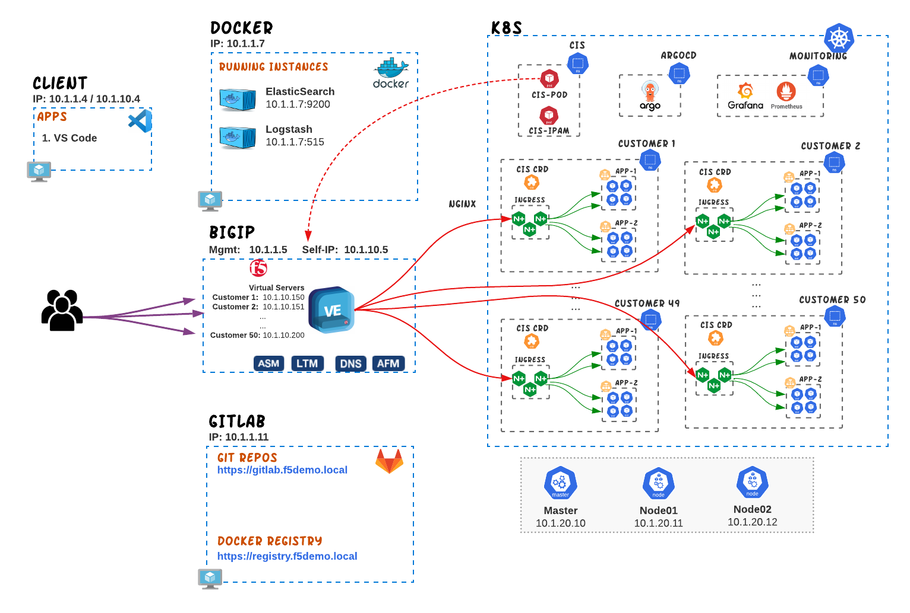
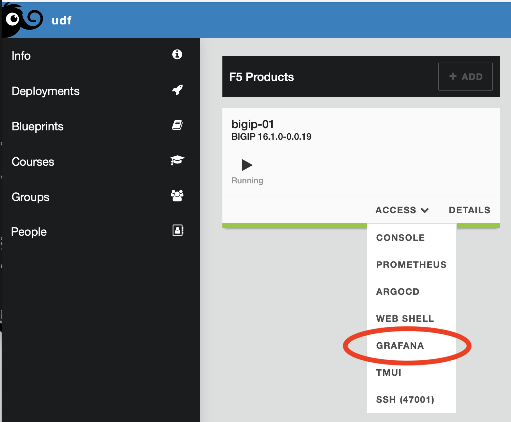
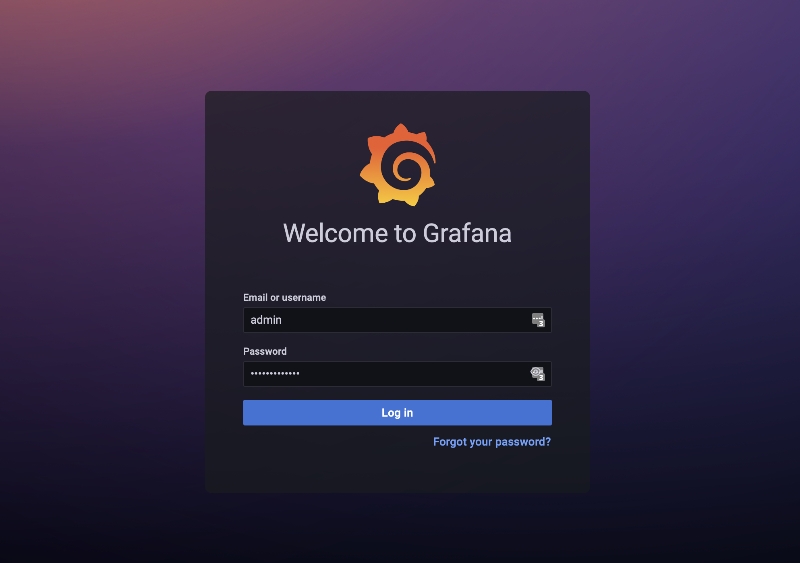
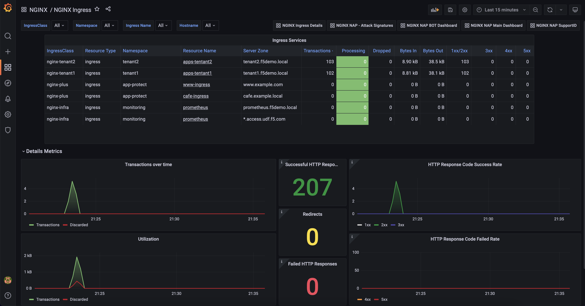
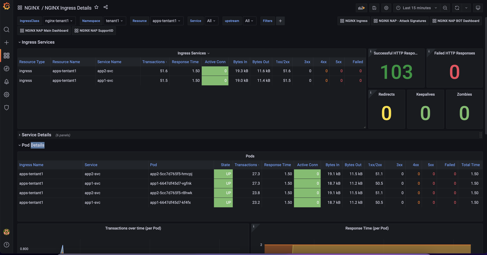

# Multi-tenant Ingress services
In this use-case we go through how we can build a multi-tenant Kubernetes cluster from the ingress and load balancing perspective. This includes clusters shared by different users at a single organization or clusters that are shared by different organizations.

A multi-tenant cluster is shared by multiple users and/or workloads which are referred to as "tenants". The operators of multi-tenant clusters must isolate tenants from each other to minimize the damage that a compromised or malicious tenant can do to the cluster and other tenants.

## Ingress multi-tenancy requirements
The typical requirements of a multi-tenant K8s environments in terms of Ingress/Load-Balancing are:
1. Each tenant should be able to manage their own Ingress Resources.
2. Ingress Resources of one tenant shouldn't not affect/interfere with another tenant's even if they are using the same FQDNs.
3. Performance degradation of the Ingress Controller (IC) on one tenant (due to usage/attacks/misconfiguration) shouldn't affect the performance of the IC on another tenant.
4. Each Tenant should be able to publish their ingress services outside the Kubernetes cluster.
5. Each Tenant Load Balancing IPs should be different and must be assigned automatically.
6. Each Tenant should have a different Network IP address(es) to differentiate them and being able to apply different network policies outside the K8s cluster. 


## Proposed Architecture
In order to address the above requirements, we have designed a 2-tier architecture. The 1st tier is based on NGNIX+ Ingress Controller and will be deployed in each tenant while the 2nd tier is based on BIGIP/CIS that will have the role of the external load balancer.

<p align="center">
  
</p>

### Tier 1 - NGINX+ Ingress Controller
In our design we choose to have separate NGINX+ Ingress Controller deployment per tenant. This design was preferred because of the following benefits:

- **Security.** By deploying separate IC instances, we are creating a full isolation for both dataplane and control plane between tenants. This means that in situation of high-usage, attacks or even misconfiguration on a tenant's IC this will not affect other tenants deployments.  

- **Customization.** Generally, you can customize or fine tune your IC behavior through the use of configmaps (e.g., set the number of worker processes, customize the access log format). While this is very important for the application delivery, ConfigMap applies globally, meaning that it affects every Ingress resource. Therefore, if applied across multiple tenants, you cannot fine-tune these variables based on each tenant's requirements.

- **Management.** When sharing a single IC across multiple tenants, the responsibility for upgrading, patching, scaling, performance-tuning, etc lies with the operator. By having seperate IC per tenant the responsibility can be transferred or shared with the tenants.

When running NGINX Ingress Controller, you have the following options with regards to which configuration resources it handles:

- **Cluster-wide Ingress Controller.** The Ingress Controller handles configuration resources created in any namespace of the cluster.
- **Single-namespace Ingress Controller (selected).** You can configure the Ingress Controller to handle configuration resources only from a particular namespace, which is controlled through the -watch-namespace command-line argument. In this design we chose to have a separate IC per namespace


### Tier 2 - BIGIP / CIS (external Load Balancer)
BIGIP role in the overall design is to publish the NGINX IC outside of the Kubernetes environment. To achieve that we are using CIS to discover the NGINX IC services and publish each service with a different VIP on BIGIP.  

**Discovery**
Tenants, have at least one NGINX IC service running on their environment and some tentants might even run multiple NGINX IC services. CIS is used to discover the NGINX IC services running across all tenants and configure BIGIP accordingly. This can be achieve by deploying one of the 3 available CIS CRDs (**VirtualServer**, **TransportServer** or **IngressLink**) on the same namespaces as the NGINX IC services are running or publish the IC services with Type Load Balancer. Choosing between these methods on the type of functionality/features you need to enable on BIGIP. The following matrix gives you a brief explanation on what can be achieved by each CRDs.

| Type | Functionality |
|---|---|
| VirtualServer CRD | With VS CRD you can enable multiple functionalities such as **Reverse Proxy**, **DDoS**, **BoT mitigation**, **SSL offloading**, **HTTP/HTTP2 profiles**, **L4/7 iRules**, **WAF policies**, **SNAT pools** , **Cookie/IP Persistence**, **EDNS**. <br> Examples on VirtualServer CRD can be found <a href="https://github.com/F5EMEA/oltra/blob/main/use-cases/cis-examples/README.md#virtualserver-crd-examples">here</a> |
| TransportServer CRD |  With TS CRD you can enable primarily L4 functionalities such as **Reverse Proxy**,  **L4 DDoS**, **L4 iRules**, **SNAT pools**, **IP Persistence**.<br> Examples on TransportServer CRD can be found <a href="https://github.com/F5EMEA/oltra/blob/main/use-cases/cis-examples/README.md#transportserver-crd-examples">here</a> |
| Service Type LB | With service type LB you can enable primarily L4 functionalities like TS CRD such as **Reverse Proxy**,  **L4 DDoS**, **L4 iRules**, **SNAT pools**, **IP persistence**.<br> Examples on Service Type LB can be found <a href="https://github.com/F5EMEA/oltra/blob/main/use-cases/cis-examples/README.md#service-type-loadbalancer-examples">here</a> |


**Separation** 

Given the fact that we are sharing the same BIGIP device across all tenants, we need to consider how to allocate IP addresses without creating conflict between tenants. The way to achieve this is by using F5's IPAM controller. The IPAM controller will be configured with different labels per tenant and each label will define the IP ranges that should be assigned per tenant.
These labels must be referenced on the CIS CRDs that will be used to publish the NGINX IC services.

> **How to avoid tenats changing IPAM labels** <br>
> **Option 1.** CIS CRDs are deployed/managed by the Kubernetes administrator and the tenant has read-only rights.<br>
> **Option 2.** CIS CRDs can only be deployed through a pipeline that verifies the right usage of the labels. Manifests are created/stored on a GIT by the tenant and then a pipeline applies the desired state on the K8s cluster. Tenant has read-only rights on the CRDs. <br>
> **Option 3.** Finally as the last option we can use [**OPA Gatekeeper**](https://open-policy-agent.github.io/gatekeeper/website/docs/). Gatekeeper's engine is designed to be portable, allowing administrators to detect and reject non-compliant commits to an infrastructure-as-code system's source-of-truth, further strengthening compliance efforts and preventing bad state from slowing down the organization. Therefore, the administrator can set the label values that need to be present on the CIS CRD in order for it to be accepted. 

More information on CIS and IPAM can be found on the following links:
- [CIS](https://clouddocs.f5.com/containers/latest/)
- [CIS CRDs](https://clouddocs.f5.com/containers/latest/userguide/crd/)
- [IPAM Controller](https://clouddocs.f5.com/containers/latest/userguide/ipam/)


## Demo 

### Step 1. Create Tentants

Access the terminal on the VS Code.


Create the namespace for each tenant (Tenant-1, Tenant-2)
```
kubectl create namespace tenant1
kubectl create namespace tenant2
```

### Step 2. Deploy NGINX+ Ingress Controller

For each tenant we will deploy a separate NGINX+ Ingress Controller. 

Change the working directory to `multi-tenancy`.
```
cd ~/oltra/use-cases/two-tier-architectures/multi-tenancy
```


Copy the NGINX plus deployment from the setup folder
```
cd ~/oltra/use-cases/two-tier-architectures/multi-tenancy
mkdir nginx_t1
mkdir nginx_t2
cp -R ~/oltra/setup/nginx-ic/* nginx_t1
cp -R ~/oltra/setup/nginx-ic/* nginx_t2
```

3. Replace the namespace `nginx` with `tenant1` and `tenant2` for the required manifests
```
./rename.sh
```

4. Deploy NGNINX+ IC for each tenant.
```
kubectl apply -f ~/oltra/use-cases/two-tier-architectures/multi-tenancy/nginx_t1/rbac
kubectl apply -f ~/oltra/use-cases/two-tier-architectures/multi-tenancy/nginx_t2/rbac
kubectl apply -f ~/oltra/use-cases/two-tier-architectures/multi-tenancy/nginx_t1/resources
kubectl apply -f ~/oltra/use-cases/two-tier-architectures/multi-tenancy/nginx_t2/resources
kubectl apply -f ~/oltra/use-cases/two-tier-architectures/multi-tenancy/nginx_t1/nginx-plus
kubectl apply -f ~/oltra/use-cases/two-tier-architectures/multi-tenancy/nginx_t2/nginx-plus
```

5. Verify that the NGINX pods are up and running on each tenant

```
kubectl get pods -n tenant1
kubectl get pods -n tenant2
```
```
####################################      Expected Output   ######################################
NAME                            READY   STATUS    RESTARTS   AGE
nginx-tenant1-74fd9b786-hqm6k   1/1     Running   0          22s
##################################################################################################
```

Deploy the NGINX+ service with Type LoadBalancer so that BIGIP will publish the service externally
```cmd
kubectl apply -f svc.yml
```

Confirm that Service Type LB has received and IP from F5 IPAM and being deployed on BIGIP.
```
kubectl get svc -n tenant1
kubectl get svc -n tenant2

####################################      Expected Output   ######################################
NAME            TYPE           CLUSTER-IP      EXTERNAL-IP   PORT(S)                      AGE
nginx-tenant1   LoadBalancer   10.105.30.253   10.1.10.190   80:32151/TCP,443:32062/TCP   33m

NAME            TYPE           CLUSTER-IP       EXTERNAL-IP   PORT(S)                      AGE
nginx-tenant2   LoadBalancer   10.105.188.239   10.1.10.193   80:32658/TCP,443:31926/TCP   34m
##################################################################################################
```

Save the IP addresses that was assigned by the IPAM for each tenant NGINX services
```
IP_tenant1=$(kubectl get svc nginx-tenant1 -n tenant1 --output=jsonpath='{.status.loadBalancer.ingress[0].ip}')
IP_tenant2=$(kubectl get svc nginx-tenant2 -n tenant2 --output=jsonpath='{.status.loadBalancer.ingress[0].ip}')
```

Try accessing the service as per the example below. 
```
curl http://$IP_tenant1
curl http://$IP_tenant2
```

The output should be similar to:

```html
<html>
<head><title>404 Not Found</title></head>
<body>
<center><h1>404 Not Found</h1></center>
<hr><center>nginx/1.21.5</center>
</body>
</html>
```

### Step 3. Deploy services for each tenant

Deploy demo applications in each tenant
```
kubectl apply -f  ~/oltra/setup/apps/apps.yml -n tenant1
kubectl apply -f  ~/oltra/setup/apps/apps.yml -n tenant2
```

Deploy Ingress services for each tenant
```
kubectl apply -f ingress.yml
```


Access the services for both tenants as per the example below. 
```
curl http://tenant1.f5demo.local/ --resolve tenant1.f5demo.local:80:$IP_tenant1
curl http://tenant2.f5demo.local/ --resolve tenant2.f5demo.local:80:$IP_tenant2
curl http://tenant1.f5demo.local/app2 --resolve tenant1.f5demo.local:80:$IP_tenant1
curl http://tenant2.f5demo.local/app2 --resolve tenant2.f5demo.local:80:$IP_tenant2
```


### Step 4. (Optional) Grafana Dashboards 

Setup scraping for the new NGINX instances
```yml
cat <<EOF | kubectl apply -f -
apiVersion: v1
kind: Service
metadata:
  name: nginx-metrics-tenant1
  namespace: tenant1
  labels:
    type: nginx-metrics
spec:
  ports:
  - port: 9113
    protocol: TCP
    targetPort: 9113
    name: prometheus
  selector:
    app: nginx-tenant1
---
apiVersion: v1
kind: Service
metadata:
  name: nginx-metrics-tenant2
  namespace: tenant2
  labels:
    type: nginx-metrics
spec:
  ports:
  - port: 9113
    protocol: TCP
    targetPort: 9113
    name: prometheus
  selector:
    app: nginx-tenant2
---
apiVersion: monitoring.coreos.com/v1
kind: ServiceMonitor
metadata:
  name: nginx-metrics
  namespace: monitoring
  labels:
    type: nginx-plus
spec:
  selector:
    matchLabels:
      type: nginx-metrics
  namespaceSelector:
    matchNames:
    - nginx
    - tenant1
    - tenant2
  endpoints:
  - interval: 30s
    path: /metrics
    port: prometheus
EOF
```

Login to Grafana. On the UDF you can access Grafana from BIGIP "Access" methods as per the image below.

<p align="left">
  
</p>

Login to Grafana (credentials **admin/IngressLab123**)
<p align="left">
  
</p>


Go to **Dashboards->Browse**

<p align="left">
  
</p>


Select any of the 2 Ingress Dashboards (NGINX Ingress / NGINX Ingress Details) which can be found on NGINX Folder

<p align="left">
  
</p>


Run the following script to generate traffic and review the Grafana Dashboards per tenant
```cmd
for i in {1..500} ; do curl http://tenant1.f5demo.local/ --resolve tenant1.f5demo.local:80:$IP_tenant1; \
curl http://tenant2.f5demo.local/ --resolve tenant2.f5demo.local:80:$IP_tenant2;  \
curl http://tenant1.f5demo.local/app2 --resolve tenant1.f5demo.local:80:$IP_tenant1; \
curl http://tenant2.f5demo.local/app2 --resolve tenant2.f5demo.local:80:$IP_tenant2; \
done
```

**Ingress Dashboard**

<p align="left">
  
</p>

**Ingress Dashboard Details**

<p align="left">
  
</p>


### Step 5. Clean up the environment

Delete the namespaces that were created during this demo to remove all configuration
```
kubectl delete ns tenant1
kubectl delete ns tenant2
rm -R nginx_t1
rm -R nginx_t2
```
