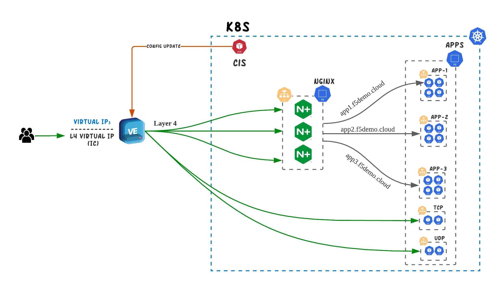
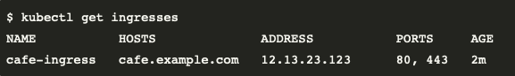

# Layer 4 Deployments
One of the most common deployment in regards to the external load balancer is the Layer 4. The main requirement in this case is to provide L4 connectivity between the external environment and the Ingress Controller running inside K8s. The typical customer environmnet will contain mutliple ingress controllers for Production, UAT and Test environments and probably multiple Kubernetes clusters. 

## Requirements
The usual requirements for such an environment are the following:
1. DevOps team should be able to control the process of publishing resources
1. The process should happen in a Kubernetes-native way.
1. DevOps teams shouldn’t have to manage the external IPs on BIGIP
1. SSL termination should take place on Kubernetes Ingress Controller
1. While the main service that should be exposed is the NGINX+ Ingress Controller, the DevOps team might require also to expose TCP/UDP apps without going through the Ingress Controller.
1. Multiple NGINX+ IC groups running per K8s cluster.
1. The design should be scalable to multiple Kubernetes clusters


## Proposed Architecture

<p align="center">
  
</p>

Having a single, standardized approach that runs everywhere Kubernetes runs, ensures that configurations are applied consistently, across all environments. This is one of the many benefits that **Kubernetes-native** configuration provides.

BIGIP can be configured in a kubernetes-native manner though the use of <a href="https://clouddocs.f5.com/containers/latest/userguide/what-is.html">CIS controller</a>. Altough CIS has multiple modes of operation (Ingress, Routes, CRDs, Configmaps) the 3 most relevant for our use case are IngressLink and TransportServer CRDs and Service Type LoadBalancer. 

| Type | Functionality |
|---|---|
| TransportServer CRD |  With TS CRD you can forward all traffic to your service through a L4 Virtual Server on BIGIP. It provides functionalities such as **Reverse Proxy**,  **L4 DDoS**, **L4 iRules**, **SNAT pools**, **IP Persistence**.<br> It works with and without **IPAM** controller.<br> Examples on TransportServer CRD can be found <a href="https://github.com/F5EMEA/oltra/blob/main/use-cases/cis-examples/README.md#transportserver-crd-examples">here</a> |
| Service Type LB | Services of type LoadBalancer are natively supported in Kubernetes deployments. When you create a service of type LoadBalancer it spins up service in integration with F5 IPAM Controller which allocates an IP address that will forward all traffic to your service through a L4 Virtual Server on BIGIP. It provides functionalities such as **Reverse Proxy**,  **L4 DDoS**, **L4 iRules**, **SNAT pools**, **IP persistence**.<br> It works only with **IPAM** controller.<br> Examples on Service Type LB can be found <a href="https://github.com/F5EMEA/oltra/blob/main/use-cases/cis-examples/README.md#service-type-loadbalancer-examples">here</a> |

| IngressLink | IngressLink CRD is a dedicated CRD for integrating BIGIP with NGINX Ingress Controller. The integration is acheved through a Layer 4 Virtual Server on BIGIP that forwards all traffic to NGINX Ingress Controller. <br> It works with or without **IPAM** controller. <br> Examples on IngressLink CRD can be found <a href="https://github.com/F5EMEA/oltra/blob/main/use-cases/cis-examples/README.md#ingresslink-examples">here</a> |

**IngressLink** and **Service Type LB** are the recommended methods for publishing NGINX Ingress Controller in our use case. Both methods provide Layer 4 Load Balancing from BIGIP to NGINX+ IC instances and therefore do not terminate SSL and both support IPAM so that IPs are not managed by the DevOps teams.

An intresting feature is that both methods can populate the Ingress Resource Address information with external IP that has been configured on BIGIP. To achieve this we need to enable the correct arguments on NGINX Ingress Controller. These are:
- "-ingresslink" for Ingresslink deployments
- "-external-service" for Type LB deployments

<p align="center">
  
</p>

More information on how to configure those arguments can be found on the link https://docs.nginx.com/nginx-ingress-controller/configuration/global-configuration/command-line-arguments/

**TransportServer** and **Service Type LB** are recommended methods to publish either TCP or UDP applications, since both provide Layer 4 Load Balancing adn IPAM funcitonality.

> **Why select ServiceType LB?**
> - Easier Deployment. No need for additional resource (TS CRD).

> **Why select TransportServer (TS) or IngressLink instead of Type LB??**
> - If you want to use a static IP address on the BIGIP
> - If, for RBAC purposes, you need to have a separate resource (TS CRD) that will control the publishing of a service.


## Demo 
In the following section we will demontrate how we can implement the above architecture on the following environment
- 1 NGINX+ IC,
- 3 Applications behind Ingress Controller (routed based on Ingress)
- 1 UDP application

We are using ServiceType LB to publishing NGINX+ IC and Transport Server for the UDP application.

### Step 1. Create Tentants

Create the namespace for each tenant (Tenant-1, Tenant-2)
```
kubectl create namespace layer4
```

### Step 2. Deploy NGINX+ Ingress Controller

For each tenant we will deploy a seperate NGINX+ Ingress Controller. 

1. Copy the NGINX plus deployment from the setup folder
```
cd ~/oltra/use-cases/two-tier-designs/layer4
mkdir layer4
cp -R ~/oltra/setup/nginx-ic/* .
```

2. Replace the namespace `nginx` with `tenant1` and `tenant2` for the required manifests
```
./rename.sh
```

3. Apply configurations
```
kubectl apply -f ~/oltra/use-cases/multi-tenancy/nginx_t1/rbac
kubectl apply -f ~/oltra/use-cases/multi-tenancy/nginx_t2/rbac
kubectl apply -f ~/oltra/use-cases/multi-tenancy/nginx_t1/resources
kubectl apply -f ~/oltra/use-cases/multi-tenancy/nginx_t2/resources
kubectl apply -f ~/oltra/use-cases/multi-tenancy/nginx_t1/nginx-plus
kubectl apply -f ~/oltra/use-cases/multi-tenancy/nginx_t2/nginx-plus
kubectl apply -f ~/oltra/use-cases/multi-tenancy/nginx_t1/publish
kubectl apply -f ~/oltra/use-cases/multi-tenancy/nginx_t2/publish
```

4. Verify that the NGINX pods are up and running on each tenant

```
kubectl get pods -n tenant1
kubectl get pods -n tenant2
```
```
####################################      Expected Output   ######################################
NAME                            READY   STATUS    RESTARTS   AGE
nginx-tenant1-74fd9b786-hqm6k   1/1     Running   0          22s
##################################################################################################
```

5. Confirm that CIS TransportServer CRDs have been deployed correctly. You should see `Ok` under the Status column for the TransportServer that was just deployed.
```
kubectl get ts -n tenant1
kubectl get ts -n tenant2
```
```
####################################      Expected Output   ######################################
NAME            VIRTUALSERVERADDRESS   VIRTUALSERVERPORT   POOL            POOLPORT   IPAMLABEL   IPAMVSADDRESS   STATUS   AGE
nginx-tenant1                          80                  nginx-tenant1   80         tenant1     10.1.10.191     Ok       30h
##################################################################################################
```

6. Save the IP adresses that was assigned by the IPAM for each tenant NGINX services
```
IP_tenant1=$(kubectl get ts nginx-tenant1 -n tenant1 --template '{{.status.vsAddress}}')
IP_tenant2=$(kubectl get ts nginx-tenant2 -n tenant2 --template '{{.status.vsAddress}}')
```

7. Try accessing the service as per the example below. 
```
curl http://$IP_tenant1
curl http://$IP_tenant2
```

The output should be similar to:

```html
<html>
<head><title>404 Not Found</title></head>
<body>
<center><h1>404 Not Found</h1></center>
<hr><center>nginx/1.21.5</center>
</body>
</html>
```

### Step 3. Deploy services for each tenant

1. Deploy demo applications in each tenant
```
kubectl apply -f  ~/oltra/setup/apps/apps.yml -n tenant1
kubectl apply -f  ~/oltra/setup/apps/apps.yml -n tenant2
```

2. Deploy Ingress services for each tenant
```yml
cat <<EOF | kubectl apply -f -
apiVersion: networking.k8s.io/v1
kind: Ingress
metadata:
  name: apps-tentant1
  namespace: tenant1
spec:
  ingressClassName: nginx-tenant1
  rules:
  - host: tenant1.f5demo.local
    http:
      paths:
      - path: /
        pathType: Prefix
        backend:
          service:
            name: app1-svc
            port:
              number: 80
      - path: /app2
        pathType: Prefix
        backend:
          service:
            name: app2-svc
            port:
              number: 80
---
apiVersion: networking.k8s.io/v1
kind: Ingress
metadata:
  name: apps-tentant2
  namespace: tenant2
spec:
  ingressClassName: nginx-tenant2
  rules:
  - host: tenant2.f5demo.local
    http:
      paths:
      - path: /
        pathType: Prefix
        backend:
          service:
            name: app1-svc
            port:
              number: 80
      - path: /app2
        pathType: Prefix
        backend:
          service:
            name: app2-svc
            port:
              number: 80
EOF
```


3. Access the services for both tenants as per the example below. 
```
curl http://tenant1.f5demo.local/ --resolve tenant1.f5demo.local:80:$IP_tenant1
curl http://tenant2.f5demo.local/ --resolve tenant2.f5demo.local:80:$IP_tenant2
curl http://tenant1.f5demo.local/app2 --resolve tenant1.f5demo.local:80:$IP_tenant1
curl http://tenant2.f5demo.local/app2 --resolve tenant2.f5demo.local:80:$IP_tenant2
```


### Step 4. (Optional) Grafana Dashboards 

1. Setup scraping for the new NGINX instances
```yml
cat <<EOF | kubectl apply -f -
apiVersion: v1
kind: Service
metadata:
  name: nginx-metrics-tenant1
  namespace: tenant1
  labels:
    type: nginx-metrics
spec:
  ports:
  - port: 9113
    protocol: TCP
    targetPort: 9113
    name: prometheus
  selector:
    app: nginx-tenant1
---
apiVersion: v1
kind: Service
metadata:
  name: nginx-metrics-tenant2
  namespace: tenant2
  labels:
    type: nginx-metrics
spec:
  ports:
  - port: 9113
    protocol: TCP
    targetPort: 9113
    name: prometheus
  selector:
    app: nginx-tenant2
---
apiVersion: monitoring.coreos.com/v1
kind: ServiceMonitor
metadata:
  name: nginx-metrics
  namespace: monitoring
  labels:
    type: nginx-plus
spec:
  selector:
    matchLabels:
      type: nginx-metrics
  namespaceSelector:
    matchNames:
    - nginx
    - tenant1
    - tenant2
  endpoints:
  - interval: 30s
    path: /metrics
    port: prometheus
EOF
```

2. Login to Grafana. On the UDF you can acess Grafana from BIGIP "Access" methods as per the image below.

<p align="left">
  
</p>

Login to Grafana (credentials **admin/IngressLab123**)
<p align="left">
  
</p>


Go to **Dashboards->Browse**

<p align="left">
  
</p>


Select any of the 2 Ingress Dashboards (NGINX Ingress / NGINX Ingress Details) which can be found on NGINX Folder

<p align="left">
  
</p>


2. Run the following script to generate traffic and review the Grafana Dashboards per tenant
```cmd
for i in {1..500} ; do curl http://tenant1.f5demo.local/ --resolve tenant1.f5demo.local:80:$IP_tenant1; \
curl http://tenant2.f5demo.local/ --resolve tenant2.f5demo.local:80:$IP_tenant2;  \
curl http://tenant1.f5demo.local/app2 --resolve tenant1.f5demo.local:80:$IP_tenant1; \
curl http://tenant2.f5demo.local/app2 --resolve tenant2.f5demo.local:80:$IP_tenant2; \
done
```

**Ingress Dashboard**

<p align="left">
  
</p>

**Ingress Dashboard Details**

<p align="left">
  
</p>
